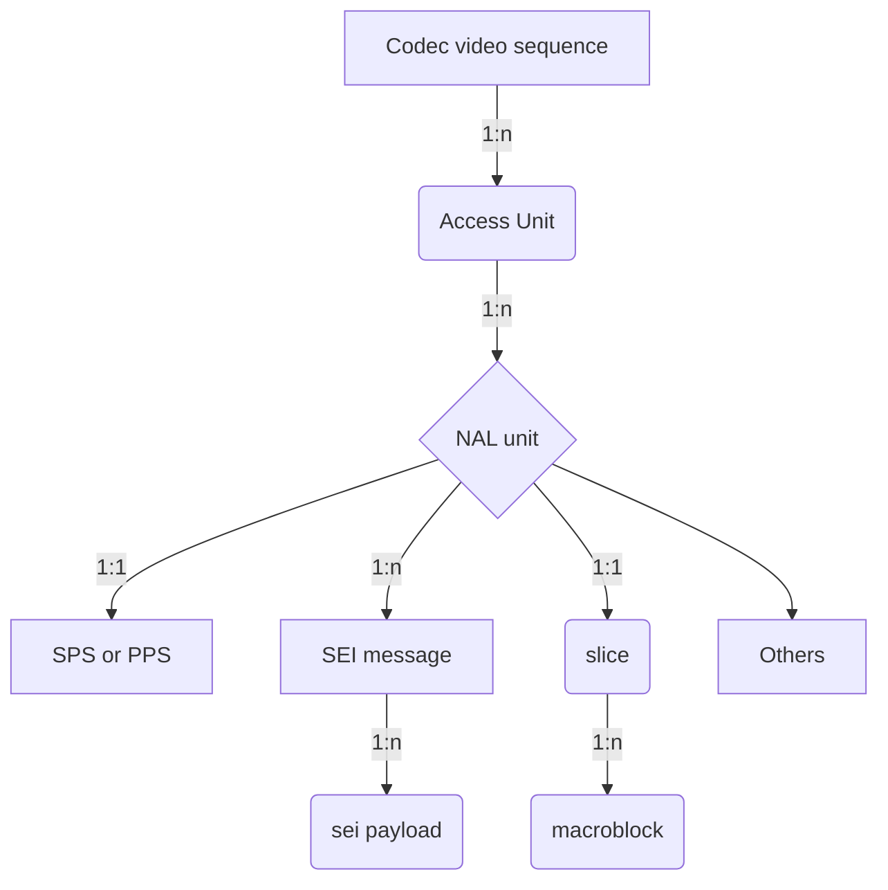

# Media Syntax Element Locator
## Contents
* [Abbreviation](#abbreviation)
* [What's media syntax element?](#whats-media-syntax-element)
* [How to locate the media syntax element?](#how-to-locate-the-media-syntax-element)
	* [MPEG video bitstream media syntax element locator](#mpeg-video-bitstream-media-syntax-element-locator)
	* [NAL bitstream media syntax element locator](#nal-bitstream-media-syntax-element-locator)
* [Commands](#commands)
	* [`listMSE` command](#listmse-command)
	* [`showMSE` command](#showmse-command)
	* [`showMSEHex` command](#showmse-command)

## Abbreviation
* **URI**: Uniform Resource Identifier
* **MSE**: Media Syntax Element
* **AU**: Access Unit
* **CVS**: Codec Video Sequence
* **TU**: Temporal Unit
* **FU**: Frame Unit
* **OBU**: Open Bitstream Unit
* **GOP**: Group of Picture
* **NU**: NAL Unit
* **PL**: Payload
* **MSG**: Message
* **SEIPL**: SEI payload
* **SEIMSG**: SEI Message

[Top](#contents)

## What's media syntax element?
For the audio, video and other multimedia payload, in the corresponding technical specification, it defined its data organization, and let's call the minimum organization units as `syntax element`, normally it is hierarchical, and defined in tabular form, for example, H.264, it consists of:


[Top](#contents)
## How to locate the media syntax element?
Since every media syntax element can be unpacked, and parsed, and its syntax view can also be displayed, we need defined a media syntax element locator protocol to locate it accurately.
In this document, we follow the RFC3986,
```
      URI         = scheme ":" hier-part [ "?" query ] [ "#" fragment ]

      hier-part   = "//" authority path-abempty
                  / path-absolute
                  / path-rootless
                  / path-empty
```
scheme: only support `MSE`, it can be also ignored
hier-part: the media syntax element locate part, it is the media object, or syntactic elements defined in each multimedia specification scheme
query and framgment: it is the syntax structure in the media object or syntactic element.

**hier-part** *: `[syntax-element-filter[.syntax-element-filter[....]]][/syntax/element/inside/...][#leaf-field]`*

**syntax_element-fitler** *: `[`~`]syntax_element[s][-][e]]`*

**~** *:exclude the followed syntax element(s), or range*

**s** *:the start index(0-based) of syntax element in its parents*

**e** *:the end index(0-based) of syntax element in its parents*

### MPEG video bitstream media syntax element locator
*[MSE://][[`~`]**MB**[`m₀`][`-`][`mₙ`]][.]\([[`~`]**SE**[`s₀`][`-`][`sₙ`]] | [[`~`]**SLICE**[`s₀`][`-`][`sₙ`]])[.][[`~`]**AU**[`a₀`][`-`][`aₙ`]][.][[`~`]**GOP**[`g₀`][`-`][`gₙ`]][.][[`~`]**VSEQ**[`v₀`][`-`][`vₙ`]][/part/part/...][#field]*

- AU
    Normally a MPEG2 video frame, I frame may start video sequence_header + sequence_extension + extension_and_user_data(0) + group_of_pictures_header + extension_and_user_data(1) + picture_header + ...
- SE (syntactic element)
	The basic element start with start_code, for example, sequence_header, sequence_extension and so on 

| URI | comment |
| --- | --- |
| VSEQ`1` | The 2nd video sequence in the MPEG video bitstream |
| GOP`50` | The GOP#50(0-based) in the whole MPEG video bitstream instead of a specified video sequence |
| AU`50` | The access-unit#50(0-based) in the whole MPEG video bitstream instead of a specified video sequence or/and a specified GOP |
| AU`50`.VSEQ`1` |The access-unit#50(0-based) in the second video sequence|
| AU`1`.GOP`0`.VSEQ`1` |The 2nd access-unit of the first GOP in the 2nd video sequence|
| SE`0`.GOP`0`.VSEQ`1`/#aspect_ratio_information |aspect_ratio_information of sequence header if SE#0 is a sequence header|
|~slice.au`1`|all non-slice syntax elements of the 2nd access-unit|
|slice.au`1-2`|all slices of access-unit 1 and 2|

Here are some command examples:
```
DumpTS 00023.m2v --listmse
```
Show all syntax elements in a MPEG2 video stream:
```
------------Name-------------------------------|-----len-----|------------URI-------------
Video Sequence#0                               |             |                      VSEQ0
    GOP#0 (closed)                             |             |                 GOP0.VSEQ0
        AU#0 (I)                               |    91,997 B |             AU0.GOP0.VSEQ0
            SE#0 sequence_header               |       140 B |         SE0.AU0.GOP0.VSEQ0
            SE#1 sequence_extension            |        10 B |         SE1.AU0.GOP0.VSEQ0
            SE#2 group_of_pictures_header      |         8 B |         SE2.AU0.GOP0.VSEQ0
            SE#3 picture_header                |         8 B |         SE3.AU0.GOP0.VSEQ0
            SE#4 picture_coding_extension      |         9 B |         SE4.AU0.GOP0.VSEQ0
            SE#5 slice1                        |       688 B |         SE5.AU0.GOP0.VSEQ0
            SE#6 slice2                        |       692 B |         SE6.AU0.GOP0.VSEQ0
            SE#7 slice3                        |       698 B |         SE7.AU0.GOP0.VSEQ0
            SE#8 slice4                        |       714 B |         SE8.AU0.GOP0.VSEQ0
            SE#9 slice5                        |       831 B |         SE9.AU0.GOP0.VSEQ0
            SE#10 slice6                       |     1,691 B |        SE10.AU0.GOP0.VSEQ0
            SE#11 slice7                       |     1,798 B |        SE11.AU0.GOP0.VSEQ0
            SE#12 slice8                       |     1,730 B |        SE12.AU0.GOP0.VSEQ0
            SE#13 slice9                       |     1,747 B |        SE13.AU0.GOP0.VSEQ0
            SE#14 slice10                      |     1,746 B |        SE14.AU0.GOP0.VSEQ0
            SE#15 slice11                      |     1,714 B |        SE15.AU0.GOP0.VSEQ0
            SE#16 slice12                      |     1,723 B |        SE16.AU0.GOP0.VSEQ0
            SE#17 slice13                      |     1,762 B |        SE17.AU0.GOP0.VSEQ0
            SE#18 slice14                      |     1,846 B |        SE18.AU0.GOP0.VSEQ0
            SE#19 slice15                      |     1,824 B |        SE19.AU0.GOP0.VSEQ0
            SE#20 slice16                      |     1,842 B |        SE20.AU0.GOP0.VSEQ0
            SE#21 slice17                      |     1,792 B |        SE21.AU0.GOP0.VSEQ0
            SE#22 slice18                      |     1,779 B |        SE22.AU0.GOP0.VSEQ0
            SE#23 slice19                      |     1,769 B |        SE23.AU0.GOP0.VSEQ0
            SE#24 slice20                      |     1,791 B |        SE24.AU0.GOP0.VSEQ0
            SE#25 slice21                      |     1,827 B |        SE25.AU0.GOP0.VSEQ0
            SE#26 slice22                      |     1,923 B |        SE26.AU0.GOP0.VSEQ0
            SE#27 slice23                      |     1,869 B |        SE27.AU0.GOP0.VSEQ0
            SE#28 slice24                      |     1,903 B |        SE28.AU0.GOP0.VSEQ0
            SE#29 slice25                      |     1,847 B |        SE29.AU0.GOP0.VSEQ0
            SE#30 slice26                      |     1,842 B |        SE30.AU0.GOP0.VSEQ0
            SE#31 slice27                      |     1,778 B |        SE31.AU0.GOP0.VSEQ0
            SE#32 slice28                      |     1,678 B |        SE32.AU0.GOP0.VSEQ0
            SE#33 slice29                      |     1,620 B |        SE33.AU0.GOP0.VSEQ0
......
```
Ok, now want to see the sequence header syntax according to its given URI,
```
DumpTS 00023.m2v --showmse=SE0.AU0.GOP0.VSEQ0
```
And then,
```
Video Sequence#0                               |             |                      VSEQ0
    GOP#0 (closed)                             |             |                 GOP0.VSEQ0
        AU#0 (I)                               |    91,997 B |             AU0.GOP0.VSEQ0
            SE#0 sequence_header               |       140 B |         SE0.AU0.GOP0.VSEQ0
            ------------------------------------------------------------------------------
            sequence_header_code: 00 00 01 b3 // should be 00 00 01 B3
            horizontal_size_value: 1920(0X780)// This word forms the 12 least significant bits of horizontal_size
            vertical_size_value: 1080(0X438)  // This word forms the 12 least significant bits of vertical_size
            aspect_ratio_information: 3(0X3)  // 16:9
            frame_rate_code: 4(0X4)           // 30 000/1001 (29.97...)
            bit_rate_value: 87500(0X155CC)    // The lower 18 bits of bit_rate, and the upper 12 bits are in bit_rat...
            marker_bit: 1
            vbv_buffer_size_value: 597(0X255) // the lower 10 bits of vbv_buffer_size, and the upper 8 bits are in v...
            constrained_parameters_flag: 0    // This flag (used in ISO/IEC 11172-2) has no meaning in this Specific...
            load_intra_quantiser_matrix: 1    // See 6.3.11 "Quant matrix extension".
            intra_quantiser_matrix:           // See 6.3.11 "Quant matrix extension".
                  8  16  16  19  16  19  22  22
                 22  22  22  22  26  24  26  27
                 27  27  26  26  26  26  27  27
                 27  29  29  29  34  34  34  29
                 29  29  27  27  29  29  32  32
                 34  34  37  38  37  35  35  34
                 35  38  38  40  40  40  48  48
                 46  46  56  56  58  69  69  83

            load_non_intra_quantiser_matrix: 1// See 6.3.11 "Quant matrix extension".
            non_intra_quantiser_matrix:       // See 6.3.11 "Quant matrix extension".
                 16  17  17  18  18  18  19  19
                 19  19  20  20  20  20  20  21
                 21  21  21  21  21  22  22  22
                 22  22  22  22  23  23  23  23
                 23  23  23  23  24  24  24  25
                 24  24  24  25  26  26  26  26
                 25  27  27  27  27  27  28  28
                 28  28  30  30  30  31  31  33
```
Now, sequence_header and sequence_extension want to be shown together,
```
DumpTS 00023.m2v --showmse=SE0.AU0.GOP0.VSEQ0
```
And then
```
Video Sequence#0                               |             |                      VSEQ0
    GOP#0 (closed)                             |             |                 GOP0.VSEQ0
        AU#0 (I)                               |    91,997 B |             AU0.GOP0.VSEQ0
            SE#0 sequence_header               |       140 B |         SE0.AU0.GOP0.VSEQ0
            ------------------------------------------------------------------------------
            sequence_header_code: 00 00 01 b3 // should be 00 00 01 B3
            horizontal_size_value: 1920(0X780)// This word forms the 12 least significant bits of horizontal_size
            vertical_size_value: 1080(0X438)  // This word forms the 12 least significant bits of vertical_size
            aspect_ratio_information: 3(0X3)  // 16:9
            frame_rate_code: 4(0X4)           // 30 000/1001 (29.97...)
            bit_rate_value: 87500(0X155CC)    // The lower 18 bits of bit_rate, and the upper 12 bits are in bit_rat...
            marker_bit: 1
            vbv_buffer_size_value: 597(0X255) // the lower 10 bits of vbv_buffer_size, and the upper 8 bits are in v...
            constrained_parameters_flag: 0    // This flag (used in ISO/IEC 11172-2) has no meaning in this Specific...
            load_intra_quantiser_matrix: 1    // See 6.3.11 "Quant matrix extension".
            intra_quantiser_matrix:           // See 6.3.11 "Quant matrix extension".
                  8  16  16  19  16  19  22  22
                 22  22  22  22  26  24  26  27
                 27  27  26  26  26  26  27  27
                 27  29  29  29  34  34  34  29
                 29  29  27  27  29  29  32  32
                 34  34  37  38  37  35  35  34
                 35  38  38  40  40  40  48  48
                 46  46  56  56  58  69  69  83

            load_non_intra_quantiser_matrix: 1// See 6.3.11 "Quant matrix extension".
            non_intra_quantiser_matrix:       // See 6.3.11 "Quant matrix extension".
                 16  17  17  18  18  18  19  19
                 19  19  20  20  20  20  20  21
                 21  21  21  21  21  22  22  22
                 22  22  22  22  23  23  23  23
                 23  23  23  23  24  24  24  25
                 24  24  24  25  26  26  26  26
                 25  27  27  27  27  27  28  28
                 28  28  30  30  30  31  31  33


            SE#1 sequence_extension            |        10 B |         SE1.AU0.GOP0.VSEQ0
            ------------------------------------------------------------------------------
            extension_start_code: 00 00 01 b5      // should be 00 00 01 B5
            extension_start_code_identifier: 1(0X1)// Should be 1
            profile_and_level_indication: 68(0X44) // Main@High
            progressive_sequence: 0                // the coded video sequence may contain both frame-pictures and field-...
            chroma_format: 1(0X1)                  // 4:2:0
            horizontal_size_extension: 0(0X0)      // (horizontal_size_extension<<12)|horizontal_size_value
            vertical_size_extension: 0(0X0)        // (vertical_size_extension<<12)|vertical_size_value
            bit_rate_extension: 0(0X0)             // (bit_rate_extension<18)|bit_rate_value
            marker_bit: 1
            vbv_buffer_size_extension: 0(0X0)      // (vbv_buffer_size_extension<10)|vbv_buffer_size_value
            low_delay: 0                           // the sequence may contain B-pictures, that the frame re-ordering del...
            frame_rate_extension_n: 0(0X0)         // frame_rate = frame_rate_value * (frame_rate_extension_n + 1) / (fra...
            frame_rate_extension_d: 0(0X0)         // frame_rate = frame_rate_value * (frame_rate_extension_n + 1) / (fra...

```
According to the command `listmse=gop`, we can know how many gops in this MPEG2 video stream, and now we want to show access-units of  the first and the last GOP,
```
DumpTS 00023.m2v --listmse=au.~gop1-119
```
And then
```
------------Name-------------------------------|-----len-----|------------URI-------------
GOP#0 (closed)                                 |             |                       GOP0
    AU#0 (I)                                   |    91,997 B |                   AU0.GOP0
    AU#1 (P)                                   |    83,847 B |                   AU1.GOP0
    AU#2 (B)                                   |    22,773 B |                   AU2.GOP0
    AU#3 (B)                                   |    53,424 B |                   AU3.GOP0
    AU#4 (P)                                   |   111,616 B |                   AU4.GOP0
    AU#5 (B)                                   |    63,292 B |                   AU5.GOP0
    AU#6 (B)                                   |    64,618 B |                   AU6.GOP0
    AU#7 (P)                                   |   131,912 B |                   AU7.GOP0
    AU#8 (B)                                   |    67,947 B |                   AU8.GOP0
    AU#9 (B)                                   |    70,578 B |                   AU9.GOP0
    AU#10 (P)                                  |   140,350 B |                  AU10.GOP0
    AU#11 (B)                                  |    79,321 B |                  AU11.GOP0
    AU#12 (B)                                  |    68,619 B |                  AU12.GOP0
GOP#120 (closed)                               |             |                     GOP120
    AU#0 (I)                                   |   117,313 B |                 AU0.GOP120
```
### NAL bitstream media syntax element locator
*[MSE://][SEIPL`i`].[SEIMSG`j`].[NU`k`].[AU`l`].[CVS`m`]/part/part/...#field*

| URI | comment |
| --- | --- |
| AU`50` | The access-unit#50(0-based) |
| NU`50` | The NAL unit#50(0-based) in the whole NAL bitstream |
| SEIMSG`50`| The SEI message#50(0-based) in the whole NAL bitstream|
| SEIPL`50`|The SEI payload#50(0-based) in the whole NAL bitstream|
| SEIPL`0`.AU`50`|The SEI payload#0 in the whole Access-unit#50|
| SEIPL`1`.SEIMSG`0`.NU`50`|The SEI payload#1(0-based) of SEI message#0 of NAL-unit#50 in the whole NAL bitstream|
| SEIPL`0`.SEIMSG`0`.NU`4`.AU`100`|The SEI payload#0 of SEI message#0 of NAL-unit#4 of Access-unit#100 in the whole NAL stream|
| NU`2`.AU`60`|The NAL-unit#2(0-based) of Access-Unit#60 in the whole NAL stream|
| NU`1`/seq_parameter_set_rbsp/vui_parameters|vui_parameters of NAL-unit#1(it is a SPS NU)|
| NU`1`/*/vui_parameters#aspect_ratio_idc |the `aspect_ratio_idc` field of VUI of NAL-unit#1|

### AV1 bitstream media syntax locator
*[MSE://][OBU`i`].[FU`j`].[TU`k`]/part/part/...#field*

| URI | comment |
| --- | --- |
| TU`50` | The temporal-unit#50(0-based) |
| FU`50` | The Frame unit#50(0-based) in the whole AV1 bitstream instead of a specified TU |
| OBU`50`| The OBU#50(0-based) in the whole AV1 bitstream instead of a specified TU or/and a specified FU|
| OBU`0`.TU`50`|The first OBU in temporal-unit#50|
| OBU`1`.FU`0`.TU`50`|The 2nd OBU in first the frame-unit of the temporal-unit#50|
| OBU`0`.FU`100`|The 1st OBU of frame-unit#100 in the whole AV1 stream|
| OBU`0`/sequence_header_obu/color_config|color_config in sequence header OBU|
| OBU`0`/sequence_header_obu/color_config#BitDepth|The `BitDepth` field in sequence_header_obu's color config|

### ISOBMFF box media syntax unit locator
*[MSE://]box`i`].[box`j`]........[box`n`]/sub/object/#field*
Here are some examples:
```
mvhd.moov/#creation_time
stsd.stbl.minf.mdia.track0.moov/AVCSampleEntry#width
//*/*/Projection
```
## Commands
At present, support 2 kinds of command, one is `listMSE` , another is `showMSE`,

### `listMSE` command
`listMSE` is used to list the media syntax element:
```
DumpTS xxxx.h264 --listMSE=MSE://AU
```
And it may show the below output

```
...
---------Name---------------|--URI---|
Access-Unit#123	            |  AU123 |
...
```
List AU/NU tree
```
DumpTS xxxxx.h264 --listMSE=NU.AU
```
And then
```
----------Name--------------|----len----|----URI-----|------------Description-------------------
...
Access-Unit#84              |           | AU84     | Access unit delimiter
    NAL Unit#0 non-VCL::AUD |       2 B | NU0.AU84   | Sequence parameter set
    NAL Unit#1 non-VCL::SPS |      51 B | NU1.AU84   | Picture parameter set
    NAL Unit#2 non-VCL::PPS |       6 B | NU2.AU84   | Supplemental enhancement information(SEI)
    NAL Unit#3 non-VCL::SEI |      14 B | NU3.AU84   | Supplemental enhancement information(SEI)
    NAL Unit#4 non-VCL::SEI |      14 B | NU4.AU84   | Supplemental enhancement information(SEI)
    NAL Unit#5 non-VCL::SEI |       5 B | NU5.AU84   | Supplemental enhancement information(SEI)
    NAL Unit#6 VCL::IDR     | 113,827 B | NU6.AU84   | Coded slice of an IDR picture
    NAL Unit#7 VCL::IDR     | 114,431 B | NU7.AU84   | Coded slice of an IDR picture
    NAL Unit#8 VCL::IDR     |  94,709 B | NU8.AU84   | Coded slice of an IDR picture
    NAL Unit#9 VCL::IDR     |  75,413 B | NU9.AU84   | Coded slice of an IDR picture
...
```
List TU/FR/OBU tree
```
DumpTS xxxxx.av1 --listMSE=OBU.FU.TU
```
And then
```
----Name-------------------|--len---|------URI------|obu_size|OBU start|
...
Temporal Unit#41           |  xxx B |          TU41 |        |         |
    Frame Unit#0           |  xxx B |      FU0.TU41 |        |         |
        OBU#0 Frame OBU    |  580 B | OBU0.FU0.TU41 |  579 B | OBU100  |
    Frame Unit#1           |  xxx B |      FU1.TU41 |        |         |
        OBU#0: Frame OBU   |  439 B | OBU0.FU1.TU41 |  438 B | OBU101  |
    Frame Unit#2           |  xxx B |      FU2.TU41 |        |         |
        OBU#0: Frame OBU   |  305 B | OBU0.FU2.TU41 |  304 B | OBU102  |
...
```

List ISOBMFF boxes
```
DumpTS xxxxx.mp4 --listMSE
```
And then
```
  --------------Box name-----------------------------|---len----|-----Description-----------------
  .
  |--ftyp                                            |          | File Type Box
  |--free                                            |          | Free Space Box
  |--mdat                                            |          | Media Data Box
  |--moov                                            |          | Movie Box
       |--mvhd                                       |          | Movie Header Box
       |--trak -- track_ID: 1, duration: 8.008s      |          | Track Box
       |    |--tkhd                                  |          | 
       |    |--edts                                  |          | 
       |    |    |--elst                             |          | 
       |    |--mdia                                  |          | 
       |         |--mdhd                             |          | 
       |         |--hdlr -- Video track              |          | 
       |         |--minf                             |          | 
       |              |--vmhd                        |          | 
       |              |--dinf                        |          | 
       |              |    |--dref                   |          | 
       |              |--stbl                        |          | 
       |                   |--stsd -- avc1@1920x1080 |          | 
       |                   |    |--avc1              |          | 
       |                   |         |--avcC         |          | 
       |                   |         |--pasp         |          | 
       |                   |--stts                   |          | 
       |                   |--stss                   |          | 
       |                   |--ctts                   |          | 
       |                   |--stsc                   |          | 
       |                   |--stsz                   |          | 
       |                   |--stco                   |          | 
       |--trak -- track_ID: 2, duration: 8.054s      |          | 
       |    |--tkhd                                  |          | 
       |    |--edts                                  |          | 
       |    |    |--elst                             |          | 
       |    |--mdia                                  |          | 
       |         |--mdhd                             |          | 
       |         |--hdlr -- Audio track              |          | 
       |         |--minf                             |          | 
       |              |--smhd                        |          | 
       |              |--dinf                        |          | 
       |              |    |--dref                   |          | 
       |              |--stbl                        |          | 
       |                   |--stsd -- mp4a@48000HZ   |          | 
       |                   |    |--mp4a              |          | 
       |                   |         |--esds         |          | 
       |                   |--stts                   |          | 
       |                   |--stsc                   |          | 
       |                   |--stsz                   |          | 
       |                   |--stco                   |          | 
       |--udta                                       |          | 
            |--meta                                  |          | 
                 |--hdlr                             |          | 
                 |--ilst                             |          |
```
Show a part of ISOBMFF tree
```
DumpTS xxxxx.mp4 --listMSE=minf.mdia.trak0.moov
```
And then,
```
moov.trak[0].mdia.minf 
  ------- Box Name --------------|---len----|-----Description-----------------
  |--vmhd                        |          | 
  |--dinf                        |          | 
  |    |--dref                   |          | 
  |--stbl                        |          | 
       |--stsd -- avc1@1920x1080 |          | 
       |    |--avc1              |          | 
       |         |--avcC         |          | 
       |         |--pasp         |          | 
       |--stts                   |          | 
       |--stss                   |          | 
       |--ctts                   |          | 
       |--stsc                   |          | 
       |--stsz                   |          | 
       |--stco                   |          | 
  
```

### `showMSE` command

[Top](#contents)
### `showMSEHex` command
Show the located media syntax element buffer w/o any modification and parsing, for example,
```
DumpTS 00023.m2v --showmsehex=slice1.au0.gop15
```
And then the second slice of access-unit 0 of the 16th GOP buffer will be printed as,
```
------------Name-------------------------------|-----len-----|------------URI-------------
GOP#15 (open)                                  |             |                      GOP15
    AU#0 (I)                                   |   400,946 B |                  AU0.GOP15
        Slice#1 slice2                         |     6,920 B |           SLICE1.AU0.GOP15
        ----------------------------------------------------------------------------------
                 00  01  02  03  04  05  06  07    08  09  0A  0B  0C  0D  0E  0F
                 ----------------------------------------------------------------
         000000  00  00  01  02  5B  7E  37  40    03  D8  2F  5C  A3  CB  A3  61 | ....[~7@../\...a
         000010  ED  F4  6F  BD  E3  9A  4E  E6    C1  F2  96  52  37  1B  79  20 | ..o...N....R7.y
         000020  DF  94  85  8F  8F  46  F4  89    B9  1E  6F  AB  7C  94  89  15 | .....F....o.|...
         000030  5B  D8  C0  F5  36  28  62  36    FB  07  0F  93  CE  E0  4C  4B | [...6(b6......LK
         000040  49  4D  E6  C8  DA  6B  B3  6D    00  8A  D3  9B  08  9E  E7  31 | IM...k.m.......1
         000050  E4  E3  87  28  D6  95  F1  EF    9B  72  84  16  5B  7C  EC  B6 | ...(.....r..[|..
         000060  07  DC  81  85  56  85  85  27    8B  52  7E  B6  61  3B  36  16 | ....V..'.R~.a;6.
         000070  13  07  B7  C7  C8  D9  BE  E6    73  D5  51  B2  E6  6C  28  6C | ........s.Q..l(l
         000080  39  94  56  80  55  C1  76  0F    A8  18  D9  F7  9F  6F  72  27 | 9.V.U.v......or'
         000090  9F  4F  A0  4B  8C  87  A4  2C    E6  D3  61  BA  F9  02  CA  3A | .O.K...,..a....:
         0000A0  C6  E7  00  9F  30  60  E2  A8    D6  DE  C8  54  A2  9E  FC  A8 | ....0`.....T....
         0000B0  16  87  B7  96  00  79  8F  CC    EE  F9  50  CB  36  95  02  DA | .....y....P.6...
         0000C0  92  39  11  C2  B9  9C  CC  0C    DC  E5  0B  96  04  37  CD  7F | .9...........7..
         0000D0  BF  4C  C2  2C  C1  6E  A0  02    8D  D4  6E  EA  F5  BB  53  C3 | .L.,.n....n...S.
         0000E0  4A  A3  9B  A3  52  C9  0B  83    D6  1F  23  53  3E  F0  2B  BD | J...R.....#S>.+.
         0000F0  E6  95  B2  78  12  99  88  97    9C  4B  32  51  F3  43  1B  87 | ...x.....K2Q.C..
         000100  6E  F7  D5  00  B1  E1  30  25    BB  19  B4  41  16  E3  F1  47 | n.....0%...A...G
         000110  2D  2E  78  B7  96  B6  C8  4A    69  A9  9A  52  04  B5  2A  D1 | -.x....Ji..R..*.
         000120  4B  29  9C  DC  A1  B4  68  E6    F9  47  DB  99  9D  1A  2B  36 | K)....h..G....+6
         000130  D1  B0  E3  77  02  1B  AD  F4    7C  77  9A  54  00  88  6B  7E | ...w....|w.T..k~
         000140  50  F7  7E  3F  AE  16  80  40    84  86  F5  6D  F3  B6  60  E8 | P.~?...@...m..`.
         000150  A1  C1  8D  C6  4D  CC  BA  90    0D  B5  23  F6  A7  B1  1F  AE | ....M.....#.....
         000160  7D  EC  BB  AA  30  75  83  03    06  37  88  9B  F1  ED  ED  8A | }...0u...7......
         000170  55  01  2D  48  95  5B  E6  20    0C  5F  2A  4E  33  10  05  75 | U.-H.[. ._*N3..u
         000180  BA  C0  0E  79  33  7A  CE  6B    A0  69  B4  E6  E3  DE  C3  EC | ...y3z.k.i......
         000190  BB  28  C4  89  51  BB  45  E4    C3  0C  96  C1  E6  D8  B4  F8 | .(..Q.E.........
         0001A0  D4  9F  BE  66  DD  E7  BB  92    0E  90  F6  F9  C7  46  BB  5F | ...f.........F._
         0001B0  55  46  1D  0B  56  FA  3F  93    D7  BD  32  51  A7  4A  73  73 | UF..V.?...2Q.Jss
         0001C0  C8  A2  B9  E6  6D  D9  03  29    F1  5B  B3  03  EB  CF  9E  85 | ....m..).[......
         0001D0  37  B3  B1  24  38  2D  5A  91    F3  7F  E3  9F  9C  EE  CE  32 | 7..$8-Z........2
         0001E0  8F  35  29  74  21  B2  0A  76    80  3F  F8  AB  E3  1D  61  DE | .5)t!..v.?....a.
         0001F0  0D  FA  1C  4B  BB  22  8B  F3    E8  DA  04  15  1B  9F  7B  DE | ...K."........{.
         000200  FE  BD  4D  DA  A7  00  E2  48    5B  72  74  6A  1A  42  C8  5B | ..M....H[rtj.B.[
         000210  60  4F  9E  78  88  DB  CF  3A    EF  35  F9  D6  CA  3A  99  6A | `O.x...:.5...:.j
         000220  0F  0D  66  00  37  E7  90  06    50  9F  50  00  50  ED  7D  B6 | ..f.7...P.P.P.}.
         000230  7E  A1  75  BA  FF  4B  BF  1D    73  2C  D0  1E  C0  F8  50  5B | ~.u..K..s,....P[
         000240  72  77  9D  FF  CF  8C  E7  42    66  EE  54  F0  6D  BC  96  EC | rw.....Bf.T.m...
         000250  38  21  B8  E2  6B  B1  12  06    D8  AA  53  52  7E  45  DB  A8 | 8!..k.....SR~E..
         000260  80  03  CD  AF  81  17  1F  E1    EA  DE  7B  97  4D  73  91  D6 | ..........{.Ms..
         000270  8D  2A  0E  6F  BA  08  84  0D    11  CE  66  84  00  1F  2A  C8 | .*.o......f...*.
         000280  12  DF  08  ED  D4  5F  31  CA    E0  85  91  5B  E8  0A  86  C5 | ....._1....[....
         000290  0B  6C  ED  AF  42  49  CD  47    FA  CB  A7  98  BE  76  F7  83 | .l..BI.G.....v..
         0002A0  14  C2  CF  38  E6  7F  61  4E    17  82  EC  76  85  41  C1  0D | ...8..aN...v.A..
         0002B0  C6  CE  8C  23  38  BA  09  3F    FB  62  37  BE  17  B6  E4  BB | ...#8..?.b7.....
         0002C0  5F  06  A8  E1  ED  E5  43  F7    53  C2  C4  8D  D2  A9  4C  9A | _.....C.S.....L.
         0002D0  10  93  0B  29  A9  3F  22  2C    56  59  0C  0D  2D  11  5B  E9 | ...).?",VY..-.[.
         0002E0  FD  CC  22  51  6E  ED  D8  1B    68  93  AD  6F  3F  D7  28  27 | .."Qn...h..o?.('
         0002F0  8D  73  82  69  4C  D9  A0  16    67  79  CF  2E  00  8A  B7  65 | .s.iL...gy.....e
         000300  0E  98  5F  AA  B1  0B  5B  60    6A  1C  7B  52  BB  1C  CA  23 | .._...[`j.{R...#
         000310  79  9E  6A  19  9A  52  56  F9    BF  16  66  66  9C  1B  2D  2A | y.j..RV...ff..-*
         000320  37  77  AE  26  17  1C  01  1B    F0  F1  A7  2C  6F  3F  D5  DF | 7w.&.......,o?..
         000330  6E  66  87  85  1A  96  48  71    6D  74  BA  A9  E0  C8  E4  81 | nf....Hqmt......
         000340  4D  B7  FB  82  10  04  41  7C    2F  84  D4  F5  6E  88  AD  00 | M.....A|/...n...
         000350  3D  36  6A  F8  C6  41  0A  FE    9E  F2  87  E5  A9  6B  7C  FC | =6j..A.......k|.
         000360  01  AF  B3  9F  1F  9D  DD  0C    B3  36  4A  3D  85  3D  3D  1B | .........6J=.==.
         000370  44  54  2F  D1  A9  3F  4A  20    4E  1E  46  7F  41  25  EE  55 | DT/..?J N.F.A%.U
         000380  5F  46  F4  5D  BE  74  FE  7D    53  15  BC  58  03  0E  DF  CF | _F.].t.}S..X....
         000390  0F  7F  DA  D0  D7  71  79  5B    70  20  B6  F2  1F  E1  3D  0A | .....qy[p ....=.
         0003A0  CD  BA  94  28  70  53  75  BF    2F  92  46  E2  75  3E  DA  D4 | ...(pSu./.F.u>..
         0003B0  BF  AD  60  7B  AD  D0  4B  FF    D6  EE  BF  20  9C  F6  BA  A1 | ..`{..K.... ....
         0003C0  52  6B  7C  BF  EC  45  E0  4E    72  66  CA  37  F1  36  AC  6F | Rk|..E.Nrf.7.6.o
         0003D0  59  ED  DF  1C  D9  ED  BE  70    12  3F  F7  56  23  70  D9  5B | Y......p.?.V#p.[
         0003E0  AE  6A  56  A4  FB  82  6B  D2    20  54  B2  C6  E4  B8  4E  DC | .jV...k. T....N.
         0003F0  11  05  5A  3D  28  7D  A4  26    F0  A0  0C  3E  AE  20  0A  F2 | ..Z=(}.&...>. ..
         000400  7C  0D  97  24  2A  84  23  64    FA  00  39  77  6E  F8  E4  8D | |..$*.#d..9wn...
         000410  10  09  70  BF  2B  6E  C0  84    3D  B7  7C  AD  9B  92  8D  28 | ..p.+n..=.|....(
         000420  25  A9  9E  A3  A7  49  CB  F3    92  1B  F1  48  4D  F2  51  40 | %....I.....HM.Q@
         000430  85  FF  49  C3  AF  83  9C  DB    EF  BB  BD  BB  17  7B  E1  07 | ..I..........{..
         000440  9A  E9  0D  B1  BA  97  B9  40    2B  26  86  25  BA  73  31  B6 | .......@+&.%.s1.
         000450  92  E3  0A  B1  3D  11  A9  7E    23  A1  59  7D  DD  F1  D8  04 | ....=..~#.Y}....
         000460  75  15  D0  2D  BE  C3  2D  F2    82  AF  AE  BA  9E  11  63  7C | u..-..-.......c|
         000470  BD  DA  4F  E8  9E  1E  01  1C    3B  D1  B6  FB  3F  3E  E2  DD | ..O.....;...?>..
         000480  EF  C6  D0  1E  47  F1  21  BA    34  E0  96  83  A8  14  DA  DA | ....G.!.4.......
         000490  B4  0E  6D  F5  DD  74  7B  FB    E3  68  42  3B  25  AD  D1  00 | ..m..t{..hB;%...
         0004A0  4C  00  F8  5F  BF  D6  73  D7    C5  0C  F3  41  87  9E  DB  7B | L.._..s....A...{
         0004B0  99  F4  7B  DF  B2  86  CD  AB    2F  82  C6  F3  CF  B8  F4  AE | ..{...../.......
         0004C0  B0  31  1F  15  99  EA  57  AB    45  3A  0C  0A  6D  EF  C0  0A | .1....W.E:..m...
         0004D0  B9  F9  23  89  14  FE  BD  C0    45  71  C5  EF  A4  2D  BD  A9 | ..#.....Eq...-..
         0004E0  00  47  B7  4F  14  60  65  49    72  69  A0  2B  B5  BF  39  F2 | .G.O.`eIri.+..9.
         0004F0  2C  02  A8  A2  25  0B  8B  5B    E1  DF  18  01  59  15  C0  15 | ,...%..[....Y...
         000500  F5  03  1F  DE  45  83  DB  A0    B4  2F  40  A6  E1  28  A0  E8 | ....E..../@..(..
         000510  3A  52  1B  6F  B9  FD  9D  BD    72  46  E0  3C  7D  92  ED  84 | :R.o....rF.<}...
         000520  3A  73  79  92  79  38  89  38    F7  0A  D8  E7  99  10  F3  D0 | :sy.y8.8........
         000530  EA  DE  3F  DF  E3  5C  23  AC    CE  7C  77  29  B0  69  ED  EB | ..?..\#..|w).i..
         000540  FE  5D  7F  FC  FD  2A  FA  DB    64  18  7A  34  4A  18  DD  FB | .]...*..d.z4J...
         000550  14  EA  D4  9F  8C  EE  CC  F8    AB  DD  01  53  A4  3A  84  2B | ...........S.:.+
         000560  0D  B8  FC  BB  ED  68  6E  3B    A7  EA  90  DB  B1  7E  5D  F6 | .....hn;.....~].
         000570  7F  40  16  DC  0C  79  9E  56    51  A7  18  87  B7  82  99  AE | .@...y.VQ.......
         000580  7C  92  04  13  15  BA  E8  0D    4F  6E  33  E5  96  35  2E  F7 | |.......On3..5..
         000590  F2  ED  7B  89  F9  E3  16  7A    37  F5  1E  DE  40  17  88  22 | ..{....z7...@.."
         0005A0  F1  49  D4  7C  E1  C5  D5  39    BF  9E  44  73  48  B8  22  65 | .I.|...9..DsH."e
         0005B0  81  0F  ED  D0  F2  43  7F  7B    5F  D8  01  EF  BF  BE  8B  40 | .....C.{_......@
         0005C0  9B  22  16  DF  2C  03  88  EB    7C  15  BE  8C  FD  E6  40  B2 | ."..,...|.....@.
         0005D0  9A  91  FC  91  FA  BB  BF  F0    B2  25  FE  2E  00  4A  A2  8F | .........%...J..
         0005E0  B3  C5  BC  50  8F  A8  91  59    F3  F2  F5  1F  8E  4E  5D  96 | ...P...Y.....N].
         0005F0  40  9A  8D  F5  F7  F5  00  17    08  00  71  D6  20  66  EF  B6 | @.........q. f..
         000600  E2  78  1A  DF  95  C5  68  01    90  AE  AB  DF  42  4C  A5  10 | .x....h.....BL..
         000610  DB  EA  0A  C3  2D  C0  98  58    D6  F9  BB  FB  4A  13  56  04 | ....-..X....J.V.
         000620  46  A3  F2  F8  78  B7  09  5E    77  70  32  41  85  85  37  8D | F...x..^wp2A..7.
         000630  D8  00  7F  78  E1  60  6C  28    FA  DE  8B  55  D7  72  14  3C | ...x.`l(...U.r.<
         000640  F2  90  25  A0  AF  3C  E3  6E    EE  06  E0  BA  5C  4A  59  CD | ..%..<.n....\JY.
         000650  AC  2A  D5  25  36  A4  DD  03    DA  95  F7  10  03  C9  F2  EE | .*.%6...........
         000660  1F  DC  80  91  FF  BC  E4  F2    5F  16  EF  D9  40  17  0B  22 | ........_...@.."
         000670  73  00  47  1F  33  64  D0  A5    6F  7D  D5  A0  0D  EF  71  F9 | s.G.3d..o}....q.
         000680  07  C0  FD  18  10  8D  E6  78    34  01  20  92  21  9E  43  AC | .......x4. .!.C.
         000690  5E  9F  8B  EA  35  BC  82  6C    C2  43  74  AD  CB  49  30  A6 | ^...5..l.Ct..I0.
         0006A0  A5  F8  91  7B  9E  EF  7B  A9    0A  16  D8  C1  0C  01  40  0E | ...{..{.......@.
         0006B0  8E  04  9F  F6  C9  72  7A  37    43  8B  E6  01  6D  7A  06  5C | .....rz7C...mz.\
         0006C0  2A  FA  C6  E6  BB  26  47  3A    C0  B2  0B  DD  65  F0  AD  47 | *....&G:....e..G
         0006D0  81  CD  D1  06  12  5A  93  F4    B9  C9  3E  EB  D7  20  C0  0A | .....Z....>.. ..
         0006E0  33  5C  34  12  00  0D  BC  CD    BA  44  E3  B3  32  0F  B3  2E | 3\4......D..2...
         0006F0  A2  8C  39  BE  91  DD  9F  0E    82  26  80  AE  47  18  10  18 | ..9......&..G...
         000700  DF  2B  15  99  9D  F5  6F  A7    79  16  0C  6E  32  69  4D  91 | .+....o.y..n2iM.
         000710  C8  D4  EC  09  7D  BA  17  24    09  0F  DA  77  8B  7B  B5  D9 | ....}..$...w.{..
         000720  D0  9E  34  A0  9B  1F  B8  87    1C  5B  7C  ED  CF  4D  CE  65 | ..4......[|..M.e
         000730  81  88  E4  95  7C  4E  6E  FD    D9  EE  FE  3B  28  24  80  ED | ....|Nn....;($..
         000740  CA  A1  0D  E9  34  B5  33  35    DA  45  CF  74  A0  10  DC  A4 | ....4.35.E.t....
         000750  A6  E5  68  21  7F  CF  02  96    82  50  02  3D  F1  02  D1  B8 | ..h!.....P.=....
         000760  DF  0F  BC  E9  14  5C  32  8F    33  D9  FD  65  F1  53  99  4B | .....\2.3..e.S.K
         000770  F9  32  69  90  07  89  8F  A1    83  9B  99  B5  1D  1A  8D  F3 | .2i.............
         000780  7F  F3  EF  3F  F2  30  81  68    18  F8  5B  F8  76  D0  E3  EA | ...?.0.h..[.v...
         000790  2E  37  90  23  BB  04  4E  BA    23  E3  C7  E3  DE  63  9C  6C | .7.#..N.#....c.l
         0007A0  A1  23  C6  B5  BB  40  2C  E7    8D  B1  60  E3  2C  39  5A  B1 | .#...@,...`.,9Z.
         0007B0  7B  D3  F1  DD  47  A9  FF  93    39  B2  E7  8D  6F  67  0A  8D | {...G...9...og..
         0007C0  E1  1F  60  1C  D4  AF  E9  27    D2  68  02  FF  97  F7  92  80 | ..`....'.h......
         0007D0  8F  81  5C  DF  44  56  FC  1D    9D  F7  77  A5  C4  01  EC  D3 | ..\.DV....w.....
         0007E0  10  A0  C4  B1  BF  5D  F1  9A    00  C5  E4  EC  8A  31  48  33 | .....].......1H3
         0007F0  35  5B  F1  CC  A0  06  5B  FC    D3  C6  D4  F6  27  4A  42  8D | 5[....[.....'JB.
         000800  E6  93  56  80  0C  9B  DA  3A    E4  25  B5  3B  FA  83  C0  05 | ..V....:.%.;....
         000810  AE  F6  FB  8B  DA  80  3D  99    8B  7C  1B  F1  23  E8  05  60 | ......=..|..#..`
         000820  07  AA  F8  31  09  D9  DE  5C    56  FD  AB  5D  80  0E  4A  CC | ...1...\V..]..J.
         000830  F1  D5  21  16  DF  93  5C  AE    E4  8D  85  86  6B  FA  EA  6E | ..!...\.....k..n
         000840  28  53  79  30  B0  36  DD  A7    52  43  53  7D  4F  B7  19  AE | (Sy0.6..RCS}O...
         000850  43  1F  69  F2  F9  AE  C6  F0    77  1C  E8  ED  36  41  A5  63 | C.i.....w...6A.c
         000860  7D  7B  09  FE  DE  E6  CD  DA    09  1F  F4  E3  82  E5  8D  F3 | }{..............
         000870  BD  D8  46  9B  0B  0B  72  52    82  AB  7A  0D  C5  4A  6A  57 | ..F...rR..z..JjW
         000880  48  8F  82  80  1D  E6  1B  8E    19  12  70  4F  59  40  22  A3 | H.........pOY@".
         000890  1B  49  3A  55  DC  C0  D4  32    EC  28  25  63  7A  17  D2  09 | .I:U...2.(%cz...
         0008A0  17  49  FB  03  31  FF  57  67    2E  F4  74  AD  E0  FA  16  EC | .I..1.Wg..t.....
         0008B0  7E  07  6E  0E  32  79  D0  D3    D2  C6  C0  E8  51  09  A1  4C | ~.n.2y......Q..L
         0008C0  03  EB  52  3E  33  FE  EB  9E    27  C3  E3  9E  00  28  57  2B | ..R>3...'....(W+
         0008D0  CA  6F  6A  ED  12  45  22  FD    77  AE  9E  A3  7C  C8  DD  6D | .oj..E".w...|..m
         0008E0  DB  80  2A  48  14  DF  9E  9D    28  8E  3A  C8  81  90  CC  83 | ..*H....(.:.....
         0008F0  02  9B  E9  9F  52  30  20  FF    59  12  5B  8A  08  FF  F7  39 | ....R0 .Y.[....9
         000900  DC  90  60  E3  D9  6A  63  D2    90  DB  8C  C3  61  7E  88  D4 | ..`..jc.....a~..
         000910  AA  B9  EC  00  E7  78  8E  0A    D1  8B  0F  3D  63  7D  04  42 | .....x.....=c}.B
         000920  71  DA  24  A3  15  2C  5A  35    B0  80  3B  FA  3F  AC  EF  8F | q.$..,Z5..;.?...
         000930  37  E0  E0  EA  96  C3  87  B2    7C  93  B3  9D  8E  C7  86  9C | 7.......|.......
         000940  49  AD  98  C8  4A  65  64  18    D4  9F  97  7B  7C  6E  E0  89 | I...Jed....{|n..
         000950  B0  36  2E  38  96  1A  DD  F7    FB  41  00  86  00  AE  C8  32 | .6.8.....A.....2
         000960  87  AC  B6  F8  1E  D7  93  AF    5D  66  F6  02  3A  A5  D4  0A | ........]f..:...
         000970  AD  C0  77  40  07  02  45  3F    37  80  1E  58  6B  CC  1E  D1 | ..w@..E?7..Xk...
         000980  46  16  16  AD  C7  55  A8  FF    2C  DF  A2  71  F8  DD  0B  34 | F....U..,..q...4
         000990  29  BF  49  00  2A  77  20  81    FA  00  0A  C8  8E  EB  AB  A3 | ).I.*w .........
         0009A0  2E  F7  1D  C7  7C  58  02  B9    B9  1B  E1  6F  9C  3E  A4  CC | ....|X.....o.>..
         0009B0  51  92  98  84  86  F4  22  3B    CA  47  E4  DD  01  52  74  ED | Q.....";.G...Rt.
         0009C0  2C  69  D2  D6  F7  A9  53  6B    74  C0  FD  01  74  6A  4F  F4 | ,i....Skt...tjO.
         0009D0  27  FC  27  B0  40  02  B8  46    F9  7F  95  1B  26  8B  9A  EA | '.'.@..F....&...
         0009E0  69  E3  E5  6F  C8  A8  B6  5D    BE  2D  CB  FF  75  98  44  EF | i..o...].-..u.D.
         0009F0  3A  94  11  C0  0E  1B  B7  48    75  BE  7B  38  E2  BB  15  3C | :......Hu.{8...<
         000A00  19  8F  6B  85  92  8E  6A  3F    E9  88  EC  00  7B  A2  32  EC | ..k...j?....{.2.
         000A10  0D  4D  B0  92  DF  D5  62  28    03  F1  60  0B  40  1D  7B  8B | .M....b(..`.@.{.
         000A20  E3  A9  83  89  FE  DC  6E  8A    53  8F  2A  C8  39  BF  96  9C | ......n.S.*.9...
         000A30  77  A0  09  F6  89  14  6E  02    30  02  BB  DE  8A  9C  0E  01 | w.....n.0.......
         000A40  C9  98  5D  6F  BA  80  11  0B    E3  DB  FF  DF  B8  03  91  58 | ..]o...........X
         000A50  1A  F1  42  04  73  DC  48  58    0E  08  0B  4E  0A  6F  3E  97 | ..B.s.HX...N.o>.
         000A60  32  10  D5  BB  B2  C3  6A  CF    04  25  35  33  D0  3F  BA  00 | 2.....j..%53.?..
         000A70  83  44  8B  E7  68  69  04  8B    52  A8  04  55  BE  4C  FB  B0 | .D..hi..R..U.L..
         000A80  00  EE  54  0D  51  68  7B  7C    EA  08  D0  07  9C  91  5F  88 | ..T.Qh{|......_.
         000A90  18  08  5F  E2  4F  99  E1  71    19  9D  D1  8F  EC  A8  02  B7 | .._.O..q........
         000AA0  F7  06  92  1B  42  64  02  DB    24  53  BD  1A  93  C2  CB  9D | ....Bd..$S......
         000AB0  6D  3A  0E  0C  B5  93  1F  05    F1  C6  F2  01  01  B7  84  00 | m:..............
         000AC0  83  6B  0E  7B  AE  CB  90  12    7F  F5  50  F2  4B  77  78  E7 | .k.{......P.Kwx.
         000AD0  9F  BB  C8  96  6A  02  57  FC    02  68  02  63  71  B6  CD  BC | ....j.W..h.cq...
         000AE0  4D  A8  EE  F3  54  12  80  13    48  4B  23  7D  66  76  4E  8B | M...T...HK#}fvN.
         000AF0  50  36  39  F6  EC  81  6A  AD    F1  EF  3D  12  FD  E6  44  04 | P69...j...=...D.
         000B00  8F  FB  B1  6D  F0  AD  F4  FD    5E  DC  F7  53  43  62  20  C0 | ...m....^..SCb .
         000B10  A6  4C  35  2B  C5  99  04  CE    6D  B0  2C  8B  CF  59  01  2C | .L5+....m.,..Y.,
         000B20  01  9B  D5  49  80  15  08  9C    A8  50  99  25  9E  87  37  9F | ...I.....P.%..7.
         000B30  E2  00  5A  2F  B3  82  BE  B9    C2  28  24  80  33  7B  47  5A | ..Z/.....($.3{GZ
         000B40  2F  92  30  26  FF  B4  15  49    52  92  1A  5B  46  A4  28  AE | /.0&...IR..[F.(.
         000B50  DE  F7  3F  6A  8F  42  A7  92    00  44  84  26  CC  2A  3A  0B | ..?j.B...D.&.*:.
         000B60  8E  79  63  25  00  B6  E5  8B    E0  DC  E0  03  FC  A2  B3  CF | .yc%............
         000B70  B7  51  DC  F0  E2  03  E4  D8    59  E4  0B  8D  83  9F  C7  6E | .Q......Y......n
         000B80  D3  2C  01  59  40  3E  66  C3    52  FE  93  C0  19  43  24  1C | .,.Y@>f.R....C$.
         000B90  BA  F4  90  84  DC  BD  BA  2B    81  73  B3  28  DC  F3  E9  2C | .......+.s.(...,
         000BA0  BE  15  1B  93  71  7B  7E  A7    82  4C  BE  2D  CC  15  ED  C7 | ....q{~..L.-....
         000BB0  5B  B3  6C  B4  66  93  BC  E2    53  87  A3  68  C1  ED  BE  E9 | [.l.f...S..h....
         000BC0  D1  3E  D2  36  18  13  3C  E0    BE  43  0F  55  6F  C6  6E  C4 | .>.6..<..C.Uo.n.
         000BD0  5A  6E  8E  9B  99  5D  B6  12    9B  F5  20  87  3E  F3  C7  2E | Zn...].... .>...
         000BE0  D8  03  DE  27  3A  FC  D8  A5    1F  6C  A9  5B  C9  91  FB  EA | ...':....l.[....
         000BF0  6F  5D  64  08  0F  0E  B2  05    B6  8C  82  DA  9B  67  1C  6C | o]d..........g.l
         000C00  42  6C  1B  56  DA  89  EA  D4    2D  12  64  C8  14  01  67  9C | Bl.V....-.d...g.
         000C10  59  E0  C9  2B  8C  7C  74  DA    36  43  26  15  E3  2B  7B  4E | Y..+.|t.6C&..+{N
         000C20  77  81  2E  91  E6  C1  D6  F1    3B  68  6A  29  A9  7F  26  15 | w.......;hj)..&.
         000C30  BA  AB  BE  06  E0  C6  EB  4D    00  3F  00  3E  C8  80  2A  B3 | .......M.?.>..*.
         000C40  74  D1  C7  59  5B  EA  C2  6A    BE  0A  00  A5  46  AF  2F  D4 | t..Y[..j....F./.
         000C50  2C  30  7B  7C  5C  88  FC  00    AD  C6  AD  A3  F3  72  1F  E8 | ,0{|\........r..
         000C60  C9  85  8D  B9  AF  BD  70  E7    CE  9F  07  DA  56  4A  9E  8D | ......p.....VJ..
         000C70  EA  C9  EE  D9  CF  36  E0  5E    C5  F4  46  E2  E5  34  43  9D | .....6.^..F..4C.
         000C80  C2  A8  F2  64  2F  D5  83  BB    95  D9  76  CA  11  6C  3F  C1 | ...d/.....v..l?.
         000C90  B1  6C  1A  91  C3  15  28  02    A7  3F  9D  A8  3D  3B  79  3F | .l....(..?..=;y?
         000CA0  92  C2  1F  AD  F9  FF  DF  20    8A  E4  81  52  21  54  90  DF | ....... ...R!T..
         000CB0  A0  A1  1E  7F  39  E1  DC  38    A3  C1  0F  FE  AE  64  9E  31 | ....9..8.....d.1
         000CC0  5B  E1  1D  5B  CB  8D  86  43    92  57  14  F0  01  A4  8D  ED | [..[...C.W......
         000CD0  00  E6  D8  D8  42  9A  8D  E6    85  BB  5D  BB  2C  00  8D  4F | ....B.....].,..O
         000CE0  6E  16  C5  99  3D  1B  E9  EF    74  F6  DE  70  B9  46  9B  CF | n...=...t..p.F..
         000CF0  17  C0  68  C6  E2  8B  B1  F0    F2  1A  46  EF  83  5B  94  73 | ..h.......F..[.s
         000D00  51  F3  E8  21  7F  CE  4E  49    72  37  EB  AF  3D  E0  48  03 | Q..!..NIr7..=.H.
         000D10  91  3C  9A  1B  98  64  C9  20    5A  8D  6F  97  00  2B  EA  00 | .<...d. Z.o..+..
         000D20  35  FB  66  73  10  F8  50  D5    80  53  7D  A4  01  7D  C0  04 | 5.fs..P..S}..}..
         000D30  C0  0E  FE  FA  E2  04  0D  E0    4B  B9  C5  B0  12  00  16  D6 | ........K.......
         000D40  F1  67  E0  C6  EE  7A  59  63    52  BE  00  E7  3C  8E  EE  4C | .g...zYcR...<..L
         000D50  DA  1B  1F  5F  C4  40  11  19    1B  54  41  1A  92  40  C2  A3 | ..._.@...TA..@..
         000D60  E9  29  BD  D9  1F  89  5F  F5    36  20  FB  7E  F8  FE  1D  E0 | .)...._.6 .~....
         000D70  63  71  38  7F  22  00  2D  27    4C  A3  F0  F5  46  C6  16  DD | cq8.".-'L...F...
         000D80  0D  4C  FD  13  E7  00  1D  E8    03  99  01  2C  03  17  69  29 | .L.........,..i)
         000D90  BE  30  20  83  F7  15  FE  47    68  E9  6F  BD  D7  C2  1E  D6 | .0 ....Gh.o.....
         000DA0  FD  4B  CD  A4  7E  40  17  A8    54  AE  76  42  9B  E0  3C  E0 | .K..~@..T.vB..<.
         000DB0  20  FF  56  80  3A  55  0B  7D    D9  41  2C  00  D5  98  0C  98 |  .V.:U.}.A,.....
         000DC0  6D  CE  22  8B  82  39  73  A7    68  37  4C  E0  C9  A4  24  6F | m."..9s.h7L...$o
         000DD0  30  00  E3  E2  51  31  F8  21    6F  EA  BE  C8  A6  46  F6  52 | 0...Q1.!o....F.R
         000DE0  10  3A  4E  A5  0D  48  61  FE    08  DE  15  EF  B7  08  9B  90 | .:N..Ha.........
         000DF0  02  3E  7C  8F  09  56  96  83    A1  4D  4B  F4  BC  7C  80  1E | .>|..V...MK..|..
         000E00  7F  BA  34  5F  00  3C  D7  25    98  A7  9C  DF  0F  E6  51  44 | ..4_.<.%......QD
         000E10  7C  B8  E9  47  CE  7C  AA  AB    7E  93  E5  F8  2A  75  0D  DA | |..G.|..~...*u..
         000E20  09  00  0B  33  76  85  D9  5B    E4  22  26  6F  77  9E  38  C0 | ...3v..[."&ow.8.
         000E30  C2  7E  5A  6D  C0  82  9B  A7    0B  6D  07  90  9A  95  FB  68 | .~Zm.....m.....h
         000E40  43  DD  CC  00  62  F7  EB  C2    43  FA  A5  04  AA  B7  E5  57 | C...b...C......W
         000E50  D4  8F  B6  85  5D  2D  18  66    CE  EB  F1  F9  B0  75  29  66 | ....]-.f.....u)f
         000E60  E5  0D  56  EA  3B  9A  E8  FD    93  28  42  E4  A5  05  B7  1B | ..V.;....(B.....
         000E70  62  D4  BF  99  60  21  00  66    EB  F5  42  9F  23  7E  9C  E5 | b...`!.f..B.#~..
         000E80  D2  E6  77  CD  51  D2  BE  BF    32  85  1B  0A  6F  CC  7C  A6 | ..w.Q...2...o.|.
         000E90  8A  FA  3E  05  97  B2  42  1B    7D  91  DE  59  24  D7  E0  08 | ..>...B.}..Y$...
         000EA0  F8  93  7D  52  AB  53  0D  BB    94  5E  CE  E6  F3  C2  0E  71 | ..}R.S...^.....q
         000EB0  BB  30  A3  CE  32  37  90  7A    CC  DC  9A  81  A3  21  0D  1B | .0..27.z.....!..
         000EC0  A1  97  9F  3B  CB  DD  C0  44    79  A4  86  CB  ED  9D  BB  17 | ...;...Dy.......
         000ED0  64  83  62  3C  D4  BE  35  B9    AB  68  D4  9F  67  1F  B7  5D | d.b<..5..h..g..]
         000EE0  37  2C  19  21  3A  A1  2D  5B    96  ED  A5  69  41  77  0B  F0 | 7,.!:.-[...iAw..
         000EF0  6E  7B  88  9C  BC  02  BE  09    FE  E0  45  A4  E7  79  EC  C3 | n{........E..y..
         000F00  8F  83  1B  C8  4E  B8  BB  7C    B7  34  6E  98  F7  C3  57  D1 | ....N..|.4n...W.
         000F10  9B  68  DB  E0  52  51  17  AB    E0  9D  57  56  D8  ED  DC  73 | .h..RQ....WV...s
         000F20  F6  A0  08  B4  67  8B  36  E0    05  99  E5  E5  83  A2  71  B9 | ....g.6.......q.
         000F30  30  78  C8  DF  56  00  6F  E6    00  EC  57  B9  18  47  38  3E | 0x..V.o...W..G8>
         000F40  47  DD  99  54  92  DE  D3  79    D5  A9  C5  E0  84  00  DE  E2 | G..T...y........
         000F50  F5  40  22  DC  49  E2  DF  61    BB  04  DF  EF  91  81  37  DC | .@".I..a......7.
         000F60  81  97  C0  C6  F9  64  EF  3E    33  71  C6  51  95  35  48  6D | .....d.>3q.Q.5Hm
         000F70  DF  EA  5E  80  0E  EB  E4  01    19  1F  C8  DF  03  2B  60  DB | ..^..........+`.
         000F80  B5  37  F7  69  18  5D  77  1D    F9  A5  1B  2B  B7  79  A5  80 | .7.i.]w....+.y..
         000F90  45  1B  F9  F7  EE  22  F4  EE    E2  F7  07  DB  4C  58  01  0A | E...."......LX..
         000FA0  37  F4  60  58  21  00  48  BF    7E  16  D0  15  6B  B4  CA  01 | 7.`X!.H.~...k...
         000FB0  0C  6F  E7  3F  4B  E4  2A  D9    40  54  FA  2E  66  2F  AB  4B | .o.?K.*.@T..f/.K
         000FC0  6A  DB  DB  7B  3C  00  F3  DB    AD  CA  13  7C  B6  BE  F8  F9 | j..{<......|....
         000FD0  ED  6B  F6  65  14  9B  60  0F    2E  6F  78  66  00  8D  1B  F2 | .k.e..`..oxf....
         000FE0  FB  C0  28  4E  B5  3C  12  45    08  29  BF  49  8A  75  12  60 | ..(N.<.E.).I.u.`
         000FF0  81  6A  3A  57  55  B2  53  8F    1C  C3  71  8D  6A  5E  4E  F9 | .j:WU.S...q.j^N.
         001000  E3  38  B1  CE  A1  BB  64  3E    9C  7B  7D  87  9E  70  01  6F | .8....d>.{}..p.o
         001010  64  6C  17  B9  46  AA  CB  4B    0B  6F  14  01  5D  CC  76  66 | dl..F..K.o..].vf
         001020  C8  3F  97  59  A8  43  6F  66    41  C0  06  F9  FC  BC  50  8D | .?.Y.CofA.....P.
         001030  BC  A2  8E  1C  DC  4D  DB  06    B6  FD  5B  C0  80  41  01  BC | .....M....[..A..
         001040  17  BB  9A  17  B9  C0  16  DF    CF  4A  E2  7C  9A  EF  30  89 | .........J.|..0.
         001050  C6  6D  A4  A6  FE  BD  BE  40    05  19  FD  8F  DA  11  38  D9 | .m.....@......8.
         001060  94  78  12  8D  FC  C2  DD  73    B7  AB  F9  83  4F  C3  65  0B | .x.....s....O.e.
         001070  52  A2  37  55  68  3D  A9  5F    34  F2  20  69  3E  52  87  E9 | R.7Uh=._4. i>R..
         001080  3E  D0  DF  46  F8  0F  66  72    61  A1  69  2A  37  DE  C5  3A | >..F..fra.i*7..:
         001090  80  2E  22  7B  79  ED  1F  AB    88  B1  43  57  6D  AD  00  1F | .."{y.....CWm...
         0010A0  8A  20  9B  2A  8E  FC  6B  AC    A5  F8  B6  A3  40  E6  D0  E8 | . .*..k.....@...
         0010B0  D4  BF  73  EF  EF  77  48  B0    54  A1  91  CE  E2  97  0F  1E | ..s..wH.T.......
         0010C0  DF  0E  FB  BA  71  1F  86  D1    F2  3C  D7  AF  AC  AD  F6  0D | ....q....<......
         0010D0  9D  75  36  F0  6D  1A  B3  4B    F4  B6  B6  8E  B0  80  2B  97 | .u6.m..K......+.
         0010E0  FE  68  E9  66  5A  AA  DC  C7    B5  8F  AD  4A  FC  45  F1  99 | .h.fZ......J.E..
         0010F0  C8  B3  5F  7D  16  D8  DF  50    00  7C  46  EF  DF  BB  2F  15 | .._}...P.|F.../.
         001100  07  24  59  1B  DD  00  3F  D8    00  DF  AF  62  04  78  04  5B | .$Y...?....b.x.[
         001110  CF  98  04  5E  54  B6  FA  26    75  9A  6B  F7  7B  A3  F6  3A | ...^T..&u.k.{..:
         001120  92  8D  85  37  46  44  6E  3D    AD  4B  F8  D0  03  AA  45  DD | ...7FDn=.K....E.
         001130  74  E0  C4  FD  9C  53  7B  20    06  04  51  6F  FC  CE  DC  17 | t....S{ ..Qo....
         001140  B5  54  2D  BE  86  40  73  F1    29  06  81  01  C5  36  0D  95 | .T-..@s.)....6..
         001150  DE  6E  E3  05  D1  F6  3B  2A    78  A3  70  45  46  2A  06  46 | .n....;*x.pEF*.F
         001160  DF  25  DF  71  10  57  B0  AD    9B  47  6D  42  89  65  B7  D7 | .%.q.W...GmB.e..
         001170  05  00  50  00  7B  7B  AA  10    FA  E9  3C  11  BF  1B  11  EF | ..P.{{....<.....
         001180  9F  52  D7  E8  69  4D  EC  85    91  A3  FD  CC  7E  68  62  9B | .R..iM......~hb.
         001190  40  A6  EC  AD  99  81  2D  4D    FD  0F  D9  69  99  88  38  AA | @.....-M...i..8.
         0011A0  F5  F0  6F  9D  08  04  20  09    E2  F6  FB  43  43  D5  3D  58 | ..o... ....CC.=X
         0011B0  11  B9  79  3A  3F  D9  F2  0F    98  DF  59  FE  EC  D1  7C  71 | ..y:?.....Y...|q
         0011C0  CE  06  27  76  6C  65  4F  6E    85  58  D4  BF  4B  CB  89  FC | ..'vleOn.X..K...
         0011D0  73  DA  06  6D  82  4E  30  26    37  84  30  02  CF  29  0C  83 | s..m.N0&7.0..)..
         0011E0  AD  CD  37  68  59  6D  F5  B1    5B  E7  EF  C8  AE  D4  12  00 | ..7hYm..[.......
         0011F0  0F  8C  BC  BF  C3  10  AB  5B    E2  E8  EC  AB  90  29  0A  6E | .......[.....).n
         001200  4A  03  26  96  A4  73  DF  CC    FB  F5  FC  27  05  9A  25  F8 | J.&..s.....'..%.
         001210  E9  E8  A7  B7  EB  80  03  0F    20  04  40  0F  88  DF  3F  DD | ........ .@...?.
         001220  DA  01  27  1D  91  FE  7B  77    53  00  73  4A  B9  15  6C  6F | ..'...{wS.sJ..lo
         001230  C3  A2  B5  DD  E3  88  30  05    72  65  D4  F1  46  C3  F2  22 | ......0.re..F.."
         001240  00  3F  F8  15  93  5E  9F  A5    E3  36  C4  81  A5  B7  58  D2 | .?...^...6....X.
         001250  88  4D  90  C9  1B  5D  F4  FB    BF  EC  BB  08  CE  02  2B  C4 | .M...]........+.
         001260  52  04  31  03  A8  58  F6  E8    7C  80  3C  E3  00  1D  4D  23 | R.1..X..|.<...M#
         001270  11  68  FE  FB  16  B4  99  0A    3D  63  7D  44  01  C8  97  FF | .h......=c}D....
         001280  C8  E6  73  28  E9  21  D1  24    56  F6  DC  3F  CA  4D  36  D3 | ..s(.!.$V..?.M6.
         001290  8C  86  15  9E  25  B7  95  8B    85  85  1F  5B  AE  B6  F9  10 | ....%......[....
         0012A0  03  F0  07  6F  00  35  04  2F    F9  CC  A3  1C  EC  BC  95  20 | ...o.5./.......
         0012B0  42  B5  F7  A8  01  63  A4  B0    37  CE  E9  29  23  7A  FD  D8 | B....c..7..)#z..
         0012C0  67  0F  3C  09  A1  D6  51  C3    06  B7  60  4B  A9  16  6E  EC | g.<...Q...`K..n.
         0012D0  80  2A  A6  C3  2E  C2  8E  6C    8F  58  15  0E  65  5A  95  57 | .*.....l.X..eZ.W
         0012E0  2F  BE  66  20  25  7F  ED  3E    B7  DC  3A  27  FC  7D  C4  E9 | /.f %..>..:'.}..
         0012F0  94  27  2F  55  CE  F1  B6  07    B7  C8  78  78  05  9C  9B  78 | .'/U......xx...x
         001300  09  B1  4A  B5  BC  19  02  60    81  1D  3B  1C  1B  F9  92  AD | ..J....`..;.....
         001310  09  5A  5D  6C  9E  32  46  4D    BE  8F  C7  5B  C6  49  BC  BC | .Z]l.2FM...[.I..
         001320  07  93  22  A2  1E  7A  AB  7C    CF  9E  B3  E7  9E  DD  D7  9C | .."..z.|........
         001330  19  66  4C  99  EA  8D  B7  88    00  71  17  CB  01  24  00  F6 | .fL......q...$..
         001340  A4  9E  8D  F2  5E  5D  79  27    A6  C0  CB  6C  BB  51  BA  E9 | ....^]y'...l.Q..
         001350  7A  05  46  1B  7A  97  99  BC    07  F5  80  2A  9A  64  97  7C | z.F.z......*.d.|
         001360  1B  16  E1  03  AE  39  90  22    2A  59  42  EA  B7  B8  0E  E4 | .....9."*YB.....
         001370  D7  DB  47  A9  B5  1B  CA  8B    EA  89  E8  44  28  20  9D  1B | ..G........D( ..
         001380  6C  6A  6A  4F  D3  8D  D1  7A    1F  28  64  6B  9D  8E  15  EE | ljjO...z.(dk....
         001390  F8  E4  09  BB  89  40  06  8D    E5  2C  CB  DE  2C  C0  A8  59 | .....@...,..,..Y
         0013A0  B4  24  21  BC  67  5D  E7  C0    8B  E4  60  24  7F  E5  EE  AE | .$!.g]....`$....
         0013B0  00  89  1B  92  9C  C9  B7  90    14  F4  DE  C4  3B  02  2C  CB | ............;.,.
         0013C0  16  0C  3A  41  A3  5B  E6  1B    24  14  28  54  88  32  2E  C9 | ..:A.[..$.(T.2..
         0013D0  62  04  1B  1B  C4  7B  27  B0    A8  1F  02  79  52  FD  1B  E9 | b....{'....yR...
         0013E0  E4  5C  BF  F3  7A  E3  62  0C    27  94  A3  DB  DF  A5  EB  79 | .\..z.b.'......y
         0013F0  ED  BF  64  60  B4  9B  39  78    40  21  7F  D1  64  92  9B  95 | ..d`..9x@!..d...
         001400  D7  0F  75  95  E1  26  57  69    CD  AD  E2  5F  B4  C0  4C  FF | ..u..&Wi..._..L.
         001410  98  5A  F8  37  79  F2  FB  71    6E  A0  59  52  12  DB  E6  B0 | .Z.7y..qn.YR....
         001420  39  09  6D  D9  4B  6D  E3  0C    E7  7B  73  B2  40  88  65  18 | 9.m.Km...{s.@.e.
         001430  DE  E8  CD  E1  DC  ED  F4  B2    49  42  DA  BD  CA  ED  99  C1 | ........IB......
         001440  41  B6  C0  F4  09  56  F3  E2    2C  15  AF  2E  C1  B3  23  A4 | A....V..,.....#.
         001450  5D  1A  3D  9D  39  BA  23  51    F3  FC  BA  5C  9A  B4  29  F2 | ].=.9.#Q...\..).
         001460  0C  6F  8A  7B  3D  DD  7D  40    1D  65  C7  8E  4D  22  68  BB | .o.{=.}@.e..M"h.
         001470  10  F1  B5  BB  A4  67  FB  19    B9  C9  1A  40  45  FF  C7  F1 | .....g.....@E...
         001480  1E  5C  B8  18  53  6A  22  91    F9  23  F1  C0  A2  36  A0  CA | .\..Sj"..#...6..
         001490  F3  36  CE  2A  07  42  EC  2A    B7  6D  0F  D6  C0  E9  5A  97 | .6.*.B.*.m....Z.
         0014A0  E5  A6  3D  D3  66  A0  0A  B6    4B  31  BD  7F  BD  D0  07  E6 | ..=.f...K1......
         0014B0  E3  F7  00  45  E5  6D  46  F2    82  24  D2  36  DD  DA  16  1D | ...E.mF..$.6....
         0014C0  60  04  68  7B  7E  85  76  E4    E7  17  42  8D  35  BA  21  4D | `.h{~.v...B.5.!M
         0014D0  8B  52  7C  2F  B6  70  00  EB    EF  CB  DE  83  A1  3A  E5  B8 | .R|/.p.......:..
         0014E0  42  39  BF  29  6B  A3  C8  DC    5F  2C  04  70  03  92  52  DB | B9.)k..._,.p..R.
         0014F0  A4  B9  F4  F6  23  5E  5D  94    6C  98  83  7D  1B  F5  5F  BF | ....#^].l..}.._.
         001500  6F  FB  91  DF  DC  C8  11  85    C8  A1  0D  40  25  A0  53  03 | o..........@%.S.
         001510  9B  57  F5  13  00  1E  91  F9    37  28  0A  9D  10  E3  C6  86 | .W......7(......
         001520  B7  A8  40  0A  AA  C4  A3  CB    CA  D8  79  70  7D  EA  3F  40 | ..@.......yp}.?@
         001530  56  64  95  F1  1B  95  8E  CE    32  C5  A3  89  AD  C4  39  BA | Vd......2.....9.
         001540  5B  50  F9  39  E3  72  19  60    41  8A  DD  1B  66  6A  40  B4 | [P.9.r.`A...fj@.
         001550  3C  86  D8  BE  0C  EF  2E  F8    AC  1E  10  8D  C1  74  7A  E5 | <............tz.
         001560  32  00  8B  59  B2  6D  F4  2E    5F  9C  59  75  03  51  EB  27 | 2..Y.m.._.Yu.Q.'
         001570  83  75  FA  DD  A6  BE  D0  8C    92  A4  6F  34  F7  66  BB  A9 | .u........o4.f..
         001580  E7  60  4D  B5  08  4D  82  E4    C7  4A  6D  08  79  52  64  65 | .`M..M...Jm.yRde
         001590  5A  5A  8F  B0  3B  97  47  94    10  6D  18  7B  7A  1E  EC  D3 | ZZ..;.G..m.{z...
         0015A0  3F  18  13  89  6E  AC  6F  23    76  43  33  9F  05  A0  33  6E | ?...n.o#vC3...3n
         0015B0  B7  FA  E6  0B  C7  C7  41  B3    77  1E  55  45  41  88  53  2D | ......A.w.UEA.S-
         0015C0  61  A9  1F  47  BD  AC  5C  E6    04  29  B4  60  63  7C  BB  1F | a..G..\..).`c|..
         0015D0  BF  0E  27  FC  EA  8E  E8  3C    3B  20  1E  DC  D3  73  1D  33 | ..'....<; ...s.3
         0015E0  87  40  9C  58  5A  85  1E  8D    77  1A  00  7F  11  DA  11  55 | .@.XZ...w......U
         0015F0  06  85  56  D2  D5  A8  42  66    03  FA  DA  38  CD  B8  40  EF | ..V...Bf...8..@.
         001600  00  55  36  AA  56  FA  0F  DD    E6  8A  9B  22  0E  75  B2  1A | .U6.V......".u..
         001610  53  70  B8  DB  05  1B  5C  A3    8A  C5  B5  B0  3F  AF  6A  01 | Sp....\.....?.j.
         001620  67  22  5F  74  64  BC  93  F6    60  F3  AB  6B  22  4A  42  60 | g"_td...`..k"JB`
         001630  24  29  A9  5B  33  65  7F  1D    BA  80  8A  65  0F  6C  97  21 | $).[3e.....e.l.!
         001640  BB  53  C4  A6  E0  F0  E1  6E    76  C7  4B  07  C4  A7  4A  4B | .S.....nv.K...JK
         001650  6F  08  22  01  9E  E4  DE  34    75  D4  8D  A5  69  87  B5  27 | o."....4u...i..'
         001660  D8  BB  28  B9  9B  B0  22  DD    42  9B  B3  80  63  99  A9  B0 | ..(...".B...c...
         001670  7D  E3  32  5B  55  BE  74  46    DC  DD  7E  13  D6  15  6C  A7 | }.2[U.tF..~...l.
         001680  87  37  D6  08  BD  D1  7D  F2    21  F8  83  31  D2  B9  0A  62 | .7....}.!..1...b
         001690  9E  C8  FB  10  94  5B  52  38    1A  A2  44  DA  E9  68  64  A5 | .....[R8..D..hd.
         0016A0  44  08  6A  E5  C9  71  D3  60    23  FF  EA  44  DF  46  C2  22 | D.j..q.`#..D.F."
         0016B0  79  3F  26  62  C0  25  2A  5F    48  DE  47  05  76  28  56  E4 | y?&b.%*_H.G.v(V.
         0016C0  B6  0F  B9  5D  0B  80  2B  68    D2  C0  D3  16  35  27  E8  C4 | ...]..+h....5'..
         0016D0  6D  49  71  D8  5F  AD  AD  C3    E3  99  DE  E2  50  93  52  15 | mIq._.......P.R.
         0016E0  1B  48  B2  7B  DF  CC  CB  47    29  AD  D7  CE  77  04  4D  BC | .H.{...G)...w.M.
         0016F0  A8  5B  E9  5E  0C  43  E3  0D    B2  0A  EF  2D  72  D9  07  5C | .[.^.C.....-r..\
         001700  8E  C5  43  8F  6F  51  ED  40    2A  9D  F3  DA  C0  C9  09  92 | ..C.oQ.@*.......
         001710  37  CE  7B  12  EF  7D  E2  19    B0  71  81  C9  67  83  74  F5 | 7.{..}...q..g.t.
         001720  E4  0C  15  79  DA  03  D0  C9    20  63  74  C6  29  6D  47  9D | ...y.... ct.)mG.
         001730  72  4F  16  FA  67  43  AE  E4    83  4E  AD  EE  BC  F0  4B  B6 | rO..gC...N....K.
         001740  4D  A1  96  59  5A  A2  2E  72    EB  DC  D0  08  82  71  B8  7F | M..YZ..r.....q..
         001750  5C  95  E2  FA  E1  FD  B8  32    B8  BB  31  88  C6  A4  A0  5B | \......2..1....[
         001760  52  7D  3F  15  31  65  80  3D    3D  6B  74  DF  97  2B  CE  0C | R}?.1e.==kt..+..
         001770  2E  16  DF  14  C1  55  FE  57    B8  02  AC  B6  A3  7B  4D  EB | .....U.W.....{M.
         001780  84  98  29  D2  0D  DA  A5  55    A1  2D  35  A4  FA  DB  A6  FC | ..)....U.-5.....
         001790  F2  DD  99  90  24  25  BA  62    39  D7  DD  32  60  0F  76  0D | ....$%.b9..2`.v.
         0017A0  B4  E6  F2  5C  54  49  35  D4    64  B6  53  9A  BF  6E  49  F3 | ...\TI5.d.S..nI.
         0017B0  4D  2C  72  0C  62  B0  70  D2    1B  52  BD  61  06  2C  91  02 | M,r.b.p..R.a.,..
         0017C0  4A  6E  DE  38  DD  B5  FB  40    47  21  D1  BE  5E  EB  30  C9 | Jn.8...@G!..^.0.
         0017D0  2A  84  AD  6C  C2  24  EC  54    BC  E6  CA  7C  91  4F  AC  EC | *..l.$.T...|.O..
         0017E0  69  80  73  51  FD  AE  0B  A2    B5  D5  CF  41  D2  45  08  6F | i.sQ.......A.E.o
         0017F0  3D  C7  78  1D  79  74  08  85    9E  D8  7B  7F  B7  D3  E4  80 | =.x.yt....{.....
         001800  44  9E  EE  A5  E4  B6  C1  E5    B7  9C  00  7C  45  DD  EA  BC | D..........|E...
         001810  8F  C7  1B  FB  DF  2B  22  A8    4B  1B  28  F6  B8  50  C0  CA | .....+".K.(..P..
         001820  70  D8  D4  8F  6C  21  D9  7B    4A  58  F4  91  5A  A2  33  F3 | p...l!.{JX..Z.3.
         001830  A7  E9  F0  74  94  E6  F2  A2    7E  00  2A  7D  0F  D8  32  2E | ...t....~.*}..2.
         001840  C3  B0  0E  6D  5F  D1  3D  F2    2D  FC  71  D6  60  04  89  0A | ...m_.=.-.q.`...
         001850  2D  87  6C  18  CD  F1  2A  12    C6  35  2B  D1  0A  ED  FF  2E | -.l...*..5+.....
         001860  0F  74  08  C8  04  C0  A6  F2    9C  BB  8E  BA  E8  81  90  7E | .t.............~
         001870  BD  4F  34  63  77  B3  A9  B3    9F  3E  F9  0D  A1  B3  C1  B8 | .O4cw....>......
         001880  FE  FD  38  5B  E3  B8  98  10    53  44  A7  45  64  72  94  10 | ..8[....SD.Edr..
         001890  DB  D6  EB  B6  76  5D  A3  CF    68  22  2D  D5  94  04  50  E6 | ....v]..h"-...P.
         0018A0  EC  0B  7F  11  C7  70  14  31    BC  F7  BD  71  B8  B6  84  D1 | .....p.1...q....
         0018B0  D1  B3  85  23  3A  34  0B  6A    35  F9  D3  C5  FC  13  54  7A | ...#:4.j5.....Tz
         0018C0  CB  4A  91  9C  5F  7A  01  5D    55  08  C9  06  B7  B0  9B  C1 | .J.._z.]U.......
         0018D0  3E  E8  BA  14  92  A3  78  8A    ED  E3  4B  74  08  41  ED  84 | >.....x...Kt.A..
         0018E0  2A  E5  B4  37  C5  A8  9A  19    E1  E0  D4  8E  83  85  4E  ED | *..7..........N.
         0018F0  DB  68  45  C1  A1  6D  B4  8C    2F  27  BF  79  88  1A  1C  AD | .hE..m../'.y....
         001900  E0  A7  57  52  40  BB  63  75    78  7F  3D  74  41  2E  8F  86 | ..WR@.cux.=tA...
         001910  9C  39  B7  A7  1D  E0  D8  54    0E  6A  3F  92  73  ED  15  98 | .9.....T.j?.s...
         001920  14  B6  C8  A8  DF  4F  77  3C    CE  E1  AF  A1  77  75  07  37 | .....Ow<....wu.7
         001930  CF  A3  C0  0F  BE  AF  99  40    B6  F5  B0  5E  6F  5E  E6  64 | .......@...^o^.d
         001940  1D  40  CB  A2  28  4A  B4  28    0E  72  F8  A5  56  68  65  84 | .@..(J.(.r..Vhe.
         001950  98  D8  08  C8  EE  A9  60  2B    AF  1C  D4  77  94  58  A9  AF | ......`+...w.X..
         001960  DD  01  E4  B4  E6  ED  80  57    56  2E  F8  AB  74  05  09  DB | .......WV...t...
         001970  DF  66  C8  14  54  46  F3  80    70  AD  07  58  49  8D  46  F3 | .f..TF..p..XI.F.
         001980  1C  F3  98  2F  88  EC  D5  1E    65  1A  7B  79  C1  6E  C1  5C | .../....e.{y.n.\
         001990  19  9B  43  75  E3  60  C6  E8    43  40  2C  15  20  5D  1E  DD | ..Cu.`..C@,. ]..
         0019A0  21  70  00  F2  5B  B4  22  41    95  AA  95  50  00  67  5A  87 | !p..[."A...P.gZ.
         0019B0  52  55  6A  47  95  CB  45  73    EF  6A  06  AD  91  A9  EE  79 | RUjG..Es.j.....y
         0019C0  C7  49  A0  95  FF  A7  B7  38    53  E7  0F  CD  74  CB  0E  AA | .I.....8S...t...
         0019D0  FA  DD  DB  84  0F  6C  7D  D8    3D  2E  E1  E5  01  6D  E8  51 | .....l}.=....m.Q
         0019E0  C4  81  95  A0  7D  94  28  25    A8  F4  75  C0  01  D7  1D  0B | ....}.(%..u.....
         0019F0  12  E7  00  AA  0C  21  9C  DD    0F  97  5F  91  70  9D  20  61 | .....!...._.p. a
         001A00  54  E6  ED  F3  34  00  4F  34    5C  83  03  B3  4E  28  21  1A | T...4.O4\...N(!.
         001A10  FC  10  4E  C2  AB  72  42  F7    6D  09  2E  35  86  FA  1A  DB | ..N..rB.m..5....
         001A20  50  AE  C0  29  D3  2D  6F  20    2B  74  8C  E3  39  C0  D8  8F | P..).-o +t..9...
         001A30  43  FC  5B  1F  71  73  8B  24    6C  22  EC  F6  2E  DC  81  3A | C.[.qs.$l".....:
         001A40  95  8D  0F  F2  F5  86  B6  36    4F  C0  00  C1  5A  93  F4  1C | .......6O...Z...
         001A50  C9  7C  D0  2E  C4  6A  DD  D3    F5  22  85  6A  B7  3D  66  3F | .|...j...".j.=f?
         001A60  6B  E0  61  55  5A  CB  33  7C    FC  A4  66  75  25  98  D9  DA | k.aUZ.3|..fu%...
         001A70  B6  92  63  51  E8  CE  A7  5F    12  63  F4  27  60  C8  DD  DE | ..cQ..._.c.'`...
         001A80  F2  E6  0B  BA  F7  86  4D  DA    52  04  B7  8A  EA  59  99  BA | ......M.R....Y..
         001A90  10  78  E6  F5  7F  24  EE  48    93  95  41  C9  43  5A  69  57 | .x...$.H..A.CZiW
         001AA0  54  2D  4E  6D  62  66  C9  E9    6D  6A  2E  D2  27  74  8E  24 | T-Nmbf..mj..'t.$
         001AB0  D1  61  78  6D  B7  28  D3  D3    4E  6F  C9  DF  41  74  10  01 | .axm.(..No..At..
         001AC0  38  89  84  FA  E0  1E  40  41    FE  DD  A6  4A  4D  38  00  F2 | 8.....@A...JM8..
         001AD0  02  77  FD  58  DF  AF  C0  1B    CE  BD  BF  FE  77  00  44  51 | .w.X........w.DQ
         001AE0  4D  F8  9B  94  04  00  43  EE    D4  80  93  FD  C0  9E  01  20 | M.....C........
         001AF0  9F  FF  4D  D3  C6  80  1F  F0    2A  20  57  9A  92  14  90  D1 | ..M.....* W.....
         001B00  D8  76  D7  15  07  AC  C1  AC                                   | .v......
```

[Top](#contents)
