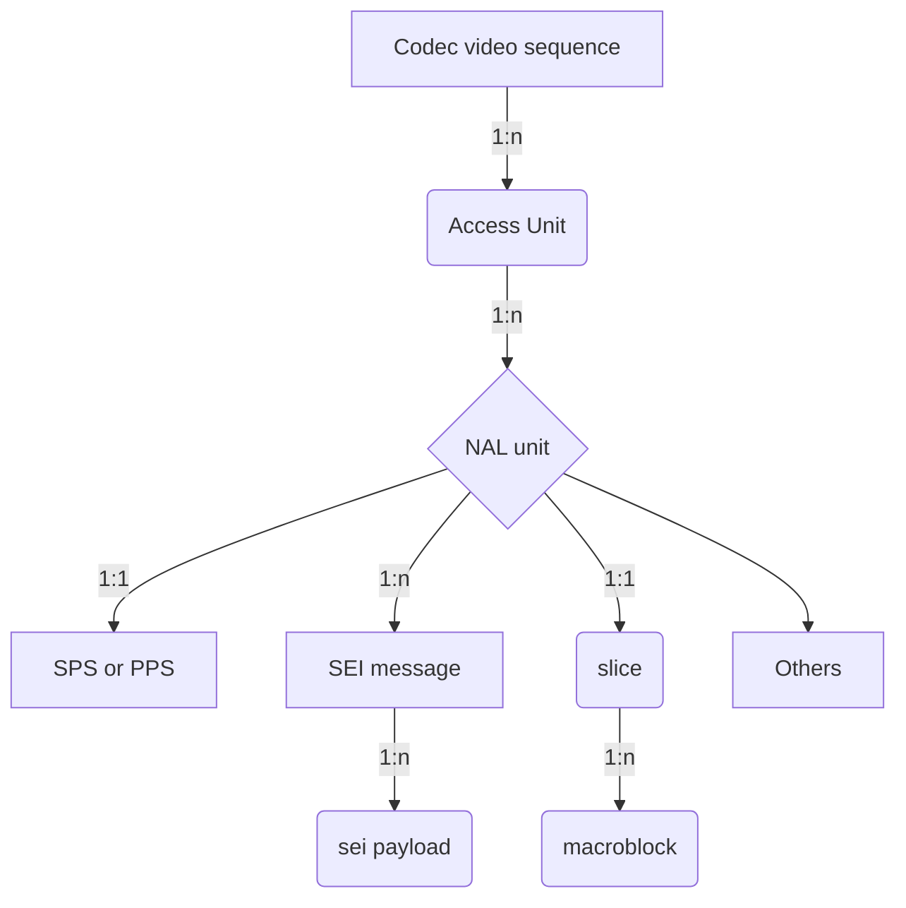

# Media Syntax Element Locator
## Contents
* [Abbreviation](#abbreviation)
* [What's media syntax element?](#whats-media-syntax-element)
* [How to locate the media syntax element?](#how-to-locate-the-media-syntax-element)
* [Commands](#commands)
	* [`listMSE` command](#listmse-command)
	* [`showMSE` command](#showmse-command)

## Abbreviation
* **URI**: Uniform Resource Identifier
* **MSE**: Media Syntax Element
* **AU**: Access Unit
* **CVS**: Codec Video Sequence
* **TU**: Temporal Unit
* **FU**: Frame Unit
* **OBU**: Open Bitstream Unit
* **GOP**: Group of Picture
* **NU**: NAL Unit
* **PL**: Payload
* **MSG**: Message
* **SEIPL**: SEI payload
* **SEIMSG**: SEI Message

[Top](#contents)

## What's media syntax element?
For the audio, video and other multimedia payload, in the corresponding technical specification, it defined its data organization, and let's call the minimum organization units as `syntax element`, normally it is hierarchical, and defined in tabular form, for example, H.264, it consists of:


[Top](#contents)
## How to locate the media syntax element?
Since every media syntax element can be unpacked, and parsed, and its syntax view can also be displayed, we need defined a media syntax element locator protocol to locate it accurately.
In this document, we follow the RFC3986,
```
      URI         = scheme ":" hier-part [ "?" query ] [ "#" fragment ]

      hier-part   = "//" authority path-abempty
                  / path-absolute
                  / path-rootless
                  / path-empty
```
scheme: only support `MSE`, it can be also ignored
hier-part: the media syntax element locate part, it is the media object, or syntactic elements defined in each multimedia specification scheme
query and framgment: it is the syntax structure in the media object or syntactic element.

*hier-part: [SE`i`].[SE`j`].[MediaUnit`k`]..../syntax/element/inside/...#leaf-field*

For example, it shows,
### NAL bitstream media syntax locator
*[MSE://][SEIPL`i`].[SEIMSG`j`].[NU`k`].[AU`l`].[CVS`m`]/part/part/...#field*

| URI | comment |
| --- | --- |
| AU`50` | The access-unit#50(0-based) |
| NU`50` | The NAL unit#50(0-based) in the whole NAL bitstream |
| SEIMSG`50`| The SEI message#50(0-based) in the whole NAL bitstream|
| SEIPL`50`|The SEI payload#50(0-based) in the whole NAL bitstream|
| SEIPL`0`.AU`50`|The SEI payload#0 in the whole Access-unit#50|
| SEIPL`1`.SEIMSG`0`.NU`50`|The SEI payload#1(0-based) of SEI message#0 of NAL-unit#50 in the whole NAL bitstream|
| SEIPL`0`.SEIMSG`0`.NU`4`.AU`100`|The SEI payload#0 of SEI message#0 of NAL-unit#4 of Access-unit#100 in the whole NAL stream|
| NU`2`.AU`60`|The NAL-unit#2(0-based) of Access-Unit#60 in the whole NAL stream|
| NU`1`/seq_parameter_set_rbsp/vui_parameters|vui_parameters of NAL-unit#1(it is a SPS NU)|
| NU`1`/*/vui_parameters#aspect_ratio_idc |the `aspect_ratio_idc` field of VUI of NAL-unit#1|

### AV1 bitstream media syntax locator
*[MSE://][OBU`i`].[FU`j`].[TU`k`]/part/part/...#field*
| URI | comment |
| --- | --- |
| TU`50` | The temporal-unit#50(0-based) |
| FU`50` | The Frame unit#50(0-based) in the whole AV1 bitstream instead of a specified TU |
| OBU`50`| The OBU#50(0-based) in the whole AV1 bitstream instead of a specified TU or/and a specified FU|
| OBU`0`.TU`50`|The first OBU in temporal-unit#50|
| OBU`1`.FU`0`.TU`50`|The 2nd OBU in first the frame-unit of the temporal-unit#50|
| OBU`0`.FU`100`|The 1st OBU of frame-unit#100 in the whole AV1 stream|
| OBU`0`/sequence_header_obu/color_config|color_config in sequence header OBU|
| OBU`0`/sequence_header_obu/color_config#BitDepth|The `BitDepth` field in sequence_header_obu's color config|

### MPEG video bitstream media syntax locator
*[MSE://][SE`n`].[SLICE`l`].[AU`k`].[GOP`j`].[VSEQ`i`]/part/part/...#field*

- AU
    Normally a MPEG2 video frame, I frame may start video sequence_header + sequence_extension + extension_and_user_data(0) + group_of_pictures_header + extension_and_user_data(1) + picture_header + ...
- SE (syntactic element)
	The basic element start with start_code, for example, sequence_header, sequence_extension and so on 

| URI | comment |
| --- | --- |
| VSEQ`1` | The 2nd video sequence in the MPEG video bitstream |
| GOP`50` | The GOP#50(0-based) in the whole MPEG video bitstream instead of a specified video sequence |
| AU`50` | The access-unit#50(0-based) in the whole MPEG video bitstream instead of a specified video sequence or/and a specified GOP |
| AU`50`.VSEQ`1` |The access-unit#50(0-based) in the second video sequence|
| AU`1`.GOP`0`.VSEQ`1` |The 2nd access-unit of the first GOP in the 2nd video sequence|
| SE`0`.GOP`0`.VSEQ`1`/#aspect_ratio_information |aspect_ratio_information of sequence header if SE#0 is a sequence header|

### ISOBMFF box media syntax unit locator
*[MSE://]box`i`].[box`j`]........[box`n`]/sub/object/#field*
Here are some examples:
```
mvhd.moov/#creation_time
stsd.stbl.minf.mdia.track0.moov/AVCSampleEntry#width
//*/*/Projection
```
## Commands
At present, support 2 kinds of command, one is `listMSE` , another is `showMSE`,

### `listMSE` command
`listMSE` is used to list the media syntax element:
```
DumpTS xxxx.h264 --listMSE=MSE://AU
```
And it may show the below output

```
...
---------Name---------------|--URI---|
Access-Unit#123	            |--AU123-|
...
```
List AU/NU tree
```
DumpTS xxxxx.h264 --listMSE=NU.AU
```
And then
```
----------Name--------------|----len----|----URI-----|------------Description-------------------
...
Access-Unit#84                            | AU84     | Access unit delimiter
    NAL Unit#0 non-VCL::AUD |       2 B | NU0.AU84   | Sequence parameter set
    NAL Unit#1 non-VCL::SPS |      51 B | NU1.AU84   | Picture parameter set
    NAL Unit#2 non-VCL::PPS |       6 B | NU2.AU84   | Supplemental enhancement information(SEI)
    NAL Unit#3 non-VCL::SEI |      14 B | NU3.AU84   | Supplemental enhancement information(SEI)
    NAL Unit#4 non-VCL::SEI |      14 B | NU4.AU84   | Supplemental enhancement information(SEI)
    NAL Unit#5 non-VCL::SEI |       5 B | NU5.AU84   | Supplemental enhancement information(SEI)
    NAL Unit#6 VCL::IDR     | 113,827 B | NU6.AU84   | Coded slice of an IDR picture
    NAL Unit#7 VCL::IDR     | 114,431 B | NU7.AU84   | Coded slice of an IDR picture
    NAL Unit#8 VCL::IDR     |  94,709 B | NU8.AU84   | Coded slice of an IDR picture
    NAL Unit#9 VCL::IDR     |  75,413 B | NU9.AU84   | Coded slice of an IDR picture
...
```
List TU/FR/OBU tree
```
DumpTS xxxxx.av1 --listMSE=OBU.FU.TU
```
And then
```
----Name-------------------|--len---|------URI------|obu_size|OBU start|
...
Temporal Unit#41           |  xxx B |          TU41 |        |         |
    Frame Unit#0           |  xxx B |      FU0.TU41 |        |         |
        OBU#0 Frame OBU    |  580 B | OBU0.FU0.TU41 |  579 B | OBU100  |
    Frame Unit#1           |  xxx B |      FU1.TU41 |        |         |
        OBU#0: Frame OBU   |  439 B | OBU0.FU1.TU41 |  438 B | OBU101  |
    Frame Unit#2           |  xxx B |      FU2.TU41 |        |         |
        OBU#0: Frame OBU   |  305 B | OBU0.FU2.TU41 |  304 B | OBU102  |
...
```
List VideoSequence/GOP/AU/SE tree

List ISOBMFF boxes
```
DumpTS xxxxx.mp4 --listMSE
```
And then
```
  --------------Box name-----------------------------|---len----|-----Description-----------------
  .
  |--ftyp                                            |          | File Type Box
  |--free                                            |          | Free Space Box
  |--mdat                                            |          | Media Data Box
  |--moov                                            |          | Movie Box
       |--mvhd                                       |          | Movie Header Box
       |--trak -- track_ID: 1, duration: 8.008s      |          | Track Box
       |    |--tkhd                                  |          | 
       |    |--edts                                  |          | 
       |    |    |--elst                             |          | 
       |    |--mdia                                  |          | 
       |         |--mdhd                             |          | 
       |         |--hdlr -- Video track              |          | 
       |         |--minf                             |          | 
       |              |--vmhd                        |          | 
       |              |--dinf                        |          | 
       |              |    |--dref                   |          | 
       |              |--stbl                        |          | 
       |                   |--stsd -- avc1@1920x1080 |          | 
       |                   |    |--avc1              |          | 
       |                   |         |--avcC         |          | 
       |                   |         |--pasp         |          | 
       |                   |--stts                   |          | 
       |                   |--stss                   |          | 
       |                   |--ctts                   |          | 
       |                   |--stsc                   |          | 
       |                   |--stsz                   |          | 
       |                   |--stco                   |          | 
       |--trak -- track_ID: 2, duration: 8.054s      |          | 
       |    |--tkhd                                  |          | 
       |    |--edts                                  |          | 
       |    |    |--elst                             |          | 
       |    |--mdia                                  |          | 
       |         |--mdhd                             |          | 
       |         |--hdlr -- Audio track              |          | 
       |         |--minf                             |          | 
       |              |--smhd                        |          | 
       |              |--dinf                        |          | 
       |              |    |--dref                   |          | 
       |              |--stbl                        |          | 
       |                   |--stsd -- mp4a@48000HZ   |          | 
       |                   |    |--mp4a              |          | 
       |                   |         |--esds         |          | 
       |                   |--stts                   |          | 
       |                   |--stsc                   |          | 
       |                   |--stsz                   |          | 
       |                   |--stco                   |          | 
       |--udta                                       |          | 
            |--meta                                  |          | 
                 |--hdlr                             |          | 
                 |--ilst                             |          |
```
Show a part of ISOBMFF tree
```
DumpTS xxxxx.mp4 --listMSE=minf.mdia.trak0.moov
```
And then,
```
moov.trak[0].mdia.minf 
  ------- Box Name --------------|---len----|-----Description-----------------
  |--vmhd                        |          | 
  |--dinf                        |          | 
  |    |--dref                   |          | 
  |--stbl                        |          | 
  	   |--stsd -- avc1@1920x1080 |          | 
  	   |    |--avc1              |          | 
  	   |         |--avcC         |          | 
  	   |         |--pasp         |          | 
  	   |--stts                   |          | 
  	   |--stss                   |          | 
  	   |--ctts                   |          | 
  	   |--stsc                   |          | 
  	   |--stsz                   |          | 
  	   |--stco                   |          | 
  
```

### `showMSE` command

[Top](#contents)
