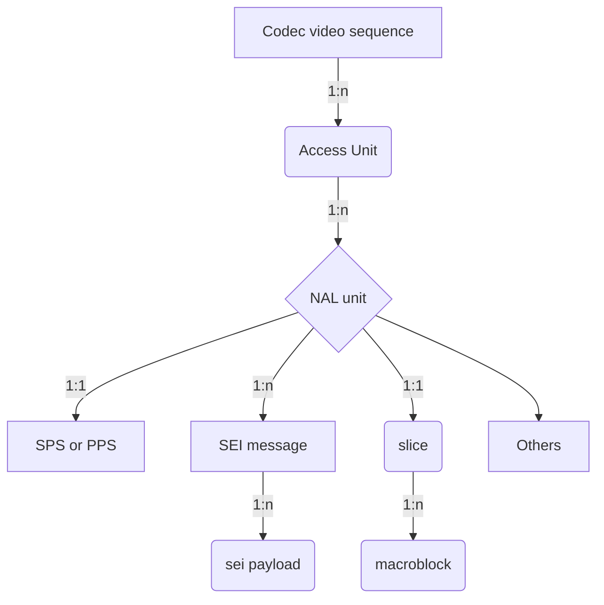

# Media Syntax Element Locator
## Contents
* [Abbreviation](#abbreviation)
* [What's media syntax element?](#whats-media-syntax-element)
* [How to locate the media syntax element?](#how-to-locate-the-media-syntax-element)
	* [MPEG video bitstream media syntax element locator](#mpeg-video-bitstream-media-syntax-element-locator)
	* [NAL bitstream media syntax element locator](#nal-bitstream-media-syntax-element-locator)
	* [AV1 bitstream media syntax element locator](#av1-bitstream-media-syntax-element-locator)
	* [ISOBMFF media syntax element locator](#isobmff-media-syntax-element-locator)
* [Commands](#commands)
	* [`listMSE` command](#listmse-command)
		* [MPEG2 Video](#mpeg2-video)
			* [1. List all video sequences](#list-all-video-sequences)
			* [2. List all GOPs](#list-all-gops)
			* [3. List all access units](#list-all-access-units)
			* [4. List all MPEG2 syntactic elements](#list-all-mpeg2-syntactic-elements)
			* [5. List all slices](#list-all-slices)
			* [6. List all non-slices syntactic elements](#list-all-non-slices-syntactic-elements)
			* [7. List all macro-blocks](#list-all-macro-blocks)
			* [8. List all GOPs in a specified video sequence](#list-all-gops-in-a-specified-video-sequence)
			* [9. List all access-units in a specified GOP](#list-all-access-units-in-a-specified-gop)
			* [10. List some syntax elements in a/some specified GOP(s) or/and Access Unit(s)](#list-some-syntax-elements-in-a-or-some-specified-gops-orand-access-units)
		* [NAL Video](#nal-video)
			* [1. List all NAL video sequences](#list-all-nal-video-sequences)
			* [2. List all GOPs(CVSes)](#list-all-gopscvses)
			* [3. List all access units](#list-all-access-units)
			* [4. List NAL Units](#list-nal-units)
			* [5. List all SEI messages](#list-all-sei-messages)
			* [6. List all SEI payloads](#list-all-sei-payloads)
			* [7. List all VCL NAL units](#list-all-vcl-nal-units)
			* [8. List all non-VCL NAL units](#list-all-non-vcl-nal-units)
			* [9. List all access units in a specified GOP](#list-all-access-units-in-a-specified-gop)
			* [10. List the first access unit of the specified GOP in a specified video sequence](#list-the-first-access-unit-of-the-specified-gop-in-a-specified-video-sequence)
			* [11. List SEI payloads in a specified access unit of a specified GOP](#list-sei-payloads-in-a-specified-access-unit-of-a-specified-gop)
			* [12. Other complex cases](#Other-complex-cases)
		* [AV1 Video](#av1-video)
			* [1. List all AV1 video sequences](#List-all-av1-video-sequences)
			* [2.-List-all AV1 GOPs(CVSes)](#List-all-AV1-GOPsCVSes)
			* [3.-List-all Temporal Units](#List-all-Temporal-Units)
			* [4.-List-all Frame Units](#List-all-Frame-Units)
			* [5.-List-all OBUs](#List-all-OBUs)
			* [6.-List-all Frame OBUs](#List-all-Frame-OBUs)
			* [7.-List-all Temporal Units In a specified Video Sequence](#List-all-Temporal-Units-In-a-specified-Video-Sequence)
			* [8. List the first Temporal Unit of some specified CVS in a specified Video Sequence](#List-the-first-Temporal-Unit-of-some-specified-CVS-in-a-specified-Video-Sequence)
			* [9. List all OBUs in a specified Temporal Unit](#List-all-OBUs-in-a-specified-Temporal-Unit)
			* [10. List all OBUs in some specified Temporal Units of a specified CVS](#List-all-OBUs-in-some-specified-Temporal-Units-of-a-specified-CVS)
		* [VVC/H.266 Video](#vvch266-video)
		* [ISOBMFF](#ISOBMFF)
	* [`showMSE` command](#showmse-command)
		* [MPEG2 Video Syntax View](#mpeg2-video-syntax-view)
			* [1. Show Sequence Header](#show-sequence-header)
			* [2. Show sequence header and extension together](#show-sequence-header-and-extension-together)
			* [3. Show all syntactic elements with full hierarchical layout](#show-all-syntactic-elements-with-full-hierarchical-layout)
			* [4. Show syntax view of the first access-unit of the 3rd and 4th GOP](#show-syntax-view-of-the-first-access-unit-of-the-3rd-and-4th-gop)
		* [NAL Video Syntax View](#nal-video-syntax-view)
			* [1. Show syntax view of VPS](#show-syntax-view-of-vps)
			* [2. Show the syntax view of all NAL units](#show-the-syntax-view-of-all-nal-units)
			* [3. Show all SEI payloads syntax view](#show-all-sei-payloads-syntax-view)
		* [AV1 Video Syntax View](#av1-video-syntax-view)
			* [1. Show syntax view of Sequence Header](#Show-syntax-view-of-Sequence-Header)
			* [2. Show the syntax view of all syntax elements](#Show-the-syntax-view-of-all-syntax-elements)
			* [3. Show syntax view of the specified OBU](#Show-syntax-view-of-the-specified-OBU)
	* [`showMSEHex` command](#showmse-command)

[Return to Main](../README.md)
## Abbreviation
* **URI**: Uniform Resource Identifier
* **MSE**: Media Syntax Element
* **VSEQ**: Video Sequence, one VSEQ should have the same profile, level, tier(if have), resolution, fps, aspect-ratio, colour primaries, transfer characteristics and so on
* **AU**: Access Unit
* **CVS**: Codec Video Sequence, like as GOP
* **TU**: Temporal Unit
* **FU**: Frame Unit
* **OBU**: Open Bitstream Unit
* **GOP**: Group of Picture, included open GOP, closed GOP
* **NU**: NAL Unit, including VCL/none-VCL NAL Unit
* **PL**: Payload
* **MSG**: Message
* **SEIPL**: SEI payload
* **SEIMSG**: SEI Message
* **SE**: Syntax Element, normally the minimum organization unit

[Top](#contents)

## What's media syntax element?
For the audio, video and other multimedia payload, in the corresponding technical specification, it defined its data organization, and let's call the minimum organization units as `syntax element`, normally it is hierarchical, and defined in tabular form, for example, H.264, it consists of:


[Top](#contents)
## How to locate the media syntax element?
Since every media syntax element can be unpacked, and parsed, and its syntax view can also be displayed, we need defined a media syntax element locator protocol to locate it accurately.
In this document, we follow the RFC3986,
```
      URI         = scheme ":" hier-part [ "?" query ] [ "#" fragment ]

      hier-part   = "//" authority path-abempty
                  / path-absolute
                  / path-rootless
                  / path-empty
```
scheme: only support `MSE`, it can be also ignored
hier-part: the media syntax element locate part, it is the media object, or syntactic elements defined in each multimedia specification scheme
query and framgment: it is the syntax structure in the media object or syntactic element.

**hier-part** *: `[syntax-element-filter[.syntax-element-filter[....]]][/syntax/element/inside/...][#leaf-field]`*

**syntax_element-fitler** *: `[`~`]syntax_element[s][-][e]]`*

**~** *:exclude the followed syntax element(s), or range*

**s** *:the start index(0-based) of syntax element in its parents*

**e** *:the end index(0-based) of syntax element in its parents*

### MPEG video bitstream media syntax element locator
*[MSE://][[`~`]**MB**[`m₀`][`-`][`mₙ`]][.]\([[`~`]**SE**[`s₀`][`-`][`sₙ`]] | [[`~`]**SLICE**[`s₀`][`-`][`sₙ`]])[.][[`~`]**AU**[`a₀`][`-`][`aₙ`]][.][[`~`]**GOP**[`g₀`][`-`][`gₙ`]][.][[`~`]**VSEQ**[`v₀`][`-`][`vₙ`]][/part/part/...][#field]*

- AU
    Normally a MPEG2 video frame, I frame may start video sequence_header + sequence_extension + extension_and_user_data(0) + group_of_pictures_header + extension_and_user_data(1) + picture_header + ...
- SE (syntactic element)
	The basic element start with start_code, for example, sequence_header, sequence_extension and so on 

| URI | comment |
| --- | --- |
| VSEQ`1` | The 2nd video sequence in the MPEG video bitstream |
| GOP`50` | The GOP#50(0-based) in the whole MPEG video bitstream instead of a specified video sequence |
| AU`50` | The access-unit#50(0-based) in the whole MPEG video bitstream instead of a specified video sequence or/and a specified GOP |
| AU`50`.VSEQ`1` |The access-unit#50(0-based) in the second video sequence|
| AU`1`.GOP`0`.VSEQ`1` |The 2nd access-unit of the first GOP in the 2nd video sequence|
| SE`0`.GOP`0`.VSEQ`1`/#aspect_ratio_information |aspect_ratio_information of sequence header if SE#0 is a sequence header|
|~slice.au`1`|all non-slice syntax elements of the 2nd access-unit|
|slice.au`1-2`|all slices of access-unit 1 and 2|

Here are some command examples:
```
DumpTS 00023.m2v --listmse
```
Show all syntax elements in a MPEG2 video stream:
```
------------Name-------------------------------|-----len-----|------------URI-------------
Video Sequence#0                               |             |                      VSEQ0
    GOP#0 (closed)                             |             |                 GOP0.VSEQ0
        AU#0 (I)                               |    91,997 B |             AU0.GOP0.VSEQ0
            SE#0 sequence_header               |       140 B |         SE0.AU0.GOP0.VSEQ0
            SE#1 sequence_extension            |        10 B |         SE1.AU0.GOP0.VSEQ0
            SE#2 group_of_pictures_header      |         8 B |         SE2.AU0.GOP0.VSEQ0
            SE#3 picture_header                |         8 B |         SE3.AU0.GOP0.VSEQ0
            SE#4 picture_coding_extension      |         9 B |         SE4.AU0.GOP0.VSEQ0
            SE#5 slice1                        |       688 B |         SE5.AU0.GOP0.VSEQ0
            SE#6 slice2                        |       692 B |         SE6.AU0.GOP0.VSEQ0
            SE#7 slice3                        |       698 B |         SE7.AU0.GOP0.VSEQ0
            SE#8 slice4                        |       714 B |         SE8.AU0.GOP0.VSEQ0
            SE#9 slice5                        |       831 B |         SE9.AU0.GOP0.VSEQ0
            SE#10 slice6                       |     1,691 B |        SE10.AU0.GOP0.VSEQ0
            SE#11 slice7                       |     1,798 B |        SE11.AU0.GOP0.VSEQ0
            SE#12 slice8                       |     1,730 B |        SE12.AU0.GOP0.VSEQ0
            SE#13 slice9                       |     1,747 B |        SE13.AU0.GOP0.VSEQ0
            SE#14 slice10                      |     1,746 B |        SE14.AU0.GOP0.VSEQ0
            SE#15 slice11                      |     1,714 B |        SE15.AU0.GOP0.VSEQ0
            SE#16 slice12                      |     1,723 B |        SE16.AU0.GOP0.VSEQ0
            SE#17 slice13                      |     1,762 B |        SE17.AU0.GOP0.VSEQ0
            SE#18 slice14                      |     1,846 B |        SE18.AU0.GOP0.VSEQ0
            SE#19 slice15                      |     1,824 B |        SE19.AU0.GOP0.VSEQ0
            SE#20 slice16                      |     1,842 B |        SE20.AU0.GOP0.VSEQ0
            SE#21 slice17                      |     1,792 B |        SE21.AU0.GOP0.VSEQ0
            SE#22 slice18                      |     1,779 B |        SE22.AU0.GOP0.VSEQ0
            SE#23 slice19                      |     1,769 B |        SE23.AU0.GOP0.VSEQ0
            SE#24 slice20                      |     1,791 B |        SE24.AU0.GOP0.VSEQ0
            SE#25 slice21                      |     1,827 B |        SE25.AU0.GOP0.VSEQ0
            SE#26 slice22                      |     1,923 B |        SE26.AU0.GOP0.VSEQ0
            SE#27 slice23                      |     1,869 B |        SE27.AU0.GOP0.VSEQ0
            SE#28 slice24                      |     1,903 B |        SE28.AU0.GOP0.VSEQ0
            SE#29 slice25                      |     1,847 B |        SE29.AU0.GOP0.VSEQ0
            SE#30 slice26                      |     1,842 B |        SE30.AU0.GOP0.VSEQ0
            SE#31 slice27                      |     1,778 B |        SE31.AU0.GOP0.VSEQ0
            SE#32 slice28                      |     1,678 B |        SE32.AU0.GOP0.VSEQ0
            SE#33 slice29                      |     1,620 B |        SE33.AU0.GOP0.VSEQ0
......
```
According to the command `listmse=gop`, we can know how many gops in this MPEG2 video stream, and now we want to show access-units of  the first and the last GOP,
```
DumpTS 00023.m2v --listmse=au.~gop1-119
```
And then
```
------------Name-------------------------------|-----len-----|------------URI-------------
GOP#0 (closed)                                 |             |                       GOP0
    AU#0 (I)                                   |    91,997 B |                   AU0.GOP0
    AU#1 (P)                                   |    83,847 B |                   AU1.GOP0
    AU#2 (B)                                   |    22,773 B |                   AU2.GOP0
    AU#3 (B)                                   |    53,424 B |                   AU3.GOP0
    AU#4 (P)                                   |   111,616 B |                   AU4.GOP0
    AU#5 (B)                                   |    63,292 B |                   AU5.GOP0
    AU#6 (B)                                   |    64,618 B |                   AU6.GOP0
    AU#7 (P)                                   |   131,912 B |                   AU7.GOP0
    AU#8 (B)                                   |    67,947 B |                   AU8.GOP0
    AU#9 (B)                                   |    70,578 B |                   AU9.GOP0
    AU#10 (P)                                  |   140,350 B |                  AU10.GOP0
    AU#11 (B)                                  |    79,321 B |                  AU11.GOP0
    AU#12 (B)                                  |    68,619 B |                  AU12.GOP0
GOP#120 (closed)                               |             |                     GOP120
    AU#0 (I)                                   |   117,313 B |                 AU0.GOP120
```
### NAL bitstream media syntax element locator
*[MSE://][[`~`]**SEIPL**[`sp₀`][`-`][`spₙ`]][.][[`~`]**SEIMSG**[`sm₀`][`-`][`smₙ`]][.]\([[`~`]**NU**[`n₀`][`-`][`nₙ`]] | [[`~`]**VCL**[`v₀`][`-`][`vₙ`]] | [[`~`]**SEINU**[`su₀`][`-`][`suₙ`]] | [[`~`]**AUD**[`aud₀`][`-`][`audₙ`]] | [[`~`]**VPS**[`vps₀`][`-`][`vpsₙ`]] | [[`~`]**SPS**[`sps₀`][`-`][`spsₙ`]] | [[`~`]**PPS**[`pps₀`][`-`][`ppsₙ`]] | [[`~`]**IDR**[`idr₀`][`-`][`idrₙ`]] | [[`~`]**FIL**[`fil₀`][`-`][`filₙ`]])[.][[`~`]**AU**[`a₀`][`-`][`aₙ`]][.][[`~`]**CVS**[`c₀`][`-`][`cₙ`]][.][[`~`]**VSEQ**[`v₀`][`-`][`vₙ`]][/part/part/...][#field]*

| URI | comment |
| --- | --- |
| AU`50` | The access-unit#50(0-based) |
| NU`50` | The NAL unit#50(0-based) in the whole NAL bitstream |
| SEIMSG`50`| The SEI message#50(0-based) in the whole NAL bitstream|
| SEIPL`50`|The SEI payload#50(0-based) in the whole NAL bitstream|
| SEIPL`0`.AU`50`|The SEI payload#0 in the whole Access-unit#50|
| SEIPL`1`.SEIMSG`0`.NU`50`|The SEI payload#1(0-based) of SEI message#0 of NAL-unit#50 in the whole NAL bitstream|
| SEIPL`0`.SEIMSG`0`.NU`4`.AU`100`|The SEI payload#0 of SEI message#0 of NAL-unit#4 of Access-unit#100 in the whole NAL stream|
| NU`2`.AU`60`|The NAL-unit#2(0-based) of Access-Unit#60 in the whole NAL stream|
| NU`1`/seq_parameter_set_rbsp/vui_parameters|vui_parameters of NAL-unit#1(it is a SPS NU)|
| NU`1`/*/vui_parameters#aspect_ratio_idc |the `aspect_ratio_idc` field of VUI of NAL-unit#1|
|~vcl.au`1`|all VCL NAL units of the 2nd access-unit|
|vcl.au`1-2`|all VCL NAL units of access-unit 1 and 2|

for example,
```
DumpTS 00005.h264 --listmse
```
And all syntax elements with the hierarchical layout will be shown as,
```
------------Name-------------------------------|-----len-----|------------URI----------------------
Video Sequence#0                               |             |                               VSEQ0
    CVS#1 (IDR, closed GOP)                    |             |                          CVS1.VSEQ0
        AU#0 (I)                               |   288,631 B |                      AU0.CVS1.VSEQ0
            NU#0 non-VCL::AUD                  |         2 B |                  NU0.AU0.CVS1.VSEQ0
            NU#1 non-VCL::SPS                  |        51 B |                  NU1.AU0.CVS1.VSEQ0
            NU#2 non-VCL::PPS                  |         5 B |                  NU2.AU0.CVS1.VSEQ0
            NU#3 non-VCL::SEI                  |        15 B |                  NU3.AU0.CVS1.VSEQ0
                SEI message#0                  |        12 B |          SEIMSG0.NU3.AU0.CVS1.VSEQ0
                    #0 buffering_period        |        10 B |   SEIPL0.SEIMSG0.NU3.AU0.CVS1.VSEQ0
            NU#4 non-VCL::SEI                  |        14 B |                  NU4.AU0.CVS1.VSEQ0
                SEI message#0                  |        11 B |          SEIMSG0.NU4.AU0.CVS1.VSEQ0
                    #0 pic_timing              |         9 B |   SEIPL0.SEIMSG0.NU4.AU0.CVS1.VSEQ0
            NU#5 non-VCL::SEI                  |         5 B |                  NU5.AU0.CVS1.VSEQ0
                SEI message#0                  |         3 B |          SEIMSG0.NU5.AU0.CVS1.VSEQ0
                    #0 recovery_point          |         1 B |   SEIPL0.SEIMSG0.NU5.AU0.CVS1.VSEQ0
            NU#6 VCL::IDR                      |    81,092 B |                  NU6.AU0.CVS1.VSEQ0
            NU#7 VCL::IDR                      |    71,634 B |                  NU7.AU0.CVS1.VSEQ0
            NU#8 VCL::IDR                      |    74,525 B |                  NU8.AU0.CVS1.VSEQ0
            NU#9 VCL::IDR                      |    61,255 B |                  NU9.AU0.CVS1.VSEQ0
        AU#1 (P)                               |    81,464 B |                      AU1.CVS1.VSEQ0
            NU#0 non-VCL::AUD                  |         2 B |                  NU0.AU1.CVS1.VSEQ0
            NU#1 non-VCL::SEI                  |        14 B |                  NU1.AU1.CVS1.VSEQ0
                SEI message#0                  |        11 B |          SEIMSG0.NU1.AU1.CVS1.VSEQ0
                    #0 pic_timing              |         9 B |   SEIPL0.SEIMSG0.NU1.AU1.CVS1.VSEQ0
            NU#2 VCL::non-IDR                  |    29,112 B |                  NU2.AU1.CVS1.VSEQ0
            NU#3 VCL::non-IDR                  |    16,360 B |                  NU3.AU1.CVS1.VSEQ0
            NU#4 VCL::non-IDR                  |    19,939 B |                  NU4.AU1.CVS1.VSEQ0
            NU#5 VCL::non-IDR                  |    16,018 B |                  NU5.AU1.CVS1.VSEQ0
        AU#2 (B)                               |    31,964 B |                      AU2.CVS1.VSEQ0
            NU#0 non-VCL::AUD                  |         2 B |                  NU0.AU2.CVS1.VSEQ0
            NU#1 non-VCL::SEI                  |        14 B |                  NU1.AU2.CVS1.VSEQ0
                SEI message#0                  |        11 B |          SEIMSG0.NU1.AU2.CVS1.VSEQ0
                    #0 pic_timing              |         9 B |   SEIPL0.SEIMSG0.NU1.AU2.CVS1.VSEQ0
            NU#2 VCL::non-IDR                  |    11,297 B |                  NU2.AU2.CVS1.VSEQ0
            NU#3 VCL::non-IDR                  |     6,227 B |                  NU3.AU2.CVS1.VSEQ0
            NU#4 VCL::non-IDR                  |     7,861 B |                  NU4.AU2.CVS1.VSEQ0
            NU#5 VCL::non-IDR                  |     6,544 B |                  NU5.AU2.CVS1.VSEQ0
        AU#3 (B)                               |    32,751 B |                      AU3.CVS1.VSEQ0
            NU#0 non-VCL::AUD                  |         2 B |                  NU0.AU3.CVS1.VSEQ0
            NU#1 non-VCL::SEI                  |        14 B |                  NU1.AU3.CVS1.VSEQ0
                SEI message#0                  |        11 B |          SEIMSG0.NU1.AU3.CVS1.VSEQ0
                    #0 pic_timing              |         9 B |   SEIPL0.SEIMSG0.NU1.AU3.CVS1.VSEQ0
            NU#2 VCL::non-IDR                  |    11,903 B |                  NU2.AU3.CVS1.VSEQ0
```

### AV1 bitstream media syntax element locator
*[MSE://]\([[`~`]**OBU**[`o₀`][`-`][`oₙ`]] | [[`~`]**Frame**[`f₀`][`-`][`fₙ`]])[.][[`~`]**FU**[`fu₀`][`-`][`fuₙ`]][.][[`~`]**TU**[`tu₀`][`-`][`tuₙ`]][.][[`~`]**CVS**[`c₀`][`-`][`cₙ`]][.][[`~`]**VSEQ**[`v₀`][`-`][`vₙ`]][/part/part/...][#field]*

| URI | comment |
| --- | --- |
| TU`50` | The temporal-unit#50(0-based) |
| FU`50` | The Frame unit#50(0-based) in the whole AV1 bitstream instead of a specified TU |
| OBU`50`| The OBU#50(0-based) in the whole AV1 bitstream instead of a specified TU or/and a specified FU|
| OBU`0`.TU`50`|The first OBU in temporal-unit#50|
| OBU`1`.FU`0`.TU`50`|The 2nd OBU in first the frame-unit of the temporal-unit#50|
| OBU`0`.FU`100`|The 1st OBU of frame-unit#100 in the whole AV1 stream|
| OBU`0`/sequence_header_obu/color_config|color_config in sequence header OBU|
| OBU`0`/sequence_header_obu/color_config#BitDepth|The `BitDepth` field in sequence_header_obu's color config|

For example,
```
DumpTS Stream3_AV1_720p_3.9mbps.av1 --listmse
```
And all syntax elements with the hierarchical layout will be shown as,
```
Low-Overhead AV1 bitstream...
------------Name-------------------------------|-----len-----|------------URI-----------------
Video Sequence#0                               |             |                          VSEQ0
    CVS#0                                      |             |                     CVS0.VSEQ0
        TU#0 (Key frame)                       |    84,891 B |                 TU0.CVS0.VSEQ0
            FU#0 (Key frame)                   |    84,891 B |             FU0.TU0.CVS0.VSEQ0
                OBU#0 Temporal delimiter       |         2 B |        OBU0.FU0.TU0.CVS0.VSEQ0
                OBU#1 Sequence header          |        13 B |        OBU1.FU0.TU0.CVS0.VSEQ0
                OBU#2 Frame                    |    84,876 B |        OBU2.FU0.TU0.CVS0.VSEQ0
        TU#1 (Inter frame)                     |   143,543 B |                 TU1.CVS0.VSEQ0
            FU#0 (Inter frame)                 |    77,815 B |             FU0.TU1.CVS0.VSEQ0
                OBU#0 Temporal delimiter       |         2 B |        OBU0.FU0.TU1.CVS0.VSEQ0
                OBU#1 Frame                    |    77,813 B |        OBU1.FU0.TU1.CVS0.VSEQ0
            FU#1 (Inter frame)                 |    36,935 B |             FU1.TU1.CVS0.VSEQ0
                OBU#0 Frame                    |    36,935 B |        OBU0.FU1.TU1.CVS0.VSEQ0
            FU#2 (Inter frame)                 |    17,391 B |             FU2.TU1.CVS0.VSEQ0
                OBU#0 Frame                    |    17,391 B |        OBU0.FU2.TU1.CVS0.VSEQ0
            FU#3 (Inter frame)                 |    11,402 B |             FU3.TU1.CVS0.VSEQ0
                OBU#0 Frame                    |    11,402 B |        OBU0.FU3.TU1.CVS0.VSEQ0
        TU#2 (Inter frame)                     |         5 B |                 TU2.CVS0.VSEQ0
            FU#0 (Inter frame)                 |         5 B |             FU0.TU2.CVS0.VSEQ0
                OBU#0 Temporal delimiter       |         2 B |        OBU0.FU0.TU2.CVS0.VSEQ0
                OBU#1 Frame header             |         3 B |        OBU1.FU0.TU2.CVS0.VSEQ0
        TU#3 (Inter frame)                     |    11,076 B |                 TU3.CVS0.VSEQ0
            FU#0 (Inter frame)                 |    11,076 B |             FU0.TU3.CVS0.VSEQ0
                OBU#0 Temporal delimiter       |         2 B |        OBU0.FU0.TU3.CVS0.VSEQ0
                OBU#1 Frame                    |    11,074 B |        OBU1.FU0.TU3.CVS0.VSEQ0
        TU#4 (Inter frame)                     |         5 B |                 TU4.CVS0.VSEQ0
            FU#0 (Inter frame)                 |         5 B |             FU0.TU4.CVS0.VSEQ0
                OBU#0 Temporal delimiter       |         2 B |        OBU0.FU0.TU4.CVS0.VSEQ0
                OBU#1 Frame header             |         3 B |        OBU1.FU0.TU4.CVS0.VSEQ0
......
```

### ISOBMFF media syntax element locator
*[MSE://]box`i`].[box`j`]........[box`n`]/sub/object/#field*
Here are some examples:
```
mvhd.moov/#creation_time
stsd.stbl.minf.mdia.track0.moov/AVCSampleEntry#width
//*/*/Projection
```
## Commands
At present, support 3 kinds of command, they are `listMSE` , `showMSE` and `showMSEHex`,

### `listMSE` command
`listMSE` is used to list the media syntax element， if there is no option value for it, all elements with hierarchical layout will be listed, please see the examples in the each byte stream scheme in the previous part, here are more examples:
#### MPEG2 Video

1. ##### List all video sequences
	```
	DumpTS 00023.m2v --listmse=vseq
	```
	And then,
	```
	------------Name-------------------------------|-----len-----|------------URI-------------
	Video Sequence#0                               |             |                      VSEQ0
	```
2. ##### List all GOPs
	```
	DumpTS 00023.m2v --listmse=gop
	```
	And then,
	```
	------------Name-------------------------------|-----len-----|------------URI-------------
	GOP#0 (closed)                                 |             |                       GOP0
	GOP#1 (open)                                   |             |                       GOP1
	GOP#2 (open)                                   |             |                       GOP2
	GOP#3 (open)                                   |             |                       GOP3
	GOP#4 (open)                                   |             |                       GOP4
	GOP#5 (open)                                   |             |                       GOP5
	GOP#6 (open)                                   |             |                       GOP6
	GOP#7 (open)                                   |             |                       GOP7
	GOP#8 (open)                                   |             |                       GOP8
	GOP#9 (open)                                   |             |                       GOP9
	GOP#10 (open)                                  |             |                      GOP10
	GOP#11 (open)                                  |             |                      GOP11
	GOP#12 (open)                                  |             |                      GOP12
	GOP#13 (open)                                  |             |                      GOP13
	GOP#14 (open)                                  |             |                      GOP14
	GOP#15 (open)                                  |             |                      GOP15
	GOP#16 (open)                                  |             |                      GOP16
	...
	```
3. ##### List all access units
	```
	DumpTS 00023.m2v --listmse=au
	```
	And then,
	```
	------------Name-------------------------------|-----len-----|------------URI-------------
	AU#0 (I)                                       |    91,997 B |                        AU0
	AU#1 (P)                                       |    83,847 B |                        AU1
	AU#2 (B)                                       |    22,773 B |                        AU2
	AU#3 (B)                                       |    53,424 B |                        AU3
	AU#4 (P)                                       |   111,616 B |                        AU4
	AU#5 (B)                                       |    63,292 B |                        AU5
	AU#6 (B)                                       |    64,618 B |                        AU6
	AU#7 (P)                                       |   131,912 B |                        AU7
	AU#8 (B)                                       |    67,947 B |                        AU8
	AU#9 (B)                                       |    70,578 B |                        AU9
	AU#10 (P)                                      |   140,350 B |                       AU10
	AU#11 (B)                                      |    79,321 B |                       AU11
	AU#12 (B)                                      |    68,619 B |                       AU12
	AU#13 (I)                                      |   282,790 B |                       AU13
	AU#14 (B)                                      |    53,920 B |                       AU14
	AU#15 (B)                                      |    52,587 B |                       AU15
	AU#16 (P)                                      |   107,529 B |                       AU16
	AU#17 (B)                                      |    48,750 B |                       AU17
	...
	```
4. ##### List all MPEG2 syntactic elements
	```
	DumpTS 00023.m2v --listmse=se
	```
	And then,
	```
	------------Name-------------------------------|-----len-----|------------URI-------------
	SE#0 sequence_header                           |       140 B |                        SE0
	SE#1 sequence_extension                        |        10 B |                        SE1
	SE#2 group_of_pictures_header                  |         8 B |                        SE2
	SE#3 picture_header                            |         8 B |                        SE3
	SE#4 picture_coding_extension                  |         9 B |                        SE4
	SE#5 slice1                                    |       688 B |                        SE5
	SE#6 slice2                                    |       692 B |                        SE6
	SE#7 slice3                                    |       698 B |                        SE7
	SE#8 slice4                                    |       714 B |                        SE8
	SE#9 slice5                                    |       831 B |                        SE9
	SE#10 slice6                                   |     1,691 B |                       SE10
	SE#11 slice7                                   |     1,798 B |                       SE11
	SE#12 slice8                                   |     1,730 B |                       SE12
	SE#13 slice9                                   |     1,747 B |                       SE13
	SE#14 slice10                                  |     1,746 B |                       SE14
	SE#15 slice11                                  |     1,714 B |                       SE15
	SE#16 slice12                                  |     1,723 B |                       SE16
	SE#17 slice13                                  |     1,762 B |                       SE17
	...
	```
5. ##### List all slices
	```
	DumpTS 00023.m2v --listmse=slice
	```
	And then,
	```
	------------Name-------------------------------|-----len-----|------------URI-------------
	Slice#0 slice1                                 |       688 B |                     SLICE0
	Slice#1 slice2                                 |       692 B |                     SLICE1
	Slice#2 slice3                                 |       698 B |                     SLICE2
	Slice#3 slice4                                 |       714 B |                     SLICE3
	Slice#4 slice5                                 |       831 B |                     SLICE4
	Slice#5 slice6                                 |     1,691 B |                     SLICE5
	Slice#6 slice7                                 |     1,798 B |                     SLICE6
	Slice#7 slice8                                 |     1,730 B |                     SLICE7
	Slice#8 slice9                                 |     1,747 B |                     SLICE8
	Slice#9 slice10                                |     1,746 B |                     SLICE9
	Slice#10 slice11                               |     1,714 B |                    SLICE10
	Slice#11 slice12                               |     1,723 B |                    SLICE11
	Slice#12 slice13                               |     1,762 B |                    SLICE12
	Slice#13 slice14                               |     1,846 B |                    SLICE13
	Slice#14 slice15                               |     1,824 B |                    SLICE14
	Slice#15 slice16                               |     1,842 B |                    SLICE15
	Slice#16 slice17                               |     1,792 B |                    SLICE16
	Slice#17 slice18                               |     1,779 B |                    SLICE17
	Slice#18 slice19                               |     1,769 B |                    SLICE18
	Slice#19 slice20                               |     1,791 B |                    SLICE19
	...
	```
6. ##### List all non-slices syntactic elements
	```
	DumpTS 00023.m2v --listmse=~slice
	```
	And then,
	```
	------------Name-------------------------------|-----len-----|------------URI-------------
	SE#0 sequence_header                           |       140 B |                        SE0
	SE#1 sequence_extension                        |        10 B |                        SE1
	SE#2 group_of_pictures_header                  |         8 B |                        SE2
	SE#3 picture_header                            |         8 B |                        SE3
	SE#4 picture_coding_extension                  |         9 B |                        SE4
	SE#73 picture_header                           |         9 B |                       SE73
	SE#74 picture_coding_extension                 |         9 B |                       SE74
	SE#143 picture_header                          |         9 B |                      SE143
	SE#144 picture_coding_extension                |         9 B |                      SE144
	SE#213 picture_header                          |         9 B |                      SE213
	SE#214 picture_coding_extension                |         9 B |                      SE214
	SE#283 picture_header                          |         9 B |                      SE283
	SE#284 picture_coding_extension                |         9 B |                      SE284
	SE#353 picture_header                          |         9 B |                      SE353
	SE#354 picture_coding_extension                |         9 B |                      SE354
	SE#423 picture_header                          |         9 B |                      SE423
	SE#424 picture_coding_extension                |         9 B |                      SE424
	SE#493 picture_header                          |         9 B |                      SE493
	SE#494 picture_coding_extension                |         9 B |                      SE494
	...
	```
7. ##### List all macro-blocks
	Not supported at present
8. ##### List all GOPs in a specified video sequence
	```
	DumpTS 00023.m2v --listmse=gop.vseq0
	```
	And then
	```
	------------Name-------------------------------|-----len-----|------------URI-------------
	Video Sequence#0                               |             |                      VSEQ0
	    GOP#0 (closed)                             |             |                 GOP0.VSEQ0
	    GOP#1 (open)                               |             |                 GOP1.VSEQ0
	    GOP#2 (open)                               |             |                 GOP2.VSEQ0
	    GOP#3 (open)                               |             |                 GOP3.VSEQ0
	    GOP#4 (open)                               |             |                 GOP4.VSEQ0
	    GOP#5 (open)                               |             |                 GOP5.VSEQ0
	    GOP#6 (open)                               |             |                 GOP6.VSEQ0
	    GOP#7 (open)                               |             |                 GOP7.VSEQ0
	    GOP#8 (open)                               |             |                 GOP8.VSEQ0
	    GOP#9 (open)                               |             |                 GOP9.VSEQ0
	    GOP#10 (open)                              |             |                GOP10.VSEQ0
	    GOP#11 (open)                              |             |                GOP11.VSEQ0
	    GOP#12 (open)                              |             |                GOP12.VSEQ0
	    GOP#13 (open)                              |             |                GOP13.VSEQ0
	...
	```
9. ##### List all access-units in a specified GOP
	```
	DumpTS 00023.m2v --listmse=au.gop2
	```
	And then, all access-units of the 3rd GOP will be listed
	```
	------------Name-------------------------------|-----len-----|------------URI-------------
	GOP#2 (open)                                   |             |                       GOP2
	    AU#0 (I)                                   |   361,074 B |                   AU0.GOP2
	    AU#1 (B)                                   |    53,397 B |                   AU1.GOP2
	    AU#2 (B)                                   |    50,591 B |                   AU2.GOP2
	    AU#3 (P)                                   |   117,745 B |                   AU3.GOP2
	    AU#4 (B)                                   |    50,194 B |                   AU4.GOP2
	    AU#5 (B)                                   |    48,185 B |                   AU5.GOP2
	    AU#6 (P)                                   |   132,027 B |                   AU6.GOP2
	    AU#7 (B)                                   |    57,506 B |                   AU7.GOP2
	    AU#8 (B)                                   |    61,382 B |                   AU8.GOP2
	    AU#9 (P)                                   |   140,204 B |                   AU9.GOP2
	    AU#10 (B)                                  |    61,736 B |                  AU10.GOP2
	    AU#11 (B)                                  |    63,833 B |                  AU11.GOP2
	    AU#12 (P)                                  |   147,079 B |                  AU12.GOP2
	    AU#13 (B)                                  |    65,729 B |                  AU13.GOP2
	    AU#14 (B)                                  |    67,136 B |                  AU14.GOP2
	...
	```
10. ##### List some syntax elements in a or some specified GOP(s) or/and Access Unit(s)
	```
	DumpTS 00023.m2v --listmse=se1-4.au1-2.gop2-3
	```
	And then, the 1st,2nd,3rd and 4th(0-based)syntax elements of the 2nd and 3rd(0-based) access-units of 2nd and 3rd GOP(0-based) will be listed,
	```
	GOP#2 (open)                                   |             |                       GOP2
	    AU#1 (B)                                   |    53,397 B |                   AU1.GOP2
	        SE#1 picture_coding_extension          |         9 B |               SE1.AU1.GOP2
	        SE#2 slice1                            |       515 B |               SE2.AU1.GOP2
	        SE#3 slice2                            |       405 B |               SE3.AU1.GOP2
	        SE#4 slice3                            |       382 B |               SE4.AU1.GOP2
	    AU#2 (B)                                   |    50,591 B |                   AU2.GOP2
	        SE#1 picture_coding_extension          |         9 B |               SE1.AU2.GOP2
	        SE#2 slice1                            |       235 B |               SE2.AU2.GOP2
	        SE#3 slice2                            |       225 B |               SE3.AU2.GOP2
	        SE#4 slice3                            |       246 B |               SE4.AU2.GOP2
	GOP#3 (open)                                   |             |                       GOP3
	    AU#1 (B)                                   |    56,516 B |                   AU1.GOP3
	        SE#1 picture_coding_extension          |         9 B |               SE1.AU1.GOP3
	        SE#2 slice1                            |       298 B |               SE2.AU1.GOP3
	        SE#3 slice2                            |       273 B |               SE3.AU1.GOP3
	        SE#4 slice3                            |       300 B |               SE4.AU1.GOP3
	    AU#2 (B)                                   |    54,804 B |                   AU2.GOP3
	        SE#1 picture_coding_extension          |         9 B |               SE1.AU2.GOP3
	        SE#2 slice1                            |       126 B |               SE2.AU2.GOP3
	        SE#3 slice2                            |       105 B |               SE3.AU2.GOP3
	        SE#4 slice3                            |       145 B |               SE4.AU2.GOP3
	```

[Top](#contents)
#### NAL Video

1. ##### List all NAL video sequences
	```
	DumpTS 02021_interlaced.hevc --listmse=vseq
	```
	And then
	```
	------------Name-------------------------------|-----len-----|------------URI----------------------
	Video Sequence#0
	```
2. ##### List all GOPs(CVSes)
	```
	DumpTS i:\02021_interlaced.hevc --listmse=cvs
	```
	And then
	```
	------------Name-------------------------------|-----len-----|------------URI----------------------
	CVS#0 (IDR, closed GOP)                        |             |                                CVS0
	CVS#1                                          |             |                                CVS1
	CVS#2                                          |             |                                CVS2
	CVS#3                                          |             |                                CVS3
	CVS#4                                          |             |                                CVS4
	CVS#5                                          |             |                                CVS5
	CVS#6                                          |             |                                CVS6
	CVS#7                                          |             |                                CVS7
	CVS#8                                          |             |                                CVS8
	CVS#9                                          |             |                                CVS9	```
	```
3. ##### List all access units
	```
	DumpTS 02021_interlaced.hevc --listmse=au
	```
	And then,
	```
	------------Name-------------------------------|-----len-----|------------URI----------------------
	AU#0 (I)                                       |    32,948 B |                                 AU0
	AU#1 (P)                                       |    20,076 B |                                 AU1
	AU#2 (P)                                       |    16,882 B |                                 AU2
	AU#3 (P)                                       |     9,896 B |                                 AU3
	AU#4 (B)                                       |    10,829 B |                                 AU4
	AU#5 (B)                                       |     4,670 B |                                 AU5
	AU#6 (B)                                       |     7,862 B |                                 AU6
	AU#7 (B)                                       |     3,481 B |                                 AU7
	AU#8 (B)                                       |     7,996 B |                                 AU8
	AU#9 (B)                                       |     3,510 B |                                 AU9
	...
	```
4. ##### List NAL Units
	```
	DumpTS 02021_interlaced.hevc --listmse=nu
	```
	And then,
	```
	------------Name-------------------------------|-----len-----|------------URI----------------------
	NU#0 non-VCL::AUD_NUT                          |         3 B |                                 NU0
	NU#1 non-VCL::VPS_NUT                          |        24 B |                                 NU1
	NU#2 non-VCL::SPS_NUT                          |        77 B |                                 NU2
	NU#3 non-VCL::PPS_NUT                          |         7 B |                                 NU3
	NU#4 non-VCL::PREFIX_SEI_NUT                   |         6 B |                                 NU4
	NU#5 non-VCL::PREFIX_SEI_NUT                   |         8 B |                                 NU5
	NU#6 non-VCL::PREFIX_SEI_NUT                   |         6 B |                                 NU6
	NU#7 VCL::IDR_W_RADL                           |    32,789 B |                                 NU7
	NU#8 non-VCL::AUD_NUT                          |         3 B |                                 NU8
	NU#9 non-VCL::PREFIX_SEI_NUT                   |         8 B |                                 NU9
	NU#10 VCL::TRAIL_R                             |    20,055 B |                                NU10
	NU#11 non-VCL::AUD_NUT                         |         3 B |                                NU11
	NU#12 non-VCL::PREFIX_SEI_NUT                  |         8 B |                                NU12
	NU#13 VCL::TRAIL_R                             |    16,861 B |                                NU13
	NU#14 non-VCL::AUD_NUT                         |         3 B |                                NU14
	NU#15 non-VCL::PREFIX_SEI_NUT                  |         8 B |                                NU15
	NU#16 VCL::TRAIL_R                             |     9,875 B |                                NU16
	...
	```
5. ##### List all SEI messages
	```
	DumpTS 02021_interlaced.hevc --listmse=seimsg
	```
	And then,
	```
	------------Name-------------------------------|-----len-----|------------URI----------------------
	SEI message#0                                  |         3 B |                             SEIMSG0
	SEI message#1                                  |         5 B |                             SEIMSG1
	SEI message#2                                  |         3 B |                             SEIMSG2
	SEI message#3                                  |         5 B |                             SEIMSG3
	SEI message#4                                  |         5 B |                             SEIMSG4
	SEI message#5                                  |         5 B |                             SEIMSG5
	SEI message#6                                  |         5 B |                             SEIMSG6
	SEI message#7                                  |         5 B |                             SEIMSG7
	SEI message#8                                  |         5 B |                             SEIMSG8
	SEI message#9                                  |         5 B |                             SEIMSG9
	...
	```
6. ##### List all SEI payloads
	```
	DumpTS 02021_interlaced.hevc --listmse=seipl
	```
	And then,
	```
	------------Name-------------------------------|-----len-----|------------URI----------------------
	#0 active_parameter_sets                       |         1 B |                              SEIPL0
	#1 pic_timing                                  |         3 B |                              SEIPL1
	#2 recovery_point                              |         1 B |                              SEIPL2
	#3 pic_timing                                  |         3 B |                              SEIPL3
	#4 pic_timing                                  |         3 B |                              SEIPL4
	#5 pic_timing                                  |         3 B |                              SEIPL5
	#6 pic_timing                                  |         3 B |                              SEIPL6
	#7 pic_timing                                  |         3 B |                              SEIPL7
	#8 pic_timing                                  |         3 B |                              SEIPL8
	#9 pic_timing                                  |         3 B |                              SEIPL9
	...
	```
7. ##### List all VCL NAL units
	```
	DumpTS 02021_interlaced.hevc --listmse=vcl
	```
	And then,
	```
	------------Name-------------------------------|-----len-----|------------URI----------------------
	VCL-NU#0 IDR_W_RADL                            |    32,789 B |                                VCL0
	VCL-NU#1 TRAIL_R                               |    20,055 B |                                VCL1
	VCL-NU#2 TRAIL_R                               |    16,861 B |                                VCL2
	VCL-NU#3 TRAIL_R                               |     9,875 B |                                VCL3
	VCL-NU#4 TRAIL_R                               |    10,808 B |                                VCL4
	VCL-NU#5 TRAIL_R                               |     4,649 B |                                VCL5
	VCL-NU#6 TRAIL_R                               |     7,841 B |                                VCL6
	VCL-NU#7 TRAIL_N                               |     3,460 B |                                VCL7
	VCL-NU#8 TRAIL_R                               |     7,975 B |                                VCL8
	VCL-NU#9 TRAIL_N                               |     3,489 B |                                VCL9
	...
	```
8. ##### List all non-VCL NAL units
	```
	DumpTS 02021_interlaced.hevc --listmse=~vcl
	```
	And then,
	```
	------------Name-------------------------------|-----len-----|------------URI----------------------
	NU#0 non-VCL::AUD_NUT                          |         3 B |                                 NU0
	NU#1 non-VCL::VPS_NUT                          |        24 B |                                 NU1
	NU#2 non-VCL::SPS_NUT                          |        77 B |                                 NU2
	NU#3 non-VCL::PPS_NUT                          |         7 B |                                 NU3
	NU#4 non-VCL::PREFIX_SEI_NUT                   |         6 B |                                 NU4
	NU#5 non-VCL::PREFIX_SEI_NUT                   |         8 B |                                 NU5
	NU#6 non-VCL::PREFIX_SEI_NUT                   |         6 B |                                 NU6
	NU#8 non-VCL::AUD_NUT                          |         3 B |                                 NU8
	NU#9 non-VCL::PREFIX_SEI_NUT                   |         8 B |                                 NU9
	...
	```
9. ##### List all access units in a specified GOP
	```
	DumpTS 02021_interlaced.hevc --listmse=au.cvs1
	```
	And then,
	```
	------------Name-------------------------------|-----len-----|------------URI----------------------
	CVS#1                                          |             |                                CVS1
	    AU#0 (I)                                   |    31,318 B |                            AU0.CVS1
	    AU#1 (P)                                   |     8,482 B |                            AU1.CVS1
	    AU#2 (B)                                   |     8,530 B |                            AU2.CVS1
	    AU#3 (B)                                   |     2,972 B |                            AU3.CVS1
	    AU#4 (B)                                   |     6,758 B |                            AU4.CVS1
	    AU#5 (B)                                   |     2,706 B |                            AU5.CVS1
	    AU#6 (B)                                   |     6,840 B |                            AU6.CVS1
	    AU#7 (B)                                   |     2,758 B |                            AU7.CVS1
	    AU#8 (P)                                   |    16,125 B |                            AU8.CVS1
	    AU#9 (P)                                   |     9,617 B |                            AU9.CVS1
	...
	```
10. ##### List the first access unit of the specified GOP in a specified video sequence
	```
	DumpTS 02021_interlaced.hevc --listmse=au0.cvs1-10.vseq0
	```
	And then the first access-unit of 2nd,....10th GOP of the first video sequence will be listed as,
	```
	------------Name-------------------------------|-----len-----|------------URI----------------------
	Video Sequence#0                               |             |                               VSEQ0
	    CVS#1 (IDR, closed GOP)                    |             |                          CVS1.VSEQ0
	        AU#0 (I)                               |    32,948 B |                      AU0.CVS1.VSEQ0
	    CVS#2                                      |             |                          CVS2.VSEQ0
	        AU#0 (I)                               |    31,318 B |                      AU0.CVS2.VSEQ0
	    CVS#3                                      |             |                          CVS3.VSEQ0
	        AU#0 (I)                               |    31,441 B |                      AU0.CVS3.VSEQ0
	    CVS#4                                      |             |                          CVS4.VSEQ0
	        AU#0 (I)                               |    31,879 B |                      AU0.CVS4.VSEQ0
	    CVS#5                                      |             |                          CVS5.VSEQ0
	        AU#0 (I)                               |    33,453 B |                      AU0.CVS5.VSEQ0
	    CVS#6                                      |             |                          CVS6.VSEQ0
	        AU#0 (I)                               |    33,310 B |                      AU0.CVS6.VSEQ0
	    CVS#7                                      |             |                          CVS7.VSEQ0
	        AU#0 (I)                               |    32,222 B |                      AU0.CVS7.VSEQ0
	    CVS#8                                      |             |                          CVS8.VSEQ0
	        AU#0 (I)                               |    32,417 B |                      AU0.CVS8.VSEQ0
	    CVS#9                                      |             |                          CVS9.VSEQ0
	        AU#0 (I)                               |    32,798 B |                      AU0.CVS9.VSEQ0
	    CVS#10                                     |             |                         CVS10.VSEQ0
	        AU#0 (I)                               |    30,385 B |                     AU0.CVS10.VSEQ0
	```
11. ##### List SEI payloads in a specified access unit of a specified GOP
	```
	DumpTS 02021_interlaced.hevc --listmse=seipl.seimsg.au0.cvs1
	```
	And then all SEI messages and payloads of the 1st access-unit of the 2nd GOP
	```
	------------Name-------------------------------|-----len-----|------------URI----------------------
	CVS#1                                          |             |                                CVS1
	    AU#0 (I)                                   |    31,318 B |                            AU0.CVS1
	        SEI message#0                          |         3 B |                    SEIMSG0.AU0.CVS1
	            #0 active_parameter_sets           |         1 B |             SEIPL0.SEIMSG0.AU0.CVS1
	        SEI message#1                          |         5 B |                    SEIMSG1.AU0.CVS1
	            #0 pic_timing                      |         3 B |             SEIPL0.SEIMSG1.AU0.CVS1
	        SEI message#2                          |         3 B |                    SEIMSG2.AU0.CVS1
	            #0 recovery_point                  |         1 B |             SEIPL0.SEIMSG2.AU0.CVS1
	```

12. ##### Other complex cases
	```
	DumpTS 00005.h264 --listmse=~seinu.~au0-17.cvs0-1.vseq0
	```
	And then non SEI NAL units in access unit except access-unit 0~17 in the first and second CVS of the first video sequence
	```
	------------Name-------------------------------|-----len-----|------------URI----------------------
	Video Sequence#0                               |             |                               VSEQ0
	    CVS#0 (IDR, closed GOP)                    |             |                          CVS0.VSEQ0
	        AU#18 (B)                              |    49,600 B |                     AU18.CVS0.VSEQ0
	            NU#0 non-VCL::AUD                  |         2 B |                 NU0.AU18.CVS0.VSEQ0
	            NU#0 VCL::non-IDR                  |    16,164 B |                 NU0.AU18.CVS0.VSEQ0
	            NU#0 VCL::non-IDR                  |    10,511 B |                 NU0.AU18.CVS0.VSEQ0
	            NU#0 VCL::non-IDR                  |    13,670 B |                 NU0.AU18.CVS0.VSEQ0
	            NU#0 VCL::non-IDR                  |     9,220 B |                 NU0.AU18.CVS0.VSEQ0
	    CVS#1 (I, open GOP)                        |             |                          CVS1.VSEQ0
	        AU#18 (P)                              |   150,957 B |                     AU18.CVS1.VSEQ0
	            NU#0 non-VCL::AUD                  |         2 B |                 NU0.AU18.CVS1.VSEQ0
	            NU#0 VCL::non-IDR                  |    50,155 B |                 NU0.AU18.CVS1.VSEQ0
	            NU#0 VCL::non-IDR                  |    34,815 B |                 NU0.AU18.CVS1.VSEQ0
	            NU#0 VCL::non-IDR                  |    41,016 B |                 NU0.AU18.CVS1.VSEQ0
	            NU#0 VCL::non-IDR                  |    24,936 B |                 NU0.AU18.CVS1.VSEQ0
	        AU#19 (B)                              |    74,616 B |                     AU19.CVS1.VSEQ0
	            NU#0 non-VCL::AUD                  |         2 B |                 NU0.AU19.CVS1.VSEQ0
	            NU#0 VCL::non-IDR                  |    24,092 B |                 NU0.AU19.CVS1.VSEQ0
	            NU#0 VCL::non-IDR                  |    16,915 B |                 NU0.AU19.CVS1.VSEQ0
	            NU#0 VCL::non-IDR                  |    21,086 B |                 NU0.AU19.CVS1.VSEQ0
	            NU#0 VCL::non-IDR                  |    12,488 B |                 NU0.AU19.CVS1.VSEQ0
	        AU#20 (B)                              |    74,694 B |                     AU20.CVS1.VSEQ0
	            NU#0 non-VCL::AUD                  |         2 B |                 NU0.AU20.CVS1.VSEQ0
	            NU#0 VCL::non-IDR                  |    24,157 B |                 NU0.AU20.CVS1.VSEQ0
	            NU#0 VCL::non-IDR                  |    17,118 B |                 NU0.AU20.CVS1.VSEQ0
	            NU#0 VCL::non-IDR                  |    21,032 B |                 NU0.AU20.CVS1.VSEQ0
	            NU#0 VCL::non-IDR                  |    12,352 B |                 NU0.AU20.CVS1.VSEQ0
	```

[Top](#contents)
#### AV1 Video


1. ##### List all AV1 Video Sequences
	```
	DumpTS Stream3_AV1_720p_3.9mbps.av1 --listmse=vseq
	```
	And then
	```
	Low-Overhead AV1 bitstream...
	------------Name-------------------------------|-----len-----|------------URI-----------------
	Video Sequence#0                               |             |                          VSEQ0
	```
2. ##### List all AV1 GOPs(CVSes)
	```
	DumpTS Stream3_AV1_720p_3.9mbps.av1 --listmse=cvs
	```
	And then
	```
	Low-Overhead AV1 bitstream...
	------------Name-------------------------------|-----len-----|------------URI-----------------
	CVS#0                                          |             |                           CVS0
	CVS#1                                          |             |                           CVS1
	CVS#2                                          |             |                           CVS2
	CVS#3                                          |             |                           CVS3
	CVS#4                                          |             |                           CVS4
	CVS#5                                          |             |                           CVS5
	CVS#6                                          |             |                           CVS6
	CVS#7                                          |             |                           CVS7
	CVS#8                                          |             |                           CVS8
	CVS#9                                          |             |                           CVS9
	...
	```
3. ##### List all Temporal Units
	```
	DumpTS mobile_annexb.obu --listmse=tu
	```
	And then,
	```
	Length-Delimited AV1 bitstream...
	------------Name-------------------------------|-----len-----|------------URI-----------------
	TU#0 (Key frame)                               |    13,098 B |                            TU0
	TU#1 (Inter frame)                             |    10,492 B |                            TU1
	TU#2 (Inter frame)                             |         7 B |                            TU2
	TU#3 (Inter frame)                             |       240 B |                            TU3
	TU#4 (Inter frame)                             |         7 B |                            TU4
	TU#5 (Inter frame)                             |       980 B |                            TU5
	TU#6 (Inter frame)                             |         7 B |                            TU6
	TU#7 (Inter frame)                             |       296 B |                            TU7
	TU#8 (Inter frame)                             |         7 B |                            TU8
	TU#9 (Inter frame)                             |       557 B |                            TU9
	...
	```
4. ##### List all Frame Units
	```
	DumpTS mobile_annexb.obu --listmse=fu
	```
	And then,
	```
	Length-Delimited AV1 bitstream...
	------------Name-------------------------------|-----len-----|------------URI-----------------
	FU#0 (Key frame)                               |    13,094 B |                            FU0
	FU#1 (Inter frame)                             |     9,446 B |                            FU1
	FU#2 (Inter frame)                             |       555 B |                            FU2
	FU#3 (Inter frame)                             |       303 B |                            FU3
	FU#4 (Inter frame)                             |       178 B |                            FU4
	FU#5 (Inter frame)                             |         5 B |                            FU5
	FU#6 (Inter frame)                             |       236 B |                            FU6
	FU#7 (Inter frame)                             |         5 B |                            FU7
	FU#8 (Inter frame)                             |       470 B |                            FU8
	FU#9 (Inter frame)                             |       321 B |                            FU9
	...
	```
5. ##### List all OBUs
	```
	DumpTS mobile_annexb.obu --listmse=obu
	```
	And then,
	```
	Length-Delimited AV1 bitstream...
	------------Name-------------------------------|-----len-----|------------URI-----------------
	OBU#0 Temporal delimiter                       |         1 B |                           OBU0
	OBU#1 Sequence header                          |        12 B |                           OBU1
	OBU#2 Frame                                    |    13,077 B |                           OBU2
	OBU#3 Temporal delimiter                       |         1 B |                           OBU3
	OBU#4 Frame                                    |     9,442 B |                           OBU4
	OBU#5 Frame                                    |       553 B |                           OBU5
	OBU#6 Frame                                    |       301 B |                           OBU6
	OBU#7 Frame                                    |       176 B |                           OBU7
	OBU#8 Temporal delimiter                       |         1 B |                           OBU8
	OBU#9 Frame header                             |         2 B |                           OBU9
	...
	```
6. ##### List all Frame OBUs
	Frame OBUs include Frame_Header OBU, Frame OBU and  Redundant Frame Header
	```
	DumpTS mobile_annexb.obu --listmse=frame
	```
	And then,
	```
	Length-Delimited AV1 bitstream...
	------------Name-------------------------------|-----len-----|------------URI-----------------
	Frame#0 Frame                                  |    13,077 B |                         FRAME0
	Frame#1 Frame                                  |     9,442 B |                         FRAME1
	Frame#2 Frame                                  |       553 B |                         FRAME2
	Frame#3 Frame                                  |       301 B |                         FRAME3
	Frame#4 Frame                                  |       176 B |                         FRAME4
	Frame#5 Frame header                           |         2 B |                         FRAME5
	Frame#6 Frame                                  |       232 B |                         FRAME6
	Frame#7 Frame header                           |         2 B |                         FRAME7
	Frame#8 Frame                                  |       466 B |                         FRAME8
	Frame#9 Frame                                  |       319 B |                         FRAME9
	...
	```
7. ##### List all Temporal Units In a specified Video Sequence
	```
	DumpTS Stream3_AV1_720p_3.9mbps.av1 --listmse=tu.cvs0
	```
	And then,
	```
	Low-Overhead AV1 bitstream...
	------------Name-------------------------------|-----len-----|------------URI-----------------
	CVS#0                                          |             |                           CVS0
	    TU#0 (Key frame)                           |    84,891 B |                       TU0.CVS0
	    TU#1 (Inter frame)                         |   143,543 B |                       TU1.CVS0
	    TU#2 (Inter frame)                         |         5 B |                       TU2.CVS0
	    TU#3 (Inter frame)                         |    11,076 B |                       TU3.CVS0
	    TU#4 (Inter frame)                         |         5 B |                       TU4.CVS0
	    TU#5 (Inter frame)                         |    67,055 B |                       TU5.CVS0
	    TU#6 (Inter frame)                         |         5 B |                       TU6.CVS0
	    TU#7 (Inter frame)                         |    11,069 B |                       TU7.CVS0
	    TU#8 (Inter frame)                         |         5 B |                       TU8.CVS0
	    TU#9 (Inter frame)                         |    29,449 B |                       TU9.CVS0
	...
	```
8. ##### List the first Temporal Unit of some specified CVS in a specified Video Sequence
	```
	DumpTS Stream3_AV1_720p_3.9mbps.av1 --listmse=tu0.cvs2-4.vseq0
	```
	And then the first temporal units in the 3rd, 4th and 5th CVS of the first video sequence are listed as,
	```
	Low-Overhead AV1 bitstream...
	------------Name-------------------------------|-----len-----|------------URI-----------------
	Video Sequence#0                               |             |                          VSEQ0
	    CVS#2                                      |             |                     CVS2.VSEQ0
	        TU#0 (Key frame)                       |   117,078 B |                 TU0.CVS2.VSEQ0
	    CVS#3                                      |             |                     CVS3.VSEQ0
	        TU#0 (Key frame)                       |   117,411 B |                 TU0.CVS3.VSEQ0
	    CVS#4                                      |             |                     CVS4.VSEQ0
	        TU#0 (Key frame)                       |    68,225 B |                 TU0.CVS4.VSEQ0
	```
9. ##### List all OBUs in a specified Temporal Unit
	```
	DumpTS Stream3_AV1_720p_3.9mbps.av1 --listmse=obu.tu1
	```
	And then all OBUs of the 2nd temporal unit are listed as,
	```
	Low-Overhead AV1 bitstream...
	------------Name-------------------------------|-----len-----|------------URI-----------------
	TU#1 (Inter frame)                             |   143,543 B |                            TU1
	    OBU#0 Temporal delimiter                   |         2 B |                       OBU0.TU1
	    OBU#1 Frame                                |    77,813 B |                       OBU1.TU1
	    OBU#2 Frame                                |    36,935 B |                       OBU2.TU1
	    OBU#3 Frame                                |    17,391 B |                       OBU3.TU1
	    OBU#4 Frame                                |    11,402 B |                       OBU4.TU1
	```
10. ##### List all OBUs in some specified Temporal Units of a specified CVS
	```
	DumpTS Stream3_AV1_720p_3.9mbps.av1 --listmse=obu.fu.tu2-6.cvs6
	```
	And then all OBUs and frame units of the 3rd, 4th, 5th, 6th and 7th temporal unit in the 7th CVS are listed as,
	```
	Low-Overhead AV1 bitstream...
	------------Name-------------------------------|-----len-----|------------URI-----------------
	CVS#6                                          |             |                           CVS6
	    TU#2 (Inter frame)                         |         5 B |                       TU2.CVS6
	        FU#0 (Inter frame)                     |         5 B |                   FU0.TU2.CVS6
	            OBU#0 Temporal delimiter           |         2 B |              OBU0.FU0.TU2.CVS6
	            OBU#1 Frame header                 |         3 B |              OBU1.FU0.TU2.CVS6
	    TU#3 (Inter frame)                         |    18,839 B |                       TU3.CVS6
	        FU#0 (Inter frame)                     |    18,839 B |                   FU0.TU3.CVS6
	            OBU#0 Temporal delimiter           |         2 B |              OBU0.FU0.TU3.CVS6
	            OBU#1 Frame                        |    18,837 B |              OBU1.FU0.TU3.CVS6
	    TU#4 (Inter frame)                         |         5 B |                       TU4.CVS6
	        FU#0 (Inter frame)                     |         5 B |                   FU0.TU4.CVS6
	            OBU#0 Temporal delimiter           |         2 B |              OBU0.FU0.TU4.CVS6
	            OBU#1 Frame header                 |         3 B |              OBU1.FU0.TU4.CVS6
	    TU#5 (Inter frame)                         |    46,667 B |                       TU5.CVS6
	        FU#0 (Inter frame)                     |    25,325 B |                   FU0.TU5.CVS6
	            OBU#0 Temporal delimiter           |         2 B |              OBU0.FU0.TU5.CVS6
	            OBU#1 Frame                        |    25,323 B |              OBU1.FU0.TU5.CVS6
	        FU#1 (Inter frame)                     |    21,342 B |                   FU1.TU5.CVS6
	            OBU#0 Frame                        |    21,342 B |              OBU0.FU1.TU5.CVS6
	    TU#6 (Inter frame)                         |         5 B |                       TU6.CVS6
	        FU#0 (Inter frame)                     |         5 B |                   FU0.TU6.CVS6
	            OBU#0 Temporal delimiter           |         2 B |              OBU0.FU0.TU6.CVS6
	            OBU#1 Frame header                 |         3 B |              OBU1.FU0.TU6.CVS6
	```

[Top](#contents)
#### VVC/H.266 Video
The similar with HEVC, for example,
```
DumpTS FILEZ058_sei_vui_gdr.h266 --listmse
```
And then,
```
------------Name-------------------------------|-----len-----|------------URI----------------------
Video Sequence#0                               |             |                               VSEQ0
    CVS#0 (IDR, closed GOP)                    |             |                          CVS0.VSEQ0
        AU#0 (I)                               |       279 B |                      AU0.CVS0.VSEQ0
            NU#0 non-VCL::AUD_NUT              |         3 B |                  NU0.AU0.CVS0.VSEQ0
            NU#1 non-VCL::SPS_NUT              |        70 B |                  NU1.AU0.CVS0.VSEQ0
            NU#2 non-VCL::PPS_NUT              |        19 B |                  NU2.AU0.CVS0.VSEQ0
            NU#3 non-VCL::PREFIX_SEI_NUT       |        17 B |                  NU3.AU0.CVS0.VSEQ0
                SEI message#0                  |        14 B |          SEIMSG0.NU3.AU0.CVS0.VSEQ0
                    #0 buffering_period        |        12 B |   SEIPL0.SEIMSG0.NU3.AU0.CVS0.VSEQ0
            NU#4 non-VCL::PREFIX_SEI_NUT       |         8 B |                  NU4.AU0.CVS0.VSEQ0
                SEI message#0                  |         5 B |          SEIMSG0.NU4.AU0.CVS0.VSEQ0
                    #0 pic_timing              |         3 B |   SEIPL0.SEIMSG0.NU4.AU0.CVS0.VSEQ0
            NU#5 non-VCL::PREFIX_SEI_NUT       |        31 B |                  NU5.AU0.CVS0.VSEQ0
                SEI message#0                  |        26 B |          SEIMSG0.NU5.AU0.CVS0.VSEQ0
                    #0 mastering_display_colour|        24 B |   SEIPL0.SEIMSG0.NU5.AU0.CVS0.VSEQ0
            NU#6 VCL::IDR_N_LP                 |       107 B |                  NU6.AU0.CVS0.VSEQ0
        AU#1 (B)                               |        48 B |                      AU1.CVS0.VSEQ0
            NU#0 non-VCL::AUD_NUT              |         3 B |                  NU0.AU1.CVS0.VSEQ0
            NU#1 non-VCL::PREFIX_SEI_NUT       |         8 B |                  NU1.AU1.CVS0.VSEQ0
                SEI message#0                  |         5 B |          SEIMSG0.NU1.AU1.CVS0.VSEQ0
                    #0 pic_timing              |         3 B |   SEIPL0.SEIMSG0.NU1.AU1.CVS0.VSEQ0
            NU#2 VCL::TRAIL_N                  |        27 B |                  NU2.AU1.CVS0.VSEQ0
        AU#2 (B)                               |        49 B |                      AU2.CVS0.VSEQ0
            NU#0 non-VCL::AUD_NUT              |         3 B |                  NU0.AU2.CVS0.VSEQ0
            NU#1 non-VCL::PREFIX_SEI_NUT       |         8 B |                  NU1.AU2.CVS0.VSEQ0
                SEI message#0                  |         5 B |          SEIMSG0.NU1.AU2.CVS0.VSEQ0
                    #0 pic_timing              |         3 B |   SEIPL0.SEIMSG0.NU1.AU2.CVS0.VSEQ0
            NU#2 VCL::TRAIL_N                  |        28 B |                  NU2.AU2.CVS0.VSEQ0
        AU#3 (B)                               |        49 B |                      AU3.CVS0.VSEQ0
            NU#0 non-VCL::AUD_NUT              |         3 B |                  NU0.AU3.CVS0.VSEQ0
            NU#1 non-VCL::PREFIX_SEI_NUT       |         8 B |                  NU1.AU3.CVS0.VSEQ0
                SEI message#0                  |         5 B |          SEIMSG0.NU1.AU3.CVS0.VSEQ0
                    #0 pic_timing              |         3 B |   SEIPL0.SEIMSG0.NU1.AU3.CVS0.VSEQ0
            NU#2 VCL::TRAIL_N                  |        28 B |                  NU2.AU3.CVS0.VSEQ0
...
```

[Top](#contents)
#### ISOBMFF
List ISOBMFF boxes
```
DumpTS xxxxx.mp4 --listMSE
```
And then
```
  --------------Box name-----------------------------|---len----|-----Description-----------------
  .
  |--ftyp                                            |          | File Type Box
  |--free                                            |          | Free Space Box
  |--mdat                                            |          | Media Data Box
  |--moov                                            |          | Movie Box
       |--mvhd                                       |          | Movie Header Box
       |--trak -- track_ID: 1, duration: 8.008s      |          | Track Box
       |    |--tkhd                                  |          | 
       |    |--edts                                  |          | 
       |    |    |--elst                             |          | 
       |    |--mdia                                  |          | 
       |         |--mdhd                             |          | 
       |         |--hdlr -- Video track              |          | 
       |         |--minf                             |          | 
       |              |--vmhd                        |          | 
       |              |--dinf                        |          | 
       |              |    |--dref                   |          | 
       |              |--stbl                        |          | 
       |                   |--stsd -- avc1@1920x1080 |          | 
       |                   |    |--avc1              |          | 
       |                   |         |--avcC         |          | 
       |                   |         |--pasp         |          | 
       |                   |--stts                   |          | 
       |                   |--stss                   |          | 
       |                   |--ctts                   |          | 
       |                   |--stsc                   |          | 
       |                   |--stsz                   |          | 
       |                   |--stco                   |          | 
       |--trak -- track_ID: 2, duration: 8.054s      |          | 
       |    |--tkhd                                  |          | 
       |    |--edts                                  |          | 
       |    |    |--elst                             |          | 
       |    |--mdia                                  |          | 
       |         |--mdhd                             |          | 
       |         |--hdlr -- Audio track              |          | 
       |         |--minf                             |          | 
       |              |--smhd                        |          | 
       |              |--dinf                        |          | 
       |              |    |--dref                   |          | 
       |              |--stbl                        |          | 
       |                   |--stsd -- mp4a@48000HZ   |          | 
       |                   |    |--mp4a              |          | 
       |                   |         |--esds         |          | 
       |                   |--stts                   |          | 
       |                   |--stsc                   |          | 
       |                   |--stsz                   |          | 
       |                   |--stco                   |          | 
       |--udta                                       |          | 
            |--meta                                  |          | 
                 |--hdlr                             |          | 
                 |--ilst                             |          |
```
Show a part of ISOBMFF tree
```
DumpTS xxxxx.mp4 --listMSE=minf.mdia.trak0.moov
```
And then,
```
moov.trak[0].mdia.minf 
  ------- Box Name --------------|---len----|-----Description-----------------
  |--vmhd                        |          | 
  |--dinf                        |          | 
  |    |--dref                   |          | 
  |--stbl                        |          | 
       |--stsd -- avc1@1920x1080 |          | 
       |    |--avc1              |          | 
       |         |--avcC         |          | 
       |         |--pasp         |          | 
       |--stts                   |          | 
       |--stss                   |          | 
       |--ctts                   |          | 
       |--stsc                   |          | 
       |--stsz                   |          | 
       |--stco                   |          | 
  
```

[Top](#contents)
### `showMSE` command
#### MPEG2 Video Syntax View
1. ##### Show Sequence Header
	List non-slice syntactic of first access-unit,
	```
	DumpTS 00023.m2v --listmse=~slice.au0
	------------Name-------------------------------|-----len-----|------------URI-------------
	AU#0 (I)                                       |    91,997 B |                        AU0
	    SE#0 sequence_header                       |       140 B |                    SE0.AU0
	    SE#1 sequence_extension                    |        10 B |                    SE1.AU0
	    SE#2 group_of_pictures_header              |         8 B |                    SE2.AU0
	    SE#3 picture_header                        |         8 B |                    SE3.AU0
	    SE#4 picture_coding_extension              |         9 B |                    SE4.AU0`
	```
	And then show the sequence header,
	```
	DumpTS 00023.m2v --showmse=se0.au0
	------------Name-------------------------------|-----len-----|------------URI-------------
	AU#0 (I)                                       |    91,997 B |                        AU0
	    SE#0 sequence_header                       |       140 B |                    SE0.AU0
	    --------------------------------------------------------------------------------------
	    sequence_header_code: 00 00 01 b3   // should be 00 00 01 B3
	    horizontal_size_value: 1920(0X780)  // This word forms the 12 least significant bits of horizontal_size
	    vertical_size_value: 1080(0X438)    // This word forms the 12 least significant bits of vertical_size
	    aspect_ratio_information: 3(0X3)    // 16:9
	    frame_rate_code: 4(0X4)             // 30 000/1001 (29.97...)
	    bit_rate_value: 87500(0X155CC)      // The lower 18 bits of bit_rate, and the upper 12 bits are in bit_rat...
	    marker_bit: 1
	    vbv_buffer_size_value: 597(0X255)   // the lower 10 bits of vbv_buffer_size, and the upper 8 bits are in v...
	    constrained_parameters_flag: 0      // This flag (used in ISO/IEC 11172-2) has no meaning in this Specific...
	    load_intra_quantiser_matrix: 1      // See 6.3.11 "Quant matrix extension".
	    intra_quantiser_matrix:             // See 6.3.11 "Quant matrix extension".
	          8  16  16  19  16  19  22  22
	         22  22  22  22  26  24  26  27
	         27  27  26  26  26  26  27  27
	         27  29  29  29  34  34  34  29
	         29  29  27  27  29  29  32  32
	         34  34  37  38  37  35  35  34
	         35  38  38  40  40  40  48  48
	         46  46  56  56  58  69  69  83
	
	    load_non_intra_quantiser_matrix: 1  // See 6.3.11 "Quant matrix extension".
	    non_intra_quantiser_matrix:         // See 6.3.11 "Quant matrix extension".
	         16  17  17  18  18  18  19  19
	         19  19  20  20  20  20  20  21
	         21  21  21  21  21  22  22  22
	         22  22  22  22  23  23  23  23
	         23  23  23  23  24  24  24  25
	         24  24  24  25  26  26  26  26
	         25  27  27  27  27  27  28  28
	         28  28  30  30  30  31  31  33
	```
2. ##### Show sequence header and extension together
	```
	DumpTS i:\00023.m2v --showmse=se0-1.au0
	------------Name-------------------------------|-----len-----|------------URI-------------
	AU#0 (I)                                       |    91,997 B |                        AU0
	    SE#0 sequence_header                       |       140 B |                    SE0.AU0
	    --------------------------------------------------------------------------------------
	    sequence_header_code: 00 00 01 b3   // should be 00 00 01 B3
	    horizontal_size_value: 1920(0X780)  // This word forms the 12 least significant bits of horizontal_size
	    vertical_size_value: 1080(0X438)    // This word forms the 12 least significant bits of vertical_size
	    aspect_ratio_information: 3(0X3)    // 16:9
	    frame_rate_code: 4(0X4)             // 30 000/1001 (29.97...)
	    bit_rate_value: 87500(0X155CC)      // The lower 18 bits of bit_rate, and the upper 12 bits are in bit_rat...
	    marker_bit: 1
	    vbv_buffer_size_value: 597(0X255)   // the lower 10 bits of vbv_buffer_size, and the upper 8 bits are in v...
	    constrained_parameters_flag: 0      // This flag (used in ISO/IEC 11172-2) has no meaning in this Specific...
	    load_intra_quantiser_matrix: 1      // See 6.3.11 "Quant matrix extension".
	    intra_quantiser_matrix:             // See 6.3.11 "Quant matrix extension".
	          8  16  16  19  16  19  22  22
	         22  22  22  22  26  24  26  27
	         27  27  26  26  26  26  27  27
	         27  29  29  29  34  34  34  29
	         29  29  27  27  29  29  32  32
	         34  34  37  38  37  35  35  34
	         35  38  38  40  40  40  48  48
	         46  46  56  56  58  69  69  83
	
	    load_non_intra_quantiser_matrix: 1  // See 6.3.11 "Quant matrix extension".
	    non_intra_quantiser_matrix:         // See 6.3.11 "Quant matrix extension".
	         16  17  17  18  18  18  19  19
	         19  19  20  20  20  20  20  21
	         21  21  21  21  21  22  22  22
	         22  22  22  22  23  23  23  23
	         23  23  23  23  24  24  24  25
	         24  24  24  25  26  26  26  26
	         25  27  27  27  27  27  28  28
	         28  28  30  30  30  31  31  33
	
	
	    SE#1 sequence_extension                    |        10 B |                    SE1.AU0
	    --------------------------------------------------------------------------------------
	    extension_start_code: 00 00 01 b5        // should be 00 00 01 B5
	    extension_start_code_identifier: 1(0X1)  // Should be 1
	    profile_and_level_indication: 68(0X44)   // Main@High
	    progressive_sequence: 0                  // the coded video sequence may contain both frame-pictures and field-...
	    chroma_format: 1(0X1)                    // 4:2:0
	    horizontal_size_extension: 0(0X0)        // (horizontal_size_extension<<12)|horizontal_size_value
	    vertical_size_extension: 0(0X0)          // (vertical_size_extension<<12)|vertical_size_value
	    bit_rate_extension: 0(0X0)               // (bit_rate_extension<18)|bit_rate_value
	    marker_bit: 1
	    vbv_buffer_size_extension: 0(0X0)        // (vbv_buffer_size_extension<10)|vbv_buffer_size_value
	    low_delay: 0                             // the sequence may contain B-pictures, that the frame re-ordering del...
	    frame_rate_extension_n: 0(0X0)           // frame_rate = frame_rate_value * (frame_rate_extension_n + 1) / (fra...
	    frame_rate_extension_d: 0(0X0)           // frame_rate = frame_rate_value * (frame_rate_extension_n + 1) / (fra...
	```
3. ##### Show all syntactic elements with full hierarchical layout
	```
	DumpTS 00023.m2v --showmse=se.au.gop.vseq
	```
	And then,
	```
	...
	            SE#2 group_of_pictures_header      |         8 B |         SE2.AU0.GOP0.VSEQ0
	            ------------------------------------------------------------------------------
	            group_start_code: 00 00 01 b8     // should be 00 00 01 B8
	            drop_frame_flag: 0                // pictures are counted assuming rounding to the nearest integral numb...
	            time_code_hours: 0(0X0)           // hours
	            time_code_minutes: 0(0X0)         // minutes
	            marker_bit: 1                   
	            time_code_seconds: 0(0X0)         // seconds
	            time_code_pictures: 0(0X0)        // frames
	            closed_gop: 1                     // these B-pictures have been encoded using only backward prediction o...
	            broken_link: 0                  
	
	            SE#3 picture_header                |         8 B |         SE3.AU0.GOP0.VSEQ0
	            ------------------------------------------------------------------------------
	            picture_start_code: 00 00 01 00   // should be 00 00 01 00
	            temporal_reference: 0(0X0)        
	            picture_coding_type: 1(0X1)       // intra-coded (I)
	            vbv_delay: 65535(0XFFFF)          
	
	            SE#4 picture_coding_extension      |         9 B |         SE4.AU0.GOP0.VSEQ0
	            ------------------------------------------------------------------------------
	            extension_start_code_identifier: 8(0X8)
	            f_code_0_0: 15(0XF)               // forward horizontal
	            f_code_0_1: 15(0XF)               // forward vertical
	            f_code_1_0: 15(0XF)               // backward horizontal
	            f_code_1_1: 15(0XF)               // backward vertical
	            intra_dc_precision: 2(0X2)        // 10bits precision
	            picture_structure: 3(0X3)         // Frame picture
	            top_field_first: 1                // The meaning of this element depends upon picture_structure, progres...
	            frame_pred_frame_dct: 0        
	            concealment_motion_vectors: 0     // indicate that no motion vectors are coded in intra macroblocks
	            q_scale_type: 1                   // This flag affects the inverse quantisation process as described in ...
	            intra_vlc_format: 1               // This flag affects the decoding of transform coefficient data as des...
	            alternate_scan: 1                 // This flag affects the decoding of transform coefficient data as des...
	            repeat_first_field: 0             // This flag is applicable only in a frame picture; in a field picture...
	            chroma_420_type: 0                
	            progressive_frame: 0              // the two fields of the frame are interlaced fields in which an inter...
	            composite_display_flag: 0         // these parameters do not occur in the bitstream
	
	            SE#5 slice1                        |       688 B |         SE5.AU0.GOP0.VSEQ0
	            ------------------------------------------------------------------------------
	            slice_start_code: 00 00 01 01     // should be 00 00 01 01~AF
	            mb_row: 0(0X0)                    // macroblock row
	            quantiser_scale_code: 5(0X5)    
	            extra_bit_slice: 0                // Should be 0
	...
	```
4. ##### Show syntax view of the first access-unit of the 3rd and 4th GOP
	```
	DumpTS 00023.m2v --showmse=se.au0.gop2-3
	```
	And then,
	```
	------------Name-------------------------------|-----len-----|------------URI-------------
	GOP#2 (open)                                   |             |                       GOP2
	    AU#0 (I)                                   |   361,074 B |                   AU0.GOP2
	        SE#0 sequence_header                   |       140 B |               SE0.AU0.GOP2
	        ----------------------------------------------------------------------------------
			...
	            
	
	        SE#1 sequence_extension                |        10 B |               SE1.AU0.GOP2
	        ----------------------------------------------------------------------------------
			...
			
	        SE#2 group_of_pictures_header          |         8 B |               SE2.AU0.GOP2
	        ----------------------------------------------------------------------------------
	        group_start_code: 00 00 01 b8   // should be 00 00 01 B8
	        drop_frame_flag: 0              // pictures are counted assuming rounding to the nearest integral numb...
	        time_code_hours: 0(0X0)         // hours
	        time_code_minutes: 0(0X0)       // minutes
	        marker_bit: 1                   
	        time_code_seconds: 0(0X0)       // seconds
	        time_code_pictures: 28(0X1C)    // frames
	        closed_gop: 0                   
	        broken_link: 0                  
	
	        SE#3 picture_header                    |         8 B |               SE3.AU0.GOP2
	        ----------------------------------------------------------------------------------
	        picture_start_code: 00 00 01 00   // should be 00 00 01 00
	        temporal_reference: 2(0X2)        
	        picture_coding_type: 1(0X1)       // intra-coded (I)
	        vbv_delay: 65535(0XFFFF)          
	
	        SE#4 picture_coding_extension          |         9 B |               SE4.AU0.GOP2
	        ----------------------------------------------------------------------------------
	        extension_start_code_identifier: 8(0X8)
	        f_code_0_0: 15(0XF)            // forward horizontal
	        f_code_0_1: 15(0XF)            // forward vertical
	        f_code_1_0: 15(0XF)            // backward horizontal
	        f_code_1_1: 15(0XF)            // backward vertical
	        intra_dc_precision: 2(0X2)     // 10bits precision
	        picture_structure: 3(0X3)      // Frame picture
	        top_field_first: 1             // The meaning of this element depends upon picture_structure, progres...
	        frame_pred_frame_dct: 0        
	        concealment_motion_vectors: 0  // indicate that no motion vectors are coded in intra macroblocks
	        q_scale_type: 1                // This flag affects the inverse quantisation process as described in ...
	        intra_vlc_format: 1            // This flag affects the decoding of transform coefficient data as des...
	        alternate_scan: 1              // This flag affects the decoding of transform coefficient data as des...
	        repeat_first_field: 0          // This flag is applicable only in a frame picture; in a field picture...
	        chroma_420_type: 0             
	        progressive_frame: 0           // the two fields of the frame are interlaced fields in which an inter...
	        composite_display_flag: 0      // these parameters do not occur in the bitstream
	
	        SE#5 slice1                            |     7,677 B |               SE5.AU0.GOP2
	        ----------------------------------------------------------------------------------
	        slice_start_code: 00 00 01 01   // should be 00 00 01 01~AF
	        mb_row: 0(0X0)                  // macroblock row
	        quantiser_scale_code: 1(0X1)    
	        extra_bit_slice: 0              // Should be 0
	
	        SE#6 slice2                            |     7,248 B |               SE6.AU0.GOP2
	        ----------------------------------------------------------------------------------
	        slice_start_code: 00 00 01 02   // should be 00 00 01 01~AF
	        mb_row: 1(0X1)                  // macroblock row
	        quantiser_scale_code: 4(0X4)    
	        extra_bit_slice: 0              // Should be 0
	
			...
	
	GOP#3 (open)                                   |             |                       GOP3
	    AU#0 (I)                                   |   366,066 B |                   AU0.GOP3
	        SE#0 sequence_header                   |       140 B |               SE0.AU0.GOP3
	        ----------------------------------------------------------------------------------
			...
	
	        SE#1 sequence_extension                |        10 B |               SE1.AU0.GOP3
	        ----------------------------------------------------------------------------------
			...
	
	        SE#2 group_of_pictures_header          |         8 B |               SE2.AU0.GOP3
	        ----------------------------------------------------------------------------------
	        group_start_code: 00 00 01 b8   // should be 00 00 01 B8
	        drop_frame_flag: 0              // pictures are counted assuming rounding to the nearest integral numb...
	        time_code_hours: 0(0X0)         // hours
	        time_code_minutes: 0(0X0)       // minutes
	        marker_bit: 1                   
	        time_code_seconds: 1(0X1)       // seconds
	        time_code_pictures: 13(0XD)     // frames
	        closed_gop: 0                   
	        broken_link: 0                  
	
	        SE#3 picture_header                    |         8 B |               SE3.AU0.GOP3
	        ----------------------------------------------------------------------------------
	        picture_start_code: 00 00 01 00   // should be 00 00 01 00
	        temporal_reference: 2(0X2)        
	        picture_coding_type: 1(0X1)       // intra-coded (I)
	        vbv_delay: 65535(0XFFFF)          
	
	        SE#4 picture_coding_extension          |         9 B |               SE4.AU0.GOP3
	        ----------------------------------------------------------------------------------
	        extension_start_code_identifier: 8(0X8)
	        f_code_0_0: 15(0XF)            // forward horizontal
	        f_code_0_1: 15(0XF)            // forward vertical
	        f_code_1_0: 15(0XF)            // backward horizontal
	        f_code_1_1: 15(0XF)            // backward vertical
	        intra_dc_precision: 2(0X2)     // 10bits precision
	        picture_structure: 3(0X3)      // Frame picture
	        top_field_first: 1             // The meaning of this element depends upon picture_structure, progres...
	        frame_pred_frame_dct: 0        
	        concealment_motion_vectors: 0  // indicate that no motion vectors are coded in intra macroblocks
	        q_scale_type: 1                // This flag affects the inverse quantisation process as described in ...
	        intra_vlc_format: 1            // This flag affects the decoding of transform coefficient data as des...
	        alternate_scan: 1              // This flag affects the decoding of transform coefficient data as des...
	        repeat_first_field: 0          // This flag is applicable only in a frame picture; in a field picture...
	        chroma_420_type: 0             
	        progressive_frame: 0           // the two fields of the frame are interlaced fields in which an inter...
	        composite_display_flag: 0      // these parameters do not occur in the bitstream
	
	        SE#5 slice1                            |     7,651 B |               SE5.AU0.GOP3
	        ----------------------------------------------------------------------------------
	        slice_start_code: 00 00 01 01   // should be 00 00 01 01~AF
	        mb_row: 0(0X0)                  // macroblock row
	        quantiser_scale_code: 2(0X2)    
	        extra_bit_slice: 0              // Should be 0
	
	        SE#6 slice2                            |     7,240 B |               SE6.AU0.GOP3
	        ----------------------------------------------------------------------------------
	        slice_start_code: 00 00 01 02   // should be 00 00 01 01~AF
	        mb_row: 1(0X1)                  // macroblock row
	        quantiser_scale_code: 5(0X5)    
	        extra_bit_slice: 0              // Should be 0
	
			...
	```

[Top](#contents)
#### NAL Video Syntax View
1. ##### Show syntax view of VPS
	At first, list all non-VCL NAL units of the first GOP
	```
	DumpTS 02021_interlaced.hevc --listmse=~vcl.cvs0
	------------Name-------------------------------|-----len-----|------------URI----------------------
	CVS#0 (IDR, closed GOP)                        |             |                                CVS0
	    NU#0 non-VCL::AUD_NUT                      |         3 B |                            NU0.CVS0
	    NU#1 non-VCL::VPS_NUT                      |        24 B |                            NU1.CVS0
	    NU#2 non-VCL::SPS_NUT                      |        77 B |                            NU2.CVS0
	    NU#3 non-VCL::PPS_NUT                      |         7 B |                            NU3.CVS0
	    NU#4 non-VCL::PREFIX_SEI_NUT               |         6 B |                            NU4.CVS0
	    NU#5 non-VCL::PREFIX_SEI_NUT               |         8 B |                            NU5.CVS0
	    NU#6 non-VCL::PREFIX_SEI_NUT               |         6 B |                            NU6.CVS0
	    NU#8 non-VCL::AUD_NUT                      |         3 B |                            NU8.CVS0
	```
	And then get the URI of the VPS `NU1.CVS0`, and run
	```
	DumpTS 02021_interlaced.hevc --showmse=nu1.cvs0
	------------Name-------------------------------|-----len-----|------------URI----------------------
	CVS#0 (IDR, closed GOP)                        |             |                                CVS0
	    NU#1 non-VCL::VPS_NUT                      |        24 B |                            NU1.CVS0
	    -----------------------------------------------------------------------------------------------
	    NAL_UNIT:                                               // non-VCL::VPS_NUT Video parameter set video_parameter_set_rbsp( )
	        forbidden_zero_bit: 0                               // shall be equal to 0.
	        nal_unit_type: 32(0X20)                             // non-VCL::VPS_NUT Video parameter set video_parameter_set_rbsp( )
	        nuh_layer_id: 0(0X0)                                // the identifier of the layer to which a VCL NAL unit belongs or	the ...
	        nuh_temporal_id_plus1: 1(0X1)                       // Should be 1
	        vps_video_parameter_set_id: 0(0X0)                  // identifies the VPS for reference by other syntax elements
	        vps_base_layer_internal_flag: 1
	        vps_base_layer_available_flag: 1
	        vps_max_layers_minus1: 0(0X0)                       // plus 1 specifies the maximum allowed number of layers in each CVS	r...
	        vps_max_sub_layers_minus1: 0(0X0)                   // plus 1 specifies the maximum number of temporal sub-layers that	may...
	        vps_temporal_id_nesting_flag: 1                     // when vps_max_sub_layers_minus1 is greater than 0, specifies	whether...
	        vps_reserved_0xffff_16bits: 65535(0XFFFF)           // shall be equal to 0xFFFF
	        profile_tier_level(1, vps_max_sub_layers_minus1):   // Main
	            general_profile_space: 0(0X0)
	            general_tier_flag: 0(0X0)
	            general_profile_idc: 1(0X1)
	            profile_compatibility_flag:
	                general_profile_compatibility_flag[0]: 0
	                general_profile_compatibility_flag[1]: 1
	                general_profile_compatibility_flag[2]: 1
	                general_profile_compatibility_flag[3]: 0
	                general_profile_compatibility_flag[4]: 0
	                general_profile_compatibility_flag[5]: 0
	                general_profile_compatibility_flag[6]: 0
	                general_profile_compatibility_flag[7]: 0
	                general_profile_compatibility_flag[8]: 0
	                general_profile_compatibility_flag[9]: 0
	                general_profile_compatibility_flag[10]: 0
	                general_profile_compatibility_flag[11]: 0
	                general_profile_compatibility_flag[12]: 0
	                general_profile_compatibility_flag[13]: 0
	                general_profile_compatibility_flag[14]: 0
	                general_profile_compatibility_flag[15]: 0
	                general_profile_compatibility_flag[16]: 0
	                general_profile_compatibility_flag[17]: 0
	                general_profile_compatibility_flag[18]: 0
	                general_profile_compatibility_flag[19]: 0
	                general_profile_compatibility_flag[20]: 0
	                general_profile_compatibility_flag[21]: 0
	                general_profile_compatibility_flag[22]: 0
	                general_profile_compatibility_flag[23]: 0
	                general_profile_compatibility_flag[24]: 0
	                general_profile_compatibility_flag[25]: 0
	                general_profile_compatibility_flag[26]: 0
	                general_profile_compatibility_flag[27]: 0
	                general_profile_compatibility_flag[28]: 0
	                general_profile_compatibility_flag[29]: 0
	                general_profile_compatibility_flag[30]: 0
	                general_profile_compatibility_flag[31]: 0
	            general_progressive_source_flag: 0
	            general_interlaced_source_flag: 1
	            general_non_packed_constraint_flag: 0
	            general_frame_only_constraint_flag: 0
	            general_reserved_zero_43bits: 0(0X0)
	            general_inbld_flag: 0
	            general_level_idc: 93(0X5D)                     // Level 3.1
	        vps_sub_layer_ordering_info_present_flag: 1         // specifies that vps_max_dec_pic_buffering_minus1[ i ],	vps_max_num_r...
	        for(i = ( vps_sub_layer_ordering_info_present_flag ? 0 : vps_max_sub_layers_minus1 ); i <= vps_max_sub_layers_minus1; i+	+ ) {:
	            vps_max_dec_pic_buffering_minus1[0]: 7          // plus 1 specifies the maximum required size of the decoded picture	b...
	            vps_max_num_reorder_pics[0]: 4                  // indicates the maximum allowed number of pictures with	PicOutputFlag...
	            vps_max_latency_increase_plus1[0]: 0            // no corresponding limit is expressed
	        vps_max_layer_id: 0(0X0)                            // specifies the maximum allowed value of nuh_layer_id of all NAL	unit...
	        vps_num_layer_sets_minus1: 0(0X0)                   // plus 1 specifies the number of layer sets that are specified by	the...
	        vps_timing_info_present_flag: 0                     // specifies that vps_num_units_in_tick, vps_time_scale,	vps_poc_propo...
	        vps_extension_flag: 0
	        rbsp_trailing_bits:
	            rbsp_stop_one_bit: 1                            // Should be 1
	```
2. ##### Show the syntax view of all NAL units
	```
	DumpTS 02021_interlaced.hevc --showmse=nu
	```
3. ##### Show all SEI payloads syntax view
	```
	DumpTS 02021_interlaced.hevc --showmse=seipl.seimsg.au.cvs
	------------Name-------------------------------|-----len-----|------------URI----------------------
	CVS#0 (IDR, closed GOP)                        |             |                                CVS0
	    AU#0 (I)                                   |    32,948 B |                            AU0.CVS0
	        SEI message#0                          |         3 B |                    SEIMSG0.AU0.CVS0
	            #0 active_parameter_sets           |         1 B |             SEIPL0.SEIMSG0.AU0.CVS0
	            ---------------------------------------------------------------------------------------
	            active_video_parameter_set_id: 0(0X0)  // indicates and shall be equal to the value of the vps_video_paramete...
	            self_contained_cvs_flag: 0             // indicates that this property may or may not apply
	            no_parameter_set_update_flag: 0        // indicates that there may or may not be parameter set update in the ...
	            num_sps_ids_minus1: 0(0X0)             // plus 1 shall be less than or equal to the number of SPSs that are r...
	            for(i=0; i<=num_sps_ids_minus1;i++):
	                active_seq_parameter_set_id[0]: 0  // a value of the sps_seq_parameter_set_id of the SPS that may be refe...
	
	        SEI message#1                          |         5 B |                    SEIMSG1.AU0.CVS0
	            #0 pic_timing                      |         3 B |             SEIPL0.SEIMSG1.AU0.CVS0
	            ---------------------------------------------------------------------------------------
	            pic_struct: 1(0X1)                   // top field
	            source_scan_type: 0(0X0)             // Interlaced
	            duplicate_flag: 0                    // the current picture is not indicated to be a duplicate of a previou...
	            au_cpb_removal_delay_minus1: 0(0X0)  // plus 1 is used to calculate the number of clock ticks between the n...
	            pic_dpb_output_delay: 4(0X4)         // how many clock ticks to wait after removal of the last decoding uni...
	
	        SEI message#2                          |         3 B |                    SEIMSG2.AU0.CVS0
	            #0 recovery_point                  |         1 B |             SEIPL0.SEIMSG2.AU0.CVS0
	            ---------------------------------------------------------------------------------------
	            recovery_poc_cnt: 0  // the recovery point of decoded pictures in output order
	            exact_match_flag: 1  // the match will be exact
	            broken_link_flag: 0  // no indication is given regarding any potential presence of visual a...
	            payload_bit_equal_to_one: 1
	            while(!byte_aligned()):
	                payload_bit_equal_to_zero[0]: 0
	                payload_bit_equal_to_zero[1]: 0
	                payload_bit_equal_to_zero[2]: 0
	                payload_bit_equal_to_zero[3]: 0
	
	    AU#1 (P)                                   |    20,076 B |                            AU1.CVS0
	        SEI message#0                          |         5 B |                    SEIMSG0.AU1.CVS0
	            #0 pic_timing                      |         3 B |             SEIPL0.SEIMSG0.AU1.CVS0
	            ---------------------------------------------------------------------------------------
	            pic_struct: 2(0X2)                   // bottom field
	            source_scan_type: 0(0X0)             // Interlaced
	            duplicate_flag: 0                    // the current picture is not indicated to be a duplicate of a previou...
	            au_cpb_removal_delay_minus1: 0(0X0)  // plus 1 is used to calculate the number of clock ticks between the n...
	            pic_dpb_output_delay: 4(0X4)         // how many clock ticks to wait after removal of the last decoding uni...
	
	    AU#2 (P)                                   |    16,882 B |                            AU2.CVS0
	        SEI message#0                          |         5 B |                    SEIMSG0.AU2.CVS0
	            #0 pic_timing                      |         3 B |             SEIPL0.SEIMSG0.AU2.CVS0
	            ---------------------------------------------------------------------------------------
	            pic_struct: 1(0X1)                   // top field
	            source_scan_type: 0(0X0)             // Interlaced
	            duplicate_flag: 0                    // the current picture is not indicated to be a duplicate of a previou...
	            au_cpb_removal_delay_minus1: 1(0X1)  // plus 1 is used to calculate the number of clock ticks between the n...
	            pic_dpb_output_delay: 10(0XA)        // how many clock ticks to wait after removal of the last decoding uni...
	
	    AU#3 (P)                                   |     9,896 B |                            AU3.CVS0
	        SEI message#0                          |         5 B |                    SEIMSG0.AU3.CVS0
	            #0 pic_timing                      |         3 B |             SEIPL0.SEIMSG0.AU3.CVS0
	            ---------------------------------------------------------------------------------------
	            pic_struct: 2(0X2)                   // bottom field
	            source_scan_type: 0(0X0)             // Interlaced
	            duplicate_flag: 0                    // the current picture is not indicated to be a duplicate of a previou...
	            au_cpb_removal_delay_minus1: 2(0X2)  // plus 1 is used to calculate the number of clock ticks between the n...
	            pic_dpb_output_delay: 10(0XA)        // how many clock ticks to wait after removal of the last decoding uni...
	
	    AU#4 (B)                                   |    10,829 B |                            AU4.CVS0
	        SEI message#0                          |         5 B |                    SEIMSG0.AU4.CVS0
	            #0 pic_timing                      |         3 B |             SEIPL0.SEIMSG0.AU4.CVS0
	            ---------------------------------------------------------------------------------------
	            pic_struct: 1(0X1)                   // top field
	            source_scan_type: 0(0X0)             // Interlaced
	            duplicate_flag: 0                    // the current picture is not indicated to be a duplicate of a previou...
	            au_cpb_removal_delay_minus1: 3(0X3)  // plus 1 is used to calculate the number of clock ticks between the n...
	            pic_dpb_output_delay: 4(0X4)         // how many clock ticks to wait after removal of the last decoding uni...
	```
[Top](#contents)
#### AV1 Video Syntax View
1. ##### Show syntax view of Sequence Header
   	At first, list the hierarchy layout of AV1 stream as,
	```
	DumpTS Stream3_AV1_720p_3.9mbps.av1 --listmse=~frame.tu | more
	```
	And then some non-frame OBU may be displayed as,
	```
	Low-Overhead AV1 bitstream...
	------------Name-------------------------------|-----len-----|------------URI-----------------
	TU#0 (Key frame)                               |    84,891 B |                            TU0
		OBU#0 Temporal delimiter                   |         2 B |                       OBU0.TU0
		OBU#1 Sequence header                      |        13 B |                       OBU1.TU0
	TU#1 (Inter frame)                             |   143,543 B |                            TU1
		OBU#0 Temporal delimiter                   |         2 B |                       OBU0.TU1
	TU#2 (Inter frame)                             |         5 B |                            TU2
		OBU#0 Temporal delimiter                   |         2 B |                       OBU0.TU2
	TU#3 (Inter frame)                             |    11,076 B |                            TU3
		OBU#0 Temporal delimiter                   |         2 B |                       OBU0.TU3
	...
	```
	Finally select the sequence header to show with the below command,
	```
	DumpTS Stream3_AV1_720p_3.9mbps.av1 --showmse=OBU1.TU0
	```
	And then,
	```
	Low-Overhead AV1 bitstream...
	------------Name-------------------------------|-----len-----|------------URI-----------------
	TU#0 (Key frame)                               |    84,891 B |                            TU0
		OBU#1 Sequence header                      |        13 B |                       OBU1.TU0
		------------------------------------------------------------------------------------------
		obu_header():
			obu_forbidden_bit: 0                            // must be set to 0
			obu_type: 1(0X1)                                // Sequence header OBU
			obu_extension_flag: 0                           // indicates if the optional obu_extension_header is present
			obu_has_size_field: 1                           // indicates that the obu_size syntax element will be present
			obu_reserved_1bit: 0                            // must be set to 0
		obu_size: 11(0XB)                                   // contains the size in bytes of the OBU not including the bytes withi...
		sequence_header_obu():
			seq_profile: 0(0X0)                             // Main Profile
			still_picture: 0                                // the coded video sequence contains one or more coded frames
			reduced_still_picture_header: 0                 // specifies that the syntax elements not needed by a still picture ar...
			timing_info_present_flag: 0                     // timing info is NOT present in the coded video sequence
			initial_display_delay_present_flag: 0           // specifies whether initial display delay information is present in t...
			operating_points_cnt_minus_1: 0(0X0)            // plus 1 indicates the number of operating points present in the code...
			for(i=0;i<=operating_points_cnt_minus_1;i++):
				operating_point[0]:
					operating_point_idc: 0(0X0)             // contains a bitmask that indicates which spatial and temporal layers...
					seq_level_idx: 5(0X5)                   // 3.1
					decoder_model_present_for_this_op: 0
			frame_width_bits_minus_1: 10(0XA)               // the number of bits minus 1 used for transmitting the frame width sy...
			frame_height_bits_minus_1: 9(0X9)               // the number of bits minus 1 used for transmitting the frame height s...
			max_frame_width_minus_1: 1279(0X4FF)            // the maximum frame width minus 1 for the frames represented by this ...
			max_frame_height_minus_1: 719(0X2CF)            // the maximum frame height minus 1 for the frames represented by this...
			frame_id_numbers_present_flag: 0                // frame id numbers are NOT present in the coded video sequence
				delta_frame_id_length_minus_2: 6(0X6)       // plus 2 used to encode delta_frame_id syntax elements
				additional_frame_id_length_minus_1: 6(0X6)  // is used to calculate the number of bits used to encode the frame_id...
			use_128x128_superblock: 1                       // superblocks contain 128x128 luma samples
			enable_filter_intra: 1                          // the use_filter_intra syntax element may be present
			enable_intra_edge_filter: 1                     // the intra edge filtering process should be enabled
			enable_interintra_compound: 1                   // the mode info for inter blocks may contain the syntax element inter...
			enable_masked_compound: 1                       // the mode info for inter blocks may contain the syntax element compo...
			enable_warped_motion: 1                         // the allow_warped_motion syntax element may be present
			enable_dual_filter: 1                           // the inter prediction filter type may be specified independently in ...
			enable_order_hint: 1                            // tools based on the values of order hints may be used
			enable_jnt_comp: 1                              // the distance weights process may be used for inter prediction
			enable_ref_frame_mvs: 1                         // the use_ref_frame_mvs syntax element may be present
			seq_choose_screen_content_tools: 1              // seq_force_screen_content_tools should be set equal to SELECT_SCREEN...
			seq_force_screen_content_tools: 2(0X2)          // the allow_screen_content_tools syntax element will be present in th...
			seq_choose_integer_mv: 1                        // seq_force_integer_mv should be set equal to SELECT_INTEGER_MV
			seq_force_integer_mv: 2(0X2)                    // Should be SELECT_INTEGER_MV
			order_hint_bits_minus_1: 6(0X6)                 // plus 1 specifies the number of bits used for the order_hint syntax ...
			OrderHintBits: 7                                // the number of bits used for the order_hint syntax element
			enable_superres: 0                              // the use_superres syntax element will not be present
			enable_cdef: 1                                  // cdef filtering may be enabled
			enable_restoration: 1                           // loop restoration filtering may be enabled
			color_config():
				high_bitdepth: 0                            // together with seq_profile, determine the bit depth
				BitDepth: 8(0X8)                            // BitDepth = high_bitdepth ? 10 : 8
				mono_chrome: 0                              // indicates that the video contains Y, U, and V color planes
				NumPlanes: 3(0X3)                           // NumPlanes = mono_chrome ? 1 : 3
				color_description_present_flag: 0           // specifies that color_primaries, transfer_characteristics and matrix...
					color_primaries: 2(0X2)                 // Unspecified
					transfer_characteristics: 2(0X2)        // Unspecified
					matrix_coefficients: 2(0X2)             // Unspecified
				color_range: 0                              // shall be referred to as the studio swing representation
				subsampling_x: 1(0X1)
				subsampling_y: 1(0X1)
				YUV Color-space:                            // YUV 4:2:0
				chroma_sample_position: 0(0X0)              // Unknown(in this case the source video transfer function must be sig...
			film_gain_params_present: 0                     // film grain parameters are NOT present in the coded video sequence
		trailing_bits():
			trailing_one_bit: 1                             // shall be equal to 1
			trailing_zero_bit[0]: 0
			trailing_zero_bit[1]: 0	
	```

2. ##### Show the syntax view of all syntax elements
	Of course, you can show all syntax elements by the below command
	```
	DumpTS FILEZ058_enable_restoration.ivf --showmse=OBU.FU.TU.CVS.VSEQ
	```
	All syntax elements will be shown according to corresponding hierarchy layout
	```
	DumpTS FILEZ058_enable_restoration.ivf --showmse=obu
	```
	All OBU syntax view will be shown.

3. ##### Show syntax view of the specified OBU
   	At first, list the hierarchy layout of temporal unit#1
	```
	DumpTS FILEZ058_enable_restoration.ivf --listmse=obu.fu.tu1
	Low-Overhead AV1 bitstream...
	------------Name-------------------------------|-----len-----|------------URI-----------------
	TU#1 (Inter frame)                             |       172 B |                            TU1
	    FU#0 (Inter frame)                         |        55 B |                        FU0.TU1
	        OBU#0 Temporal delimiter               |         2 B |                   OBU0.FU0.TU1
	        OBU#1 Frame                            |        41 B |                   OBU1.FU0.TU1
	    FU#1 (Inter frame)                         |        33 B |                        FU1.TU1
	        OBU#0 Frame                            |        33 B |                   OBU0.FU1.TU1
	    FU#2 (Inter frame)                         |        28 B |                        FU2.TU1
	        OBU#0 Frame                            |        28 B |                   OBU0.FU2.TU1
	    FU#3 (Inter frame)                         |        28 B |                        FU3.TU1
	        OBU#0 Frame                            |        28 B |                   OBU0.FU3.TU1
	    FU#4 (Inter frame)                         |        28 B |                        FU4.TU1
	        OBU#0 Frame                            |        28 B |                   OBU0.FU4.TU1
	```
	Second, select the syntax element you want to show, for example,
	```
	DumpTS FILEZ058_enable_restoration.ivf --showmse=OBU0.FU1.TU1
	```
	And then the first OBU of the second frame-unit of the first temporal unit will be shown as,
	```
	------------Name-------------------------------|-----len-----|------------URI-----------------
	TU#1 (Inter frame)                             |       172 B |                            TU1
	    FU#1 (Inter frame)                         |        33 B |                        FU1.TU1
	        OBU#0 Frame                            |        33 B |                   OBU0.FU1.TU1
	        --------------------------------------------------------------------------------------
	        obu_header():
	            obu_forbidden_bit: 0                              // must be set to 0
	            obu_type: 6(0X6)                                  // Frame OBU
	            obu_extension_flag: 0                             // indicates if the optional obu_extension_header is	present
	            obu_has_size_field: 1                             // indicates that the obu_size syntax element will be		present
	            obu_reserved_1bit: 0                              // must be set to 0
	        obu_size: 31(0X1F)                                    // contains the size in bytes of the OBU not including the	 bytes withi...
	        frame_obu():
	            frame_header_obu():
	                uncompressed_header():
	                    allFrames: 255(0XFF)                      // allFrames = (1<<NUM_REF_FRAMES)-1
	                    show_existing_frame: 0                    // indicates that further processing is required
	                    frame_type: 1(0X1)                        // Inter frame
	                    FrameIsIntra: 0                           // FrameIsIntra=(frame_type==INTRA_ONLY_FRAME ||	frame_type==KEY_FRAME...
	                    show_frame: 0                             // specifies that this frame should not be immediately	output
	                    showable_frame: 1                         // specifies that the frame may be output using the	show_existing_fram...
	                    error_resilient_mode: 0                   // indicates that error resilient mode is disabled
	                    disable_cdf_update: 0                     // specifies whether the CDF update in the symbol decoding	 process sho...
	                    allow_screen_content_tools: 0             // indicates that palette encoding is never used
	                        force_integer_mv: 0(0X0)
	                    current_frame_id: 0(0X0)                  // Should be 0
	                    frame_size_override_flag: 0               // specifies that the frame size is equal to the size in	the sequence ...
	                    order_hint: 8(0X8)                        // is used to compute OrderHint
	                    OrderHint: 8(0X8)                         // specifies OrderHintBits least significant bits of the	expected outp...
	                    primary_ref_frame: 0(0X0)                 // specifies which reference frame contains the CDF values	 and other s...
	                    allow_high_precision_mv = 0:              // initialize its value to 0, specifies that motion	vectors are specif...
	                    use_ref_frame_mvs = 0:                    // initialize its value to 0, specifies that this		information will not...
	                    allow_intrabc = 0:                        // initialize its value to 0, indicates that intra block	copy is not a...
	                    refresh_frame_flags: 8(0X8)               // contains a bitmask that specifies which reference frame	 slots will ...
	                    frame_refs_short_signaling: 0             // indicates that all reference frames are explicitly		signaled
	                    ref_frame_idx: 2,2,2,2,0,0,0              // specifies which reference frames are used by inter		frames.It is a r...
	                    frame_size():
	                        FrameWidth: 1280(0X500)               // FrameWidth = max_frame_width_minus_1 + 1
	                        FrameHeight: 720(0X2D0)               // FrameHeight = max_frame_height_minus_1 + 1
	                        superres_params():
	                            use_superres: 0
	                            SuperresDenom: 8(0X8)             // SuperresDenom = SUPERRES_NUM
	                            UpscaledWidth: 1280(0X500)        // UpscaledWidth = FrameWidth
	                            FrameWidth: 1280(0X500)           // (UpscaledWidth*SUPERRES_NUM+(SuperresDenom/2))/	SuperresDenom
	                        compute_image_size():
	                            MiCols: 320(0X140)
	                            MiRows: 180(0XB4)
	                    render_size():                            // The render size is provided as a hint to the	application about the ...
	                        render_and_frame_size_different: 0    // the render width and height are inferred from the frame	 width and h...
	                            RenderWidth: 1280(0X500)          // RenderWidth = UpscaledWidth
	                            RenderHeight: 720(0X2D0)          // RenderHeight = FrameHeight
	                    allow_high_precision_mv: 0                // specifies that motion vectors are specified to quarter		pel precisio...
	                    read_interpolation_filter():
	                        is_filter_switchable: 1
	                        interpolation_filter: 4(0X4)
	                    is_motion_mode_switchable: 1
	                    use_ref_frame_mvs: 1                      // specifies that motion vector information from a	previous frame can ...
	                    OrderHints: 0,0,0,0,16,16,16              // The order hints of ref frame of current frame
	                    RefFrameSignBias: 0,0,0,0,1,1,1           // 0, forward reference, 1: backward reference
	                    disable_frame_end_update_cdf: 0           // indicates that the end of frame CDF update is enabled
	                    load_cdfs(frame context number: 2):       // a function call that indicates that the CDF tables are		loaded from ...
	                    load_previous():                          // a function call that indicates that information from a		previous fra...
	                    motion_field_estimation():                // a function call which indicates that the motion field estimation pr...
	...
	```

[Top](#contents)
### `showMSEHex` command
Show the located media syntax element buffer w/o any modification and parsing, for example,
```
DumpTS 00023.m2v --showmsehex=slice46.au11.gop15
```
And then the 46th slice of access-unit #11 of the 16th GOP buffer will be printed as,
```
------------Name-------------------------------|-----len-----|------------URI-------------
GOP#15 (closed)                                 |             |                       GOP0
    AU#11 (B)                                  |    79,321 B |                  AU11.GOP0
        Slice#46 slice47                       |       993 B |          SLICE46.AU11.GOP0
        ----------------------------------------------------------------------------------
                 00  01  02  03  04  05  06  07    08  09  0A  0B  0C  0D  0E  0F
                 ----------------------------------------------------------------
         000000  00  00  01  2F  1A  73  0B  A1    75  74  E6  AA  AA  AE  9C  66 | .../.s..ut.....f
         000010  88  42  06  8E  A1  3E  A3  2B    8D  51  FD  DC  BA  1C  32  18 | .B...>.+.Q....2.
         000020  59  3A  AA  E8  70  68  D9  45    52  28  EB  A7  58  C0  75  55 | Y:..ph.ER(..X.uU
         000030  D3  99  8B  84  4D  D7  22  EE    9C  63  07  AA  8E  BA  1C  12 | ....M."..c......
         000040  34  7D  A4  69  0A  90  4F  1F    43  85  63  05  BD  1D  47  3D | 4}.i..O.C.c...G=
         000050  D0  E0  B3  2C  3A  A8  2B  C8    75  D9  B0  AA  1C  2E  E3  2A | ...,:.+.u......*
         000060  BD  0E  0B  54  01  CC  51  C3    D7  4B  C9  57  D2  0F  35  DE | ...T..Q..K.W..5.
         000070  4D  39  A2  E5  F1  4B  14  17    20  BF  86  A4  E5  56  ED  4C | M9...K.. ....V.L
         000080  E2  83  D8  0D  5D  39  A2  30    24  D3  24  30  C3  0F  83  07 | ....]9.0$.$0....
         000090  85  48  7E  FB  66  5B  9F  31    80  03  BA  1C  1F  0A  09  52 | .H~.f[.1.......R
         0000A0  C5  B5  0E  19  8D  B4  2A  8E    A7  10  E8  9D  4E  59  F5  35 | ......*.....NY.5
         0000B0  48  F4  E6  33  2A  36  A9  C6    34  0A  9E  11  57  43  83  43 | H..3*6..4...WC.C
         0000C0  45  BA  E4  09  91  BE  90  E7    EB  A1  C3  67  54  CD  4E  77 | E..........gT.Nw
         0000D0  50  E0  FE  8A  33  30  7D  71    54  75  29  0E  1C  33  19  F5 | P...30}qTu)..3..
         0000E0  53  88  59  3E  7A  A5  31  5E    1C  13  16  D0  51  16  46  03 | S.Y>z.1^....Q.F.
         0000F0  E9  1E  20  83  46  75  98  B8    30  E0  11  D9  D4  38  54  2C | .. .Fu..0....8T,
         000100  BA  AA  A7  28  82  38  EA  85    DD  0E  0E  CF  41  CC  46  AE | ...(.8......A.F.
         000110  73  69  B7  CC  46  F2  28  70    B8  25  55  74  38  26  2C  98 | si..F.(p.%Ut8&,.
         000120  51  3E  46  09  E6  88  61  D2    0E  0F  16  B8  30  F1  E4  F0 | Q>F...a.....0...
         000130  39  77  43  86  42  9C  16  F0    BA  1C  2A  18  DD  43  EE  87 | 9wC.B.....*..C..
         000140  0C  CD  38  80  BA  7A  71  0B    A7  D8  DA  A1  C1  FE  90  27 | ..8..zq........'
         000150  38  80  3B  4E  F2  14  6F  20    D1  43  68  CB  F0  17  57  36 | 8.;N..o .Ch...W6
         000160  31  EA  87  06  C7  E4  EC  A3    FC  19  9D  88  CB  54  81  CE | 1............T..
         000170  4F  54  53  12  CE  CB  34  FF    45  0C  86  0D  E4  DA  DE  46 | OTS...4.E......F
         000180  3E  33  53  8C  6F  A5  1D  E9    A9  C4  38  D2  E9  CF  D5  54 | >3S.o.....8....T
         000190  BA  71  0B  A3  35  5D  0E  0E    AF  43  6A  C0  35  90  66  3A | .q..5]...Cj.5.f:
         0001A0  41  B4  E6  EA  80  59  54  38    66  3F  55  0F  AA  1C  1E  F9 | A....YT8f?U.....
         0001B0  DE  28  FA  63  A9  C6  35  1C    3E  3B  9E  B8  30  06  53  E1 | .(.c..5.>;..0.S.
         0001C0  21  57  43  86  43  EB  97  4D    E5  5E  51  03  A2  09  B1  56 | !WC.C..M.^Q....V
         0001D0  56  36  5B  DD  39  9F  55  39    C2  AA  55  88  A0  ED  11  84 | V6[.9.U9..U.....
         0001E0  53  14  51  D3  2C  07  F2  30    31  00  0C  86  5F  D7  74  38 | S.Q.,..01..._.t8
         0001F0  6A  71  80  67  3D  0E  16  CF    8C  7A  AE  B0  35  E5  9C  41 | jq.g=....z..5..A
         000200  A2  83  EC  98  57  C4  93  43    9A  0C  64  B1  6C  78  9F  9E | ....W..C..d.lx..
         000210  42  86  BE  60  A8  B6  47  1A    A2  3D  DD  0E  1F  75  47  AE | B..`..G..=...uG.
         000220  5D  0E  1B  55  50  A9  15  4E    68  AA  42  A4  5D  39  AA  A0 | ]..UP..Nh.B.]9..
         000230  19  D4  80  19  D5  14  3A  13    21  5E  8C  C9  F2  A8  A1  98 | ......:.!^......
         000240  BA  42  8C  6D  26  87  06  F5    55  6B  5B  2C  3E  43  FE  06 | .B.m&...Uk[,>C..
         000250  AC  E4  25  64  0A  77  7B  A7    16  BA  A8  92  A9  82  24  63 | ..%d.w{.......$c
         000260  E2  8B  5A  AE  87  0C  84  BC    EA  F4  38  36  7F  1E  03  FA | ..Z.......86....
         000270  36  80  67  42  89  EB  A1  C3    21  CE  32  A9  CF  D5  55  79 | 6.gB....!.2...Uy
         000280  44  C4  17  6F  36  35  80  07    50  BA  71  AD  95  48  A7  12 | D..o65..P.q..H..
         000290  AF  3A  A9  CB  E1  28  91  EA    E9  DB  2C  AA  A8  70  6C  FD | .:...(....,..pl.
         0002A0  14  6C  53  03  08  00  C5  05    D3  88  60  F4  02  F5  55  D0 | .lS.......`...U.
         0002B0  E1  D0  F6  A1  C1  A1  67  AC    7C  87  1A  07  24  2F  35  1A | ......g.|...$/5.
         0002C0  06  A8  70  D4  67  55  0E  1D    AE  35  50  E1  91  B3  EA  A8 | ..p.gU...5P.....
         0002D0  8F  43  83  42  8F  44  57  A7    02  5D  11  4F  B9  9A  9C  63 | .C.B.DW..].O...c
         0002E0  E8  8A  DE  28  9E  4E  91  4E    21  67  A2  47  F2  1C  E9  14 | ...(.N.N!g.G....
         0002F0  E3  15  FD  22  3C  0E  48  0E    7A  72  EF  47  90  7B  C8  1F | ..."<.H.zr.G.{..
         000300  14  7D  3B  57  A2  54  89  14    E2  37  7D  22  2A  A9  C6  EC | .};W.T...7}"*...
         000310  F4  1F  22  A9  74  E0  9D  7E    83  4F  A2  87  CC  B1  74  65 | ..".t..~.O....te
         000320  38  C7  E5  C8  86  81  AA  A1    C3  5D  CA  87  06  86  84  48 | 8........].....H
         000330  91  57  4E  02  DE  1F  F4  48    1D  22  41  F5  C1  18  1A  60 | .WN....H."A....`
         000340  E1  A0  4A  36  2C  75  53  AE    55  63  DD  53  A4  B6  26  EA | ..J6,uS.Uc.S..&.
         000350  9D  1D  BA  2F  DF  81  FC  00    69  D3  38  33  AC  74  EB  91 | .../....i.83.t..
         000360  03  FF  FF  D3  8D  7E  8A  11    22  45  38  87  24  55  38  0F | .....~.."E8.$U8.
         000370  E5  EE  3E  9D  6F  F5  54  8A    1D  11  3F  94  64  8F  20  F8 | ..>.o.T...?.d. .
         000380  99  E9  D7  7E  88  81  15  38    5D  38  DC  12  FD  0F  15  9A | ...~...8]8......
         000390  44  D5  C1  38  19  2A  36  A3    7A  6F  40  2E  A7  53  D0  88 | D..8.*6.zo@..S..
         0003A0  C8  32  2B  AA  E9  CF  86  1F    20  93  21  C4  3C  56  23  D7 | .2+..... .!.<V#.
         0003B0  02  76  AC  90  E4  18  D0  37    06  99  25  8F  17  67  53  9F | .v.....7..%..gS.
         0003C0  A0  C4  26  47  90  68  8A  71    1D  08  89  23  E4  E4  D9  F7 | ..&G.h.q...#....
         0003D0  43  83  66  CC  25  D5  3A  D5    10  2D  22  AE  A9  D4  B8  3D | C.f.%.:..-"....=
         0003E0  F8                                                               | .

```

[Top](#contents)
