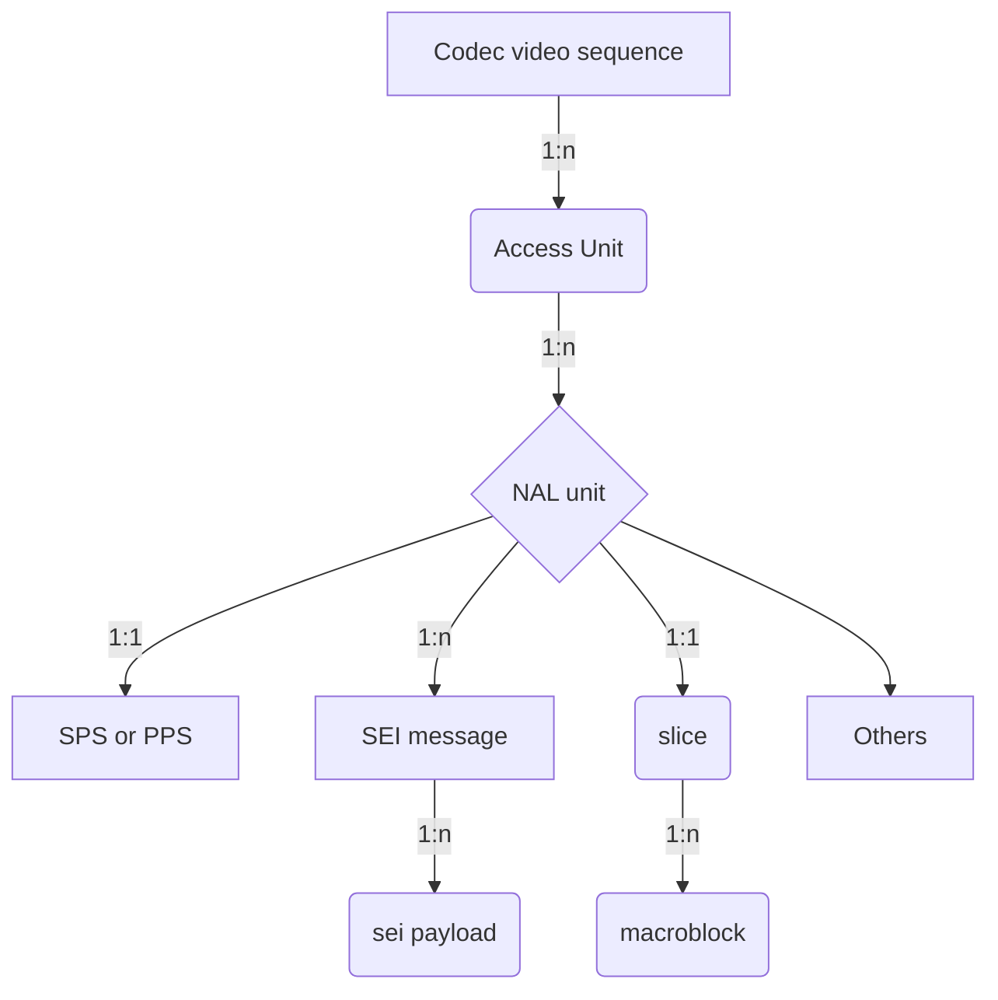

# Media Syntax Element Locator
## Contents
* [Abbreviation](#abbreviation)
* [What's media syntax element?](#whats-media-syntax-element)
* [How to locate the media syntax element?](#how-to-locate-the-media-syntax-element)
	* [MPEG video bitstream media syntax element locator](#mpeg-video-bitstream-media-syntax-element-locator)
	* [NAL bitstream media syntax element locator](#nal-bitstream-media-syntax-element-locator)
* [Commands](#commands)
	* [`listMSE` command](#listmse-command)
	* [`showMSE` command](#showmse-command)

## Abbreviation
* **URI**: Uniform Resource Identifier
* **MSE**: Media Syntax Element
* **AU**: Access Unit
* **CVS**: Codec Video Sequence
* **TU**: Temporal Unit
* **FU**: Frame Unit
* **OBU**: Open Bitstream Unit
* **GOP**: Group of Picture
* **NU**: NAL Unit
* **PL**: Payload
* **MSG**: Message
* **SEIPL**: SEI payload
* **SEIMSG**: SEI Message

[Top](#contents)

## What's media syntax element?
For the audio, video and other multimedia payload, in the corresponding technical specification, it defined its data organization, and let's call the minimum organization units as `syntax element`, normally it is hierarchical, and defined in tabular form, for example, H.264, it consists of:


[Top](#contents)
## How to locate the media syntax element?
Since every media syntax element can be unpacked, and parsed, and its syntax view can also be displayed, we need defined a media syntax element locator protocol to locate it accurately.
In this document, we follow the RFC3986,
```
      URI         = scheme ":" hier-part [ "?" query ] [ "#" fragment ]

      hier-part   = "//" authority path-abempty
                  / path-absolute
                  / path-rootless
                  / path-empty
```
scheme: only support `MSE`, it can be also ignored
hier-part: the media syntax element locate part, it is the media object, or syntactic elements defined in each multimedia specification scheme
query and framgment: it is the syntax structure in the media object or syntactic element.

**hier-part** *: `[syntax-element-filter[.syntax-element-filter[....]]][/syntax/element/inside/...][#leaf-field]`*

**syntax_element-fitler** *: `[`~`]syntax_element[s][-][e]]`*

**~** *:exclude the followed syntax element(s), or range*

**s** *:the start index(0-based) of syntax element in its parents*

**e** *:the end index(0-based) of syntax element in its parents*

### MPEG video bitstream media syntax element locator
*[MSE://][[`~`]**MB**[`m₀`][`-`][`mₙ`]][.]\([[`~`]**SE**[`s₀`][`-`][`sₙ`]] | [[`~`]**SLICE**[`s₀`][`-`][`sₙ`]])[.][[`~`]**AU**[`a₀`][`-`][`aₙ`]][.][[`~`]**GOP**[`g₀`][`-`][`gₙ`]][.][[`~`]**VSEQ**[`v₀`][`-`][`vₙ`]][/part/part/...][#field]*

- AU
    Normally a MPEG2 video frame, I frame may start video sequence_header + sequence_extension + extension_and_user_data(0) + group_of_pictures_header + extension_and_user_data(1) + picture_header + ...
- SE (syntactic element)
	The basic element start with start_code, for example, sequence_header, sequence_extension and so on 

| URI | comment |
| --- | --- |
| VSEQ`1` | The 2nd video sequence in the MPEG video bitstream |
| GOP`50` | The GOP#50(0-based) in the whole MPEG video bitstream instead of a specified video sequence |
| AU`50` | The access-unit#50(0-based) in the whole MPEG video bitstream instead of a specified video sequence or/and a specified GOP |
| AU`50`.VSEQ`1` |The access-unit#50(0-based) in the second video sequence|
| AU`1`.GOP`0`.VSEQ`1` |The 2nd access-unit of the first GOP in the 2nd video sequence|
| SE`0`.GOP`0`.VSEQ`1`/#aspect_ratio_information |aspect_ratio_information of sequence header if SE#0 is a sequence header|
|~slice.au`1`|all non-slice syntax elements of the 2nd access-unit|
|slice.au`1-2`|all slices of access-unit 1 and 2|

Here are some command examples:
```
DumpTS 00023.m2v --listmse
```
Show all syntax elements in a MPEG2 video stream:
```
------------Name-------------------------------|-----len-----|------------URI-------------
Video Sequence#0                               |             |                      VSEQ0
    GOP#0 (closed)                             |             |                 GOP0.VSEQ0
        AU#0 (I)                               |    91,997 B |             AU0.GOP0.VSEQ0
            SE#0 sequence_header               |       140 B |         SE0.AU0.GOP0.VSEQ0
            SE#1 sequence_extension            |        10 B |         SE1.AU0.GOP0.VSEQ0
            SE#2 group_of_pictures_header      |         8 B |         SE2.AU0.GOP0.VSEQ0
            SE#3 picture_header                |         8 B |         SE3.AU0.GOP0.VSEQ0
            SE#4 picture_coding_extension      |         9 B |         SE4.AU0.GOP0.VSEQ0
            SE#5 slice1                        |       688 B |         SE5.AU0.GOP0.VSEQ0
            SE#6 slice2                        |       692 B |         SE6.AU0.GOP0.VSEQ0
            SE#7 slice3                        |       698 B |         SE7.AU0.GOP0.VSEQ0
            SE#8 slice4                        |       714 B |         SE8.AU0.GOP0.VSEQ0
            SE#9 slice5                        |       831 B |         SE9.AU0.GOP0.VSEQ0
            SE#10 slice6                       |     1,691 B |        SE10.AU0.GOP0.VSEQ0
            SE#11 slice7                       |     1,798 B |        SE11.AU0.GOP0.VSEQ0
            SE#12 slice8                       |     1,730 B |        SE12.AU0.GOP0.VSEQ0
            SE#13 slice9                       |     1,747 B |        SE13.AU0.GOP0.VSEQ0
            SE#14 slice10                      |     1,746 B |        SE14.AU0.GOP0.VSEQ0
            SE#15 slice11                      |     1,714 B |        SE15.AU0.GOP0.VSEQ0
            SE#16 slice12                      |     1,723 B |        SE16.AU0.GOP0.VSEQ0
            SE#17 slice13                      |     1,762 B |        SE17.AU0.GOP0.VSEQ0
            SE#18 slice14                      |     1,846 B |        SE18.AU0.GOP0.VSEQ0
            SE#19 slice15                      |     1,824 B |        SE19.AU0.GOP0.VSEQ0
            SE#20 slice16                      |     1,842 B |        SE20.AU0.GOP0.VSEQ0
            SE#21 slice17                      |     1,792 B |        SE21.AU0.GOP0.VSEQ0
            SE#22 slice18                      |     1,779 B |        SE22.AU0.GOP0.VSEQ0
            SE#23 slice19                      |     1,769 B |        SE23.AU0.GOP0.VSEQ0
            SE#24 slice20                      |     1,791 B |        SE24.AU0.GOP0.VSEQ0
            SE#25 slice21                      |     1,827 B |        SE25.AU0.GOP0.VSEQ0
            SE#26 slice22                      |     1,923 B |        SE26.AU0.GOP0.VSEQ0
            SE#27 slice23                      |     1,869 B |        SE27.AU0.GOP0.VSEQ0
            SE#28 slice24                      |     1,903 B |        SE28.AU0.GOP0.VSEQ0
            SE#29 slice25                      |     1,847 B |        SE29.AU0.GOP0.VSEQ0
            SE#30 slice26                      |     1,842 B |        SE30.AU0.GOP0.VSEQ0
            SE#31 slice27                      |     1,778 B |        SE31.AU0.GOP0.VSEQ0
            SE#32 slice28                      |     1,678 B |        SE32.AU0.GOP0.VSEQ0
            SE#33 slice29                      |     1,620 B |        SE33.AU0.GOP0.VSEQ0
......
```
Ok, now want to see the sequence header syntax according to its given URI,
```
DumpTS 00023.m2v --showmse=SE0.AU0.GOP0.VSEQ0
```
And then,
```
Video Sequence#0                               |             |                      VSEQ0
    GOP#0 (closed)                             |             |                 GOP0.VSEQ0
        AU#0 (I)                               |    91,997 B |             AU0.GOP0.VSEQ0
            SE#0 sequence_header               |       140 B |         SE0.AU0.GOP0.VSEQ0
            ------------------------------------------------------------------------------
            sequence_header_code: 00 00 01 b3 // should be 00 00 01 B3
            horizontal_size_value: 1920(0X780)// This word forms the 12 least significant bits of horizontal_size
            vertical_size_value: 1080(0X438)  // This word forms the 12 least significant bits of vertical_size
            aspect_ratio_information: 3(0X3)  // 16:9
            frame_rate_code: 4(0X4)           // 30 000/1001 (29.97...)
            bit_rate_value: 87500(0X155CC)    // The lower 18 bits of bit_rate, and the upper 12 bits are in bit_rat...
            marker_bit: 1
            vbv_buffer_size_value: 597(0X255) // the lower 10 bits of vbv_buffer_size, and the upper 8 bits are in v...
            constrained_parameters_flag: 0    // This flag (used in ISO/IEC 11172-2) has no meaning in this Specific...
            load_intra_quantiser_matrix: 1    // See 6.3.11 "Quant matrix extension".
            intra_quantiser_matrix:           // See 6.3.11 "Quant matrix extension".
                  8  16  16  19  16  19  22  22
                 22  22  22  22  26  24  26  27
                 27  27  26  26  26  26  27  27
                 27  29  29  29  34  34  34  29
                 29  29  27  27  29  29  32  32
                 34  34  37  38  37  35  35  34
                 35  38  38  40  40  40  48  48
                 46  46  56  56  58  69  69  83

            load_non_intra_quantiser_matrix: 1// See 6.3.11 "Quant matrix extension".
            non_intra_quantiser_matrix:       // See 6.3.11 "Quant matrix extension".
                 16  17  17  18  18  18  19  19
                 19  19  20  20  20  20  20  21
                 21  21  21  21  21  22  22  22
                 22  22  22  22  23  23  23  23
                 23  23  23  23  24  24  24  25
                 24  24  24  25  26  26  26  26
                 25  27  27  27  27  27  28  28
                 28  28  30  30  30  31  31  33
```
Now, sequence_header and sequence_extension want to be shown together,
```
DumpTS 00023.m2v --showmse=SE0.AU0.GOP0.VSEQ0
```
And then
```
Video Sequence#0                               |             |                      VSEQ0
    GOP#0 (closed)                             |             |                 GOP0.VSEQ0
        AU#0 (I)                               |    91,997 B |             AU0.GOP0.VSEQ0
            SE#0 sequence_header               |       140 B |         SE0.AU0.GOP0.VSEQ0
            ------------------------------------------------------------------------------
            sequence_header_code: 00 00 01 b3 // should be 00 00 01 B3
            horizontal_size_value: 1920(0X780)// This word forms the 12 least significant bits of horizontal_size
            vertical_size_value: 1080(0X438)  // This word forms the 12 least significant bits of vertical_size
            aspect_ratio_information: 3(0X3)  // 16:9
            frame_rate_code: 4(0X4)           // 30 000/1001 (29.97...)
            bit_rate_value: 87500(0X155CC)    // The lower 18 bits of bit_rate, and the upper 12 bits are in bit_rat...
            marker_bit: 1
            vbv_buffer_size_value: 597(0X255) // the lower 10 bits of vbv_buffer_size, and the upper 8 bits are in v...
            constrained_parameters_flag: 0    // This flag (used in ISO/IEC 11172-2) has no meaning in this Specific...
            load_intra_quantiser_matrix: 1    // See 6.3.11 "Quant matrix extension".
            intra_quantiser_matrix:           // See 6.3.11 "Quant matrix extension".
                  8  16  16  19  16  19  22  22
                 22  22  22  22  26  24  26  27
                 27  27  26  26  26  26  27  27
                 27  29  29  29  34  34  34  29
                 29  29  27  27  29  29  32  32
                 34  34  37  38  37  35  35  34
                 35  38  38  40  40  40  48  48
                 46  46  56  56  58  69  69  83

            load_non_intra_quantiser_matrix: 1// See 6.3.11 "Quant matrix extension".
            non_intra_quantiser_matrix:       // See 6.3.11 "Quant matrix extension".
                 16  17  17  18  18  18  19  19
                 19  19  20  20  20  20  20  21
                 21  21  21  21  21  22  22  22
                 22  22  22  22  23  23  23  23
                 23  23  23  23  24  24  24  25
                 24  24  24  25  26  26  26  26
                 25  27  27  27  27  27  28  28
                 28  28  30  30  30  31  31  33


            SE#1 sequence_extension            |        10 B |         SE1.AU0.GOP0.VSEQ0
            ------------------------------------------------------------------------------
            extension_start_code: 00 00 01 b5      // should be 00 00 01 B5
            extension_start_code_identifier: 1(0X1)// Should be 1
            profile_and_level_indication: 68(0X44) // Main@High
            progressive_sequence: 0                // the coded video sequence may contain both frame-pictures and field-...
            chroma_format: 1(0X1)                  // 4:2:0
            horizontal_size_extension: 0(0X0)      // (horizontal_size_extension<<12)|horizontal_size_value
            vertical_size_extension: 0(0X0)        // (vertical_size_extension<<12)|vertical_size_value
            bit_rate_extension: 0(0X0)             // (bit_rate_extension<18)|bit_rate_value
            marker_bit: 1
            vbv_buffer_size_extension: 0(0X0)      // (vbv_buffer_size_extension<10)|vbv_buffer_size_value
            low_delay: 0                           // the sequence may contain B-pictures, that the frame re-ordering del...
            frame_rate_extension_n: 0(0X0)         // frame_rate = frame_rate_value * (frame_rate_extension_n + 1) / (fra...
            frame_rate_extension_d: 0(0X0)         // frame_rate = frame_rate_value * (frame_rate_extension_n + 1) / (fra...

```
According to the command `listmse=gop`, we can know how many gops in this MPEG2 video stream, and now we want to show access-units of  the first and the last GOP,
```
DumpTS 00023.m2v --listmse=au.~gop1-119
```
And then
```
------------Name-------------------------------|-----len-----|------------URI-------------
GOP#0 (closed)                                 |             |                       GOP0
    AU#0 (I)                                   |    91,997 B |                   AU0.GOP0
    AU#1 (P)                                   |    83,847 B |                   AU1.GOP0
    AU#2 (B)                                   |    22,773 B |                   AU2.GOP0
    AU#3 (B)                                   |    53,424 B |                   AU3.GOP0
    AU#4 (P)                                   |   111,616 B |                   AU4.GOP0
    AU#5 (B)                                   |    63,292 B |                   AU5.GOP0
    AU#6 (B)                                   |    64,618 B |                   AU6.GOP0
    AU#7 (P)                                   |   131,912 B |                   AU7.GOP0
    AU#8 (B)                                   |    67,947 B |                   AU8.GOP0
    AU#9 (B)                                   |    70,578 B |                   AU9.GOP0
    AU#10 (P)                                  |   140,350 B |                  AU10.GOP0
    AU#11 (B)                                  |    79,321 B |                  AU11.GOP0
    AU#12 (B)                                  |    68,619 B |                  AU12.GOP0
GOP#120 (closed)                               |             |                     GOP120
    AU#0 (I)                                   |   117,313 B |                 AU0.GOP120
```
### NAL bitstream media syntax element locator
*[MSE://][SEIPL`i`].[SEIMSG`j`].[NU`k`].[AU`l`].[CVS`m`]/part/part/...#field*

| URI | comment |
| --- | --- |
| AU`50` | The access-unit#50(0-based) |
| NU`50` | The NAL unit#50(0-based) in the whole NAL bitstream |
| SEIMSG`50`| The SEI message#50(0-based) in the whole NAL bitstream|
| SEIPL`50`|The SEI payload#50(0-based) in the whole NAL bitstream|
| SEIPL`0`.AU`50`|The SEI payload#0 in the whole Access-unit#50|
| SEIPL`1`.SEIMSG`0`.NU`50`|The SEI payload#1(0-based) of SEI message#0 of NAL-unit#50 in the whole NAL bitstream|
| SEIPL`0`.SEIMSG`0`.NU`4`.AU`100`|The SEI payload#0 of SEI message#0 of NAL-unit#4 of Access-unit#100 in the whole NAL stream|
| NU`2`.AU`60`|The NAL-unit#2(0-based) of Access-Unit#60 in the whole NAL stream|
| NU`1`/seq_parameter_set_rbsp/vui_parameters|vui_parameters of NAL-unit#1(it is a SPS NU)|
| NU`1`/*/vui_parameters#aspect_ratio_idc |the `aspect_ratio_idc` field of VUI of NAL-unit#1|

### AV1 bitstream media syntax locator
*[MSE://][OBU`i`].[FU`j`].[TU`k`]/part/part/...#field*

| URI | comment |
| --- | --- |
| TU`50` | The temporal-unit#50(0-based) |
| FU`50` | The Frame unit#50(0-based) in the whole AV1 bitstream instead of a specified TU |
| OBU`50`| The OBU#50(0-based) in the whole AV1 bitstream instead of a specified TU or/and a specified FU|
| OBU`0`.TU`50`|The first OBU in temporal-unit#50|
| OBU`1`.FU`0`.TU`50`|The 2nd OBU in first the frame-unit of the temporal-unit#50|
| OBU`0`.FU`100`|The 1st OBU of frame-unit#100 in the whole AV1 stream|
| OBU`0`/sequence_header_obu/color_config|color_config in sequence header OBU|
| OBU`0`/sequence_header_obu/color_config#BitDepth|The `BitDepth` field in sequence_header_obu's color config|

### ISOBMFF box media syntax unit locator
*[MSE://]box`i`].[box`j`]........[box`n`]/sub/object/#field*
Here are some examples:
```
mvhd.moov/#creation_time
stsd.stbl.minf.mdia.track0.moov/AVCSampleEntry#width
//*/*/Projection
```
## Commands
At present, support 2 kinds of command, one is `listMSE` , another is `showMSE`,

### `listMSE` command
`listMSE` is used to list the media syntax element:
```
DumpTS xxxx.h264 --listMSE=MSE://AU
```
And it may show the below output

```
...
---------Name---------------|--URI---|
Access-Unit#123	            |  AU123 |
...
```
List AU/NU tree
```
DumpTS xxxxx.h264 --listMSE=NU.AU
```
And then
```
----------Name--------------|----len----|----URI-----|------------Description-------------------
...
Access-Unit#84              |           | AU84     | Access unit delimiter
    NAL Unit#0 non-VCL::AUD |       2 B | NU0.AU84   | Sequence parameter set
    NAL Unit#1 non-VCL::SPS |      51 B | NU1.AU84   | Picture parameter set
    NAL Unit#2 non-VCL::PPS |       6 B | NU2.AU84   | Supplemental enhancement information(SEI)
    NAL Unit#3 non-VCL::SEI |      14 B | NU3.AU84   | Supplemental enhancement information(SEI)
    NAL Unit#4 non-VCL::SEI |      14 B | NU4.AU84   | Supplemental enhancement information(SEI)
    NAL Unit#5 non-VCL::SEI |       5 B | NU5.AU84   | Supplemental enhancement information(SEI)
    NAL Unit#6 VCL::IDR     | 113,827 B | NU6.AU84   | Coded slice of an IDR picture
    NAL Unit#7 VCL::IDR     | 114,431 B | NU7.AU84   | Coded slice of an IDR picture
    NAL Unit#8 VCL::IDR     |  94,709 B | NU8.AU84   | Coded slice of an IDR picture
    NAL Unit#9 VCL::IDR     |  75,413 B | NU9.AU84   | Coded slice of an IDR picture
...
```
List TU/FR/OBU tree
```
DumpTS xxxxx.av1 --listMSE=OBU.FU.TU
```
And then
```
----Name-------------------|--len---|------URI------|obu_size|OBU start|
...
Temporal Unit#41           |  xxx B |          TU41 |        |         |
    Frame Unit#0           |  xxx B |      FU0.TU41 |        |         |
        OBU#0 Frame OBU    |  580 B | OBU0.FU0.TU41 |  579 B | OBU100  |
    Frame Unit#1           |  xxx B |      FU1.TU41 |        |         |
        OBU#0: Frame OBU   |  439 B | OBU0.FU1.TU41 |  438 B | OBU101  |
    Frame Unit#2           |  xxx B |      FU2.TU41 |        |         |
        OBU#0: Frame OBU   |  305 B | OBU0.FU2.TU41 |  304 B | OBU102  |
...
```
List VideoSequence/GOP/AU/SE tree
```
------------Name-------------------------------|-----len-----|------------URI-------------
GOP#0                                          |             |                      GOP0
    AU#0(I)                                    |     xxxxx B |                  AU0.GOP0
        SE#0 sequence_header                   |        xx B |             SE#0.AU0.GOP0
        SE#1 sequence_extension                |        xx B |             SE#1.AU0.GOP0
        SE#2 sequence_display_extension        |        xx B |             SE#2.AU0.GOP0
        SE#3 group_of_picture_header           |        xx B |             SE#3.AU0.GOP0
        SE#4 picture_header                    |        xx B |             SE#4.AU0.GOP0
        SE#5 picture_coding_extension          |        xx B |             SE#5.AU0.GOP0
        SE#6 picture_data                      |     xxxxx B |             SE#6.AU0.GOP0
    AU#1(B)                                    |     xxxxx B |                  AU1.GOP0
        SE#0 picture_header                    |        xx B |             SE#0.AU1.GOP0
        SE#1 picture_coding_extension          |        xx B |             SE#1.AU1.GOP0
        SE#2 picture_data                      |        xx B |             SE#2.AU1.GOP0
    AU#2(B)                                    |     xxxxx B |                  AU2.GOP0
        SE#0 picture_header                    |        xx B |             SE#0.AU2.GOP0
        SE#1 picture_coding_extension          |        xx B |             SE#1.AU2.GOP0
        SE#2 picture_data                      |        xx B |             SE#2.AU2.GOP0
......
```

List ISOBMFF boxes
```
DumpTS xxxxx.mp4 --listMSE
```
And then
```
  --------------Box name-----------------------------|---len----|-----Description-----------------
  .
  |--ftyp                                            |          | File Type Box
  |--free                                            |          | Free Space Box
  |--mdat                                            |          | Media Data Box
  |--moov                                            |          | Movie Box
       |--mvhd                                       |          | Movie Header Box
       |--trak -- track_ID: 1, duration: 8.008s      |          | Track Box
       |    |--tkhd                                  |          | 
       |    |--edts                                  |          | 
       |    |    |--elst                             |          | 
       |    |--mdia                                  |          | 
       |         |--mdhd                             |          | 
       |         |--hdlr -- Video track              |          | 
       |         |--minf                             |          | 
       |              |--vmhd                        |          | 
       |              |--dinf                        |          | 
       |              |    |--dref                   |          | 
       |              |--stbl                        |          | 
       |                   |--stsd -- avc1@1920x1080 |          | 
       |                   |    |--avc1              |          | 
       |                   |         |--avcC         |          | 
       |                   |         |--pasp         |          | 
       |                   |--stts                   |          | 
       |                   |--stss                   |          | 
       |                   |--ctts                   |          | 
       |                   |--stsc                   |          | 
       |                   |--stsz                   |          | 
       |                   |--stco                   |          | 
       |--trak -- track_ID: 2, duration: 8.054s      |          | 
       |    |--tkhd                                  |          | 
       |    |--edts                                  |          | 
       |    |    |--elst                             |          | 
       |    |--mdia                                  |          | 
       |         |--mdhd                             |          | 
       |         |--hdlr -- Audio track              |          | 
       |         |--minf                             |          | 
       |              |--smhd                        |          | 
       |              |--dinf                        |          | 
       |              |    |--dref                   |          | 
       |              |--stbl                        |          | 
       |                   |--stsd -- mp4a@48000HZ   |          | 
       |                   |    |--mp4a              |          | 
       |                   |         |--esds         |          | 
       |                   |--stts                   |          | 
       |                   |--stsc                   |          | 
       |                   |--stsz                   |          | 
       |                   |--stco                   |          | 
       |--udta                                       |          | 
            |--meta                                  |          | 
                 |--hdlr                             |          | 
                 |--ilst                             |          |
```
Show a part of ISOBMFF tree
```
DumpTS xxxxx.mp4 --listMSE=minf.mdia.trak0.moov
```
And then,
```
moov.trak[0].mdia.minf 
  ------- Box Name --------------|---len----|-----Description-----------------
  |--vmhd                        |          | 
  |--dinf                        |          | 
  |    |--dref                   |          | 
  |--stbl                        |          | 
       |--stsd -- avc1@1920x1080 |          | 
       |    |--avc1              |          | 
       |         |--avcC         |          | 
       |         |--pasp         |          | 
       |--stts                   |          | 
       |--stss                   |          | 
       |--ctts                   |          | 
       |--stsc                   |          | 
       |--stsz                   |          | 
       |--stco                   |          | 
  
```

### `showMSE` command

[Top](#contents)
