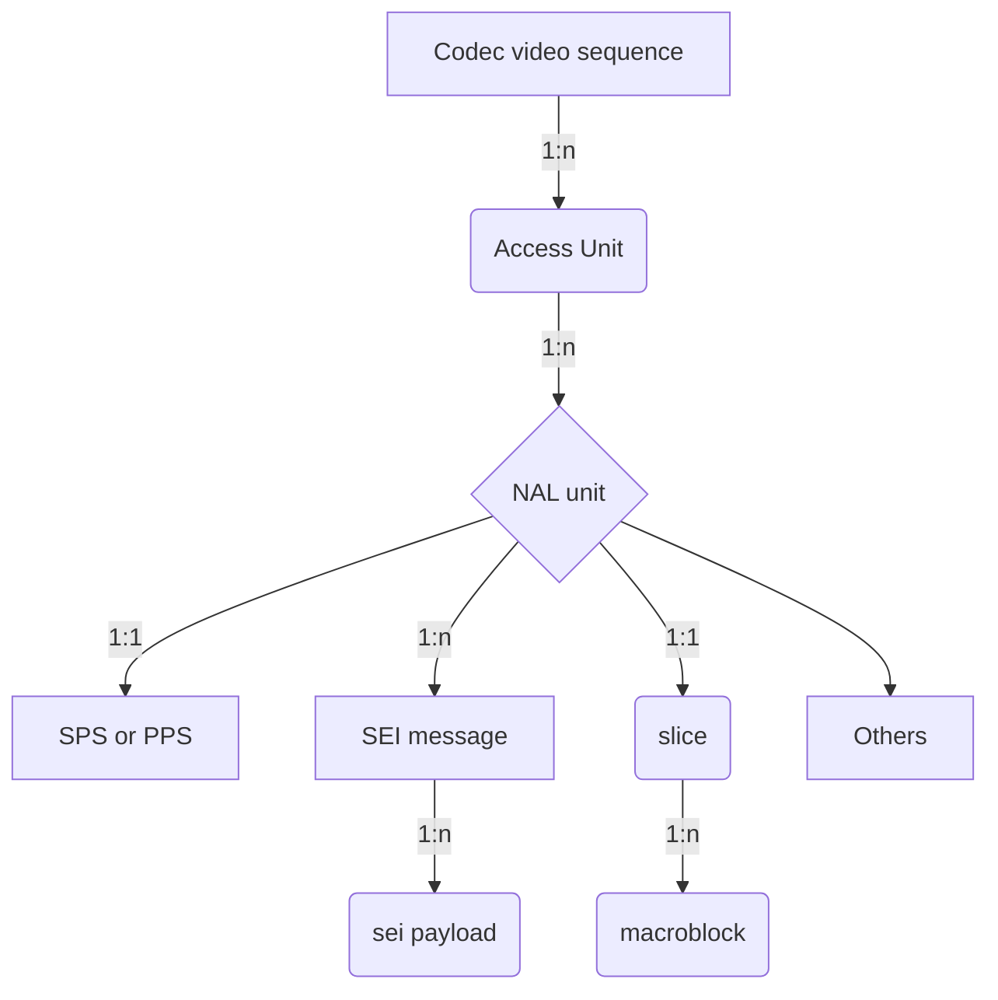

# Media Unit Locator
## Contents
* [What's media unit?](#what-s-media-unit)
* [How to locate the media unit?](#how-to-locate-the-media-unit)

## What's media unit?
For the audio, video and other payload, in each technical specification, it defined its data organization, normally it is a tree, for example, H.264, it consists of:


## How to locate the media unit?
Since every media unit can be unpacked, and parsed, and its syntax view can also be displayed, we need defined a media unit locator protocal to locate it accurately.
In this document, we follow the RFC3986,
```
      URI         = scheme ":" hier-part [ "?" query ] [ "#" fragment ]

      hier-part   = "//" authority path-abempty
                  / path-absolute
                  / path-rootless
                  / path-empty
```
scheme: only support `syntax`, it can be also ignored

*hier-part: [MediaUnit`i`].[MediaUnit`j`].[MediaUnit`k`]..../synaxpart/synaxpart/...#leaf-field*

For example, it shows,
### NAL bitstream media unit locator
*[SEIPL`i`].[SEIMSG`j`].[NU`k`].[AU`l`]/part/part/...#field*

| URI | comment |
| --- | --- |
| AU`50` | The access-unit#50(0-based) |
| NU`50` | The NAL unit#50(0-based) in the whole NAL bitstream |
| SEIMSG`50`| The SEI message#50(0-based) in the whole NAL bitstream|
| SEIPL`50`|The SEI payload#50(0-based) in the whole NAL bitstream|
| SEIPL`0`.AU`50`|The SEI payload#0 in the whole Access-unit#50|
| SEIPL`1`.SEIMSG`0`.NU`50`|The SEI payload#1(0-based) of SEI message#0 of NAL-unit#50 in the whole NAL bitstream|
| SEIPL`0`.SEIMSG`0`.NU`4`.AU`100`|The SEI payload#0 of SEI message#0 of NAL-unit#4 of Access-unit#100 in the whole NAL stream|
| NU`2`.AU`60`|The NAL-unit#2(0-based) of Access-Unit#60 in the whole NAL stream|
| NU`1`/seq_parameter_set_rbsp/vui_parameters|vui_parameters of NAL-unit#1(it is a SPS NU)|
| NU`1`/.../vui_parameters#aspect_ratio_idc|the aspect_ratio_idc of VUI of NAL-unit#1||
