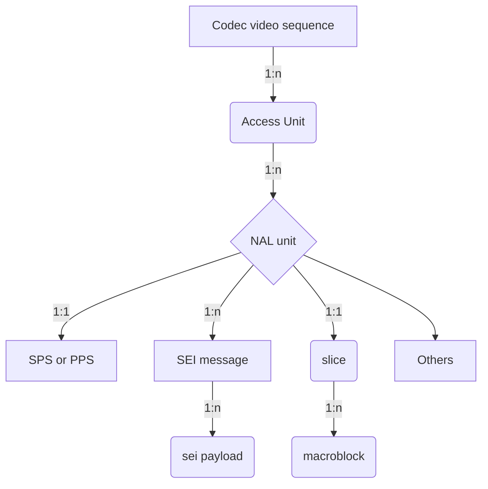

# Media Unit Locator
## Contents
* [What's media unit?](#what-s-media-unit)
* [How to locate the media unit?](#how-to-locate-the-media-unit)

## What's media unit?
For the audio, video and other payload, in each technical specification, it defined its data organization, normally it is a tree, for example, H.264, it consists of:


## How to locate the media unit?
Since every media unit can be unpacked, and parsed, and its syntax view can also be displayed, we need defined a media unit locator protocal to locate it accurately.
In this document, we follow the RFC3986,
```
      URI         = scheme ":" hier-part [ "?" query ] [ "#" fragment ]

      hier-part   = "//" authority path-abempty
                  / path-absolute
                  / path-rootless
                  / path-empty
```
scheme: only support `syntax`or `MU`, it can be also ignored

*hier-part: [MediaUnit`i`].[MediaUnit`j`].[MediaUnit`k`]..../synaxpart/synaxpart/...#leaf-field*

For example, it shows,
### NAL bitstream media unit locator
*MU://[SEIPL`i`].[SEIMSG`j`].[NU`k`].[AU`l`].[CVS`m`]/part/part/...#field*

| URI | comment |
| --- | --- |
| AU`50` | The access-unit#50(0-based) |
| NU`50` | The NAL unit#50(0-based) in the whole NAL bitstream |
| SEIMSG`50`| The SEI message#50(0-based) in the whole NAL bitstream|
| SEIPL`50`|The SEI payload#50(0-based) in the whole NAL bitstream|
| SEIPL`0`.AU`50`|The SEI payload#0 in the whole Access-unit#50|
| SEIPL`1`.SEIMSG`0`.NU`50`|The SEI payload#1(0-based) of SEI message#0 of NAL-unit#50 in the whole NAL bitstream|
| SEIPL`0`.SEIMSG`0`.NU`4`.AU`100`|The SEI payload#0 of SEI message#0 of NAL-unit#4 of Access-unit#100 in the whole NAL stream|
| NU`2`.AU`60`|The NAL-unit#2(0-based) of Access-Unit#60 in the whole NAL stream|
| NU`1`/seq_parameter_set_rbsp/vui_parameters|vui_parameters of NAL-unit#1(it is a SPS NU)|
| NU`1`/.../vui_parameters#aspect_ratio_idc|the `aspect_ratio_idc` field of VUI of NAL-unit#1|

### AV1 bitstream media unit locator
*MU://[OBU`i`].[FU`j`].[TU`k`]/part/part/...#field*
| URI | comment |
| --- | --- |
| TU`50` | The temporal-unit#50(0-based) |
| FU`50` | The Frame unit#50(0-based) in the whole AV1 bitstream instead of a specified TU |
| OBU`50`| The OBU#50(0-based) in the whole AV1 bitstream instead of a specified TU or/and a specified FU|
| OBU`0`.TU`50`|The first OBU in temporal-unit#50|
| OBU`1`.FU`0`.TU`50`|The 2nd OBU in first the frame-unit of the temporal-unit#50|
| OBU`0`.FU`100`|The 1st OBU of frame-unit#100 in the whole AV1 stream|
| OBU`0`/sequence_header_obu/color_config|color_config in sequence header OBU|
| OBU`0`/sequence_header_obu/color_config#BitDepth|The `BitDepth` field in sequence_header_obu's color config|

### MPEG video bitstream media unit locator
*MU://[SE`n`].[MB`m`].[SLICE`l`].[AU`k`].[GOP`j`].[VSEQ`i`]/part/part/...#field*

- AU
    Normally a MPEG2 video frame, I frame may start video sequence_header + sequence_extension + extension_and_user_data(0) + group_of_pictures_header + extension_and_user_data(1) + picture_header + ...
- SE (syntactic element)
	The basic element start with start_code, for example, sequence_header, sequence_extension and so on 

| URI | comment |
| --- | --- |
| VSEQ`1` | The 2nd video sequence in the MPEG video bitstream |
| GOP`50` | The GOP#50(0-based) in the whole MPEG video bitstream instead of a specified video sequence |
| AU`50` | The access-unit#50(0-based) in the whole MPEG video bitstream instead of a specified video sequence or/and a specified GOP |
| AU`50`.VSEQ`1` |The access-unit#50(0-based) in the second video sequence|
| AU`1`.GOP`0`.VSEQ`1` |The 2nd access-unit of the first GOP in the 2nd video sequence|
| SE`0`.GOP`0`.VSEQ`1`/#aspect_ratio_information |aspect_ratio_information of sequence header if SE#0 is a sequence header|
