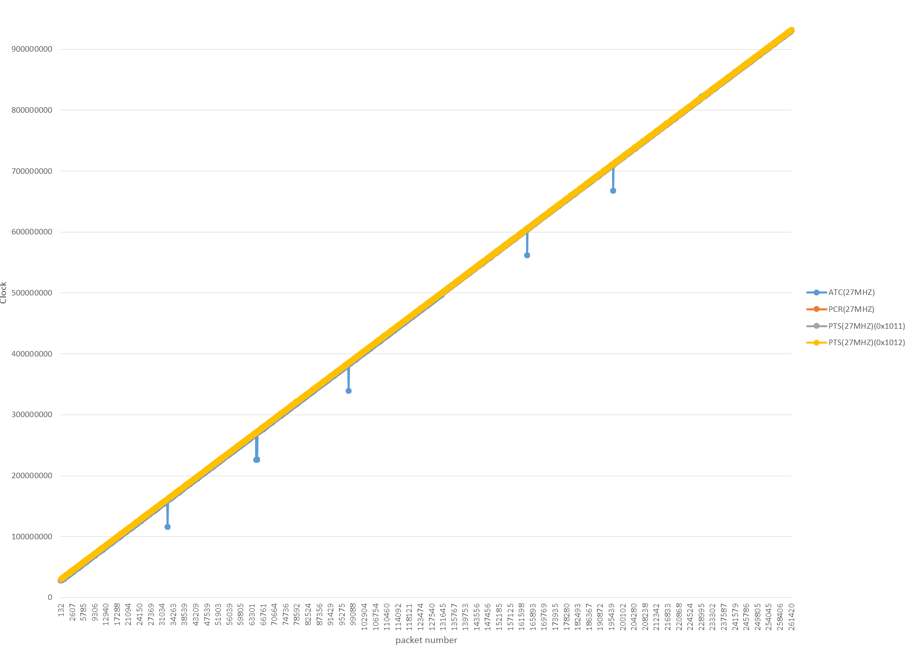
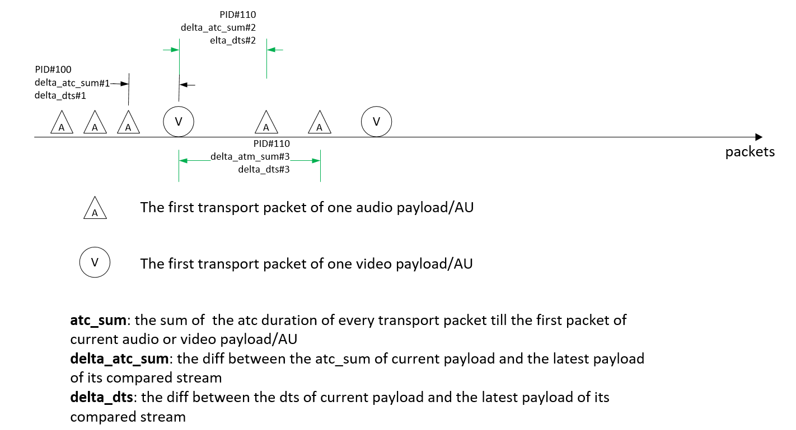

# TS/TTS/M2TS Operation Guideline
## Contents
* [Extract an elementary stream](#extract-an-elementary-stream)
* [Extract a PSI data stream](#extract-a-psi-data-stream)
* [Extract a sub-stream from one elementary stream](#extract-a-sub-stream-from-one-elementary-stream)
* [Extract a part of transport stream](#extract-a-part-of-transport-stream)
* [Extract a program sequence](#extract-a-program-sequence)
* [Extract a part of movie with the start and end packet number](#extract-a-part-of-movie-with-the-start-and-end-packet-number)
* [Show PSI information](#show-psi-information)
  * [Show PAT](#show-pai)
  * [Show PMT](#show-pmt)
  * [Show SIT](#show-sit)
* [Show transport packets](#show-transport-packets)
* [Diff the ATC](#diff-the-atc)
* [Show PCR](#show-pcr)
* [Generate diagram with ATC, PCR, PTSes and DTSes](#generate-diagram-with-atc-pcr-ptses-and-dtses)
* [Diff ATC clock and DTS clock](#diff-atc-clock-and-dts-clock)
* [Change the values(s) of PID(s)](#change-the-values-of-PIDs)

[Return to Main](../README.md)
## Extract an elementary stream
1. Get the transport stream rough information
    ```
    DumpTS 00023.m2ts --showinfo
    ```
    The elementary streams are listed:
    ```
    Program Number: 1, program_map_PID: 0X100(256).
    Program(PID:0X0100)
            Stream#0, PID: 0X1011, stm_type: 0X02 (MPEG2 Video)
            Stream#1, PID: 0X1100, stm_type: 0X83 (Dolby Lossless Audio (TrueHD/Atmos))
            Stream#2, PID: 0X1200, stm_type: 0X90 (PGS)
    ```
2. Get the PID of extracted stream
    For example, the video PID is 0x1011, and the audio is 0x1100, and the PG subtitle is 0x1200
3. Extract the stream
    Extract the video:
    ```
    DumpTS 00023.m2ts --pid=0x1011 --output=00023.m2v
    ```
    An elementary MPEG2 video stream is extracted to 00023.m2v, and it can be played by some media player, for example, VLC player, of course the PES stream with pts and dts can also be extracted by specifying the 'outputfmt', and then it can be used for multiplex;
    ```
    DumpTS 00023.m2ts --pid=0x1011 --output=00023.pes --outputfmt=pes
    ```
    On the other hand, the ts/tts/m2ts packs with the specified PID or PIDs can also be extracted to ts/tts/m2ts packs with outputfmt to 'ts/tts/m2ts':
    ```
    DumpTS 00023.m2ts --pid=0x1011 --output=00023.ts --outputfmt=ts
    ```
    But this ts file can't be played because there only exists the pack with PID '0x10111', there is no PAT or PMT

[Top](#contents)

## Extract a PSI data stream
PSI data can also be extracted when specifying the corresponding PID,
```
DumpTs 00024.m2ts --pid=0X0 --output=00024.pat
DumpTS mono_dualmono.m2ts --pid=0x1F --output=I:\NHK.sit
```
The PSI data will start from 'pointer_field', and then follow with PSI section data

[Top](#contents)

## Extract a sub-stream from one elementary stream
Some audio stream may have multiple sub-stream, for example, Dolby-TrueHD, the sub-streams can be extracted separately by adding stream_id_extension filter
1. Get the audio information
    ```
    DumpTS 00024.m2ts --showinfo --pid=0x1100
    ```
    All sub-streams will be listed,
    ```
    Dolby Lossless Audio (TrueHD/Atmos) Stream information(AC3 part):
            PID: 0X1100.
            Stream ID: 0XFD
            Stream Type: 131(0X83).
            Stream ID Extension: 0X76
            Sample Frequency: 48000 (HZ).
            Bits Per Sample: 16.
            Channel Layout: 5.1ch(L, C, R, Ls, Rs, LFE)@D-Cinema.
            Bitrate: 640.000 kbps.
    Dolby Lossless Audio (TrueHD/Atmos) Stream information(MLP part):
            PID: 0X1100.
            Stream ID: 0XFD
            Stream Type: 131(0X83).
            Stream ID Extension: 0X72
            Sample Frequency: 192000 (HZ).
            Bits Per Sample: 24.
            Channel Layout: 5.1ch(L, C, R, Ls, Rs, LFE)@D-Cinema.
    ```
2. Select the sub-stream with PID and stream_id_extension
    For example, select the AC3 sub-stream to extract with PID=0x1100 and stream_id_extension=0x76
3. Extract the AC3 sub-stream
    ```
    DumpTs 00024.m2ts --pid=0x1100 --stream_id_extension=0x76 --output=00024.ac3
    ```

[Top](#contents)
## Extract a part of transport stream
When output format is set to ts/tts/m2ts, and source file is also a transport stream, you can specify multiple PIDs in --pid delimited with one of ,;:., and then related transport packets will be extracted
```
DumpTS Mono_AAC_test.m2ts --pid=0x0,0x1f,0x100,0x110,0x1f0 --outputfmt=m2ts --output=Mono_AAC_partial.m2ts
```
The transport packet with PID 0, 0x1F, 0x100, 0x110 and 0x1F0,will extracted consequently, and save them to new file.

*(\*)No PSI sections will be modified in this case, it may cause some players with more strict check can't play it*

[Top](#contents)

## Extract a program sequence
There may be multiple program sequence with different version of PMTs, the below steps can be used to extract one of them
1. Get the program sequence layout
    ```
    DumpTS 5.1ch_stereo.m2ts --showinfo
    Program Number: 103, program_map_PID: 0X1F0(496).
    Program(PID:0X01F0)
            Stream#0, PID: 0X0138, stm_type: 0X06 (Teletext, ARIB subtitle or TTML)
            Stream#1, PID: 0X0130, stm_type: 0X06 (Teletext, ARIB subtitle or TTML)
            Stream#2, PID: 0X0110, stm_type: 0X0F (AAC Audio)
            Stream#3, PID: 0X0100, stm_type: 0X02 (MPEG2 Video)

    Program(PID:0X01F0)
            Stream#0, PID: 0X0138, stm_type: 0X06 (Teletext, ARIB subtitle or TTML)
            Stream#1, PID: 0X0130, stm_type: 0X06 (Teletext, ARIB subtitle or TTML)
            Stream#2, PID: 0X0110, stm_type: 0X0F (AAC Audio)
            Stream#3, PID: 0X0100, stm_type: 0X02 (MPEG2 Video)
            Stream#4, PID: 0X0111, stm_type: 0X0F (AAC Audio)

    The number of transport packets: 9495552
            PID: 0x0000             transport packet count:     10,579 - PAT
            PID: 0x001E             transport packet count:          2 - DIT
            PID: 0x001F             transport packet count:      2,216 - SIT
            PID: 0x0100             transport packet count:  9,174,898 - MPEG2 Video
            PID: 0x0110             transport packet count:    131,186 - AAC Audio
            PID: 0x0111             transport packet count:    130,561 - AAC Audio
            PID: 0x0130             transport packet count:      1,153 - Teletext, ARIB subtitle or TTML
            PID: 0x0138             transport packet count:        222 - Teletext, ARIB subtitle or TTML
            PID: 0x01F0             transport packet count:     10,579 - PMT
            PID: 0x01FF             transport packet count:     29,568 - PCR
            PID: 0x1FFF             transport packet count:      4,588 - Null packet
    ```
    There are 2 program sequences, the 2nd program sequence carries stereo AAC audio.
2. Extract the 2nd program sequence
    ```
    DumpTS 5.1ch_stereo.m2ts --progseq=1 --outputfmt=m2ts --output=stereo.m2ts
    DumpTS 5.1ch_stereo.m2ts --progseq=1 --outputfmt=m2ts
    DumpTS 5.1ch_stereo.m2ts --progseq=0 --outputfmt=es --output=5.1ch.m2v --pid=0x100
    DumpTS 5.1ch_stereo.m2ts --progseq=1 --outputfmt=copy --output=stereo.m2ts
    ```
    The first command copy the 2nd program sequence of m2ts file to another new m2ts file `stereo.m2ts`
    If the output path is not specified, the second command will extract it into `stereo_ps_1.m2ts` at the same directory with the source file
    the third command extract the video elementary stream from program sequence#0.
    When it is NOT sure for the source format, specify outputfmt to copy, it means both source and destination use the same format

[Top](#contents)
## Extract a part of movie with the start and end packet number
You may know the start and end packet number of a clip of movie with some way, for example, the EP_MAP, this part of video can be extracted,
```
DumpTS 00005.m2ts --start=0x2060B --end=0x3ef38 --outputfmt=m2ts
DumpTS 00005.m2ts --start=0x2060B --end=0x3ef38 --outputfmt=m2ts --output=test.m2ts
DumpTS 00005.m2ts --start=0x2060B --end=0x3ef38 --outputfmt=es --pid=0x1011 --output=test.h264
```
The first command will generate the file `00005_spnstart_0x2060B_spnend_0x3ef38.m2ts` at the same directory with the source file.
The second command will generate the output file with the specified destination file.
The third command will extract the H.264 elementary stream packetized with PID#0x1011 from the specified packet range.

[Top](#contents)
## Show PSI information
### Show PAT
```
DumpTs Mono_AAC_test.m2ts --showPAT
PAT(ver: 0):
    program number: 0x0000(00000), Network_PID:0x1F
    program number: 0x0065(00101), program_map_PID:0x1F0
```

[Top](#contents)
### Show PMT
```
DumpTs mono_dualmono.m2ts --showPMT
```
All elementary streams and their descriptors are be shown like as
```
PMT(ver: 3):
    PCR_PID: 0x1FF
    descriptor_tag/descriptor_length: 0X88/  4 - Unsupported descriptor

    descriptor_tag/descriptor_length: 0XC1/  1 - Digital copy control descriptor
        Digital copy control information: 2 -- Copy can be made for only one generation

    ES_PID: 0x100, stream_type: 0x02 -- (MPEG-2 Video or MPEG-1 constrained parameter video stream):
            descriptor_tag/descriptor_length: 0X52/  1 - Stream identifier descriptor
                component_tag: 0x00

            descriptor_tag/descriptor_length: 0XC8/  1 - Video decode control descriptor
                    still_picture_flag: 0
                sequence_end_code_flag: 1
                   video_encode_format: 1

    ES_PID: 0x110, stream_type: 0x0F -- (ISO/IEC 13818-7 Audio with ADTS transport syntax):
            descriptor_tag/descriptor_length: 0X52/  1 - Stream identifier descriptor
                component_tag: 0x10

    ES_PID: 0x138, stream_type: 0x06 -- (Rec. ITU-T H.222.0 | ISO/IEC 13818-1 PES packets containing private data):
            descriptor_tag/descriptor_length: 0X52/  1 - Stream identifier descriptor
                component_tag: 0x38

            descriptor_tag/descriptor_length: 0XFD/  3 - Data component descriptor

PMT(ver: 4):
    PCR_PID: 0x1FF
    descriptor_tag/descriptor_length: 0X88/  4 - Unsupported descriptor

    descriptor_tag/descriptor_length: 0XC1/  1 - Digital copy control descriptor
        Digital copy control information: 2 -- Copy can be made for only one generation

    ES_PID: 0x100, stream_type: 0x02 -- (MPEG-2 Video or MPEG-1 constrained parameter video stream):
            descriptor_tag/descriptor_length: 0X52/  1 - Stream identifier descriptor
                component_tag: 0x00

            descriptor_tag/descriptor_length: 0XC8/  1 - Video decode control descriptor
                    still_picture_flag: 0
                sequence_end_code_flag: 1
                   video_encode_format: 1

    ES_PID: 0x110, stream_type: 0x0F -- (ISO/IEC 13818-7 Audio with ADTS transport syntax):
            descriptor_tag/descriptor_length: 0X52/  1 - Stream identifier descriptor
                component_tag: 0x10

    ES_PID: 0x130, stream_type: 0x06 -- (Rec. ITU-T H.222.0 | ISO/IEC 13818-1 PES packets containing private data):
            descriptor_tag/descriptor_length: 0X52/  1 - Stream identifier descriptor
                component_tag: 0x30

            descriptor_tag/descriptor_length: 0XFD/  3 - Data component descriptor

    ES_PID: 0x138, stream_type: 0x06 -- (Rec. ITU-T H.222.0 | ISO/IEC 13818-1 PES packets containing private data):
            descriptor_tag/descriptor_length: 0X52/  1 - Stream identifier descriptor
                component_tag: 0x38

            descriptor_tag/descriptor_length: 0XFD/  3 - Data component descriptor

PMT(ver: 5):
    PCR_PID: 0x1FF
    descriptor_tag/descriptor_length: 0X88/  4 - Unsupported descriptor

    descriptor_tag/descriptor_length: 0XC1/  1 - Digital copy control descriptor
        Digital copy control information: 2 -- Copy can be made for only one generation

    ES_PID: 0x100, stream_type: 0x02 -- (MPEG-2 Video or MPEG-1 constrained parameter video stream):
            descriptor_tag/descriptor_length: 0X52/  1 - Stream identifier descriptor
                component_tag: 0x00

            descriptor_tag/descriptor_length: 0XC8/  1 - Video decode control descriptor
                    still_picture_flag: 0
                sequence_end_code_flag: 1
                   video_encode_format: 1

    ES_PID: 0x110, stream_type: 0x0F -- (ISO/IEC 13818-7 Audio with ADTS transport syntax):
            descriptor_tag/descriptor_length: 0X52/  1 - Stream identifier descriptor
                component_tag: 0x10

    ES_PID: 0x111, stream_type: 0x0F -- (ISO/IEC 13818-7 Audio with ADTS transport syntax):
            descriptor_tag/descriptor_length: 0X52/  1 - Stream identifier descriptor
                component_tag: 0x11

    ES_PID: 0x130, stream_type: 0x06 -- (Rec. ITU-T H.222.0 | ISO/IEC 13818-1 PES packets containing private data):
            descriptor_tag/descriptor_length: 0X52/  1 - Stream identifier descriptor
                component_tag: 0x30

            descriptor_tag/descriptor_length: 0XFD/  3 - Data component descriptor

    ES_PID: 0x138, stream_type: 0x06 -- (Rec. ITU-T H.222.0 | ISO/IEC 13818-1 PES packets containing private data):
            descriptor_tag/descriptor_length: 0X52/  1 - Stream identifier descriptor
                component_tag: 0x38

            descriptor_tag/descriptor_length: 0XFD/  3 - Data component descriptor

```

[Top](#contents)
### Show SIT
```
DumpTs DualMono_AAC_test.m2ts --showSIT
```
The descriptors will be shown as
```
SIT(ver: 4):
    descriptor_tag/descriptor_length: 0X63/  8 - partial_transport_stream_descriptor
        peak_rate: 67500(27000000bps/27Mbps)
        minimum_overall_smoothing_rate: undefined
        maximum_overall_smoothing_buffer: undefined

    descriptor_tag/descriptor_length: 0XC2/  7 - Network identification descriptor
        Country Code: JPN
        Media Type: 0X4253(BS/broadband CS)
        Network ID: 0X4

    service_id: 0X65, running_state: 0
            descriptor_tag/descriptor_length: 0X48/ 16 - service_descriptor
                service_type: 0x01 - Digital TV service
                service_provider_name(length: 5):
                     00  01  02  03  04  05  06  07    08  09  0A  0B  0C  0D  0E  0F
                     ----------------------------------------------------------------
             000000  1B  7E  CE  C8  CB                                               | .~...
                service_name(length: 8):
                     00  01  02  03  04  05  06  07    08  09  0A  0B  0C  0D  0E  0F
                     ----------------------------------------------------------------
             000000  1B  7E  CE  C8  CB  C2  D3  B1                                   | .~......

            descriptor_tag/descriptor_length: 0X4D/ 179 - short_event_descriptor
                ISO_639_language_code: jpn
                event name(length: 42):
                     00  01  02  03  04  05  06  07    08  09  0A  0B  0C  0D  0E  0F
                     ----------------------------------------------------------------
             000000  3B  7E  4F  40  38  78  4F  40    21  56  3F  4D  38  22  C7  3E | ;~O@8xO@!V?M8".>
             000010  57  46  4D  B9  EB  4A  46  43    66  21  21  46  7C  4B  5C  34 | WFM..JFCf!!F|K\4
             000020  6B  36  48  CE  36  6C  47  3A    21  57                         | k6H.6lG:!W
                text(length: 132):
                     00  01  02  03  04  05  06  07    08  09  0A  0B  0C  0D  0E  0F
                     ----------------------------------------------------------------
             000000  3F  37  61  45  1B  7C  A6  A4    B0  EB  3C  2B  3C  23  36  68 | ?7aE.|....<+<#6h
             000010  1B  7D  CA  C9  3F  4D  38  22    4C  64  42  6A  C7  CE  4A  46 | .}..?M8"LdBj..JF
             000020  43  66  42  50  4E  29  AC  3F    3C  DE  EB  43  66  21  22  CF | CfBPN).?<..Cf!".
             000030  B6  DE  CB  4E  29  C4  46  7C    4B  5C  34  6B  36  48  AC  38 | ...N).F|K\4k6H.8
             000040  37  B7  A4  4E  29  3E  6C  CB    21  23  4A  46  40  47  34  58 | 7..N)>l.!#JF@G4X
             000050  CE  1B  7C  E6  CB  AF  ED  40    3D  49  4A  4D  22  46  7E  3A | ..|....@=IJM"F~:
             000060  39  1B  7D  B7  3B  5F  E1  CA    C9  21  22  46  7C  4B  5C  34 | 9.}.;_...!"F|K\4
             000070  6B  36  48  CE  38  3D  3E  75    C8  42  50  31  7E  F2  39  4D | k6H.8=>u.BP1~.9M
             000080  A8  EB  21  23                                                   | ..!#

            descriptor_tag/descriptor_length: 0X50/  6 - component_descriptor
                stream_content: 0x1
                component_type: 0xB3
                component_tag: 0
                ISO_639_language_code: jpn

            descriptor_tag/descriptor_length: 0XC4/  9 - Audio component descriptor
                stream_content: 0x2
                component_type: 0x1 -- 1/0 mode (single monaural channel)
                component_tag: 0x10
                stream_type: 0xf
                simulcast_group_tag: 0xf
                ES_multi_lingual_flag: 0x0 --
                main_component_flag: 0x1
                quality_indicator: 0x2 -- Mode 2
                sampling_rate: 0x7 -- 48kHz
                ISO_639_language_code: jpn

            descriptor_tag/descriptor_length: 0X54/  6 - content_descriptor
                 content_nibble_level_1: 0
                 content_nibble_level_2: 6
                 user_nibble: 15
                 user_nibble: 15

            descriptor_tag/descriptor_length: 0XD6/  9 - Event group descriptor

            descriptor_tag/descriptor_length: 0XC3/ 18 - Partial Transport Stream time descriptor
                event_start_time Date(yyyy-mm-dd): 2021-5-25
                event_start_time Time(HH:MM:SS): 05:50:00
                duration: 00:10:00
                offset: 00:00:00
                offset_flag: 0
                other_descriptor_status: 0
                JST_time_flag: 1
                JST_time Date(yyyy-mm-dd): 2021-5-25
                JST_time Time(HH:MM:SS): 05:59:54

            descriptor_tag/descriptor_length: 0X4E/ 49 - extended_event_descriptor
                descriptor_number: 0x0
                last_descriptor_number: 0x1
                ISO_639_language_code: jpn
                item#0_description(length: 8):
                     00  01  02  03  04  05  06  07    08  09  0A  0B  0C  0D  0E  0F
                     ----------------------------------------------------------------
             000000  48  56  41  48  46  62  4D  46                                   | HVAHFbMF
                item#0(length: 33):
                     00  01  02  03  04  05  06  07    08  09  0A  0B  0C  0D  0E  0F
                     ----------------------------------------------------------------
             000000  21  5A  3D  50  31  69  21  5B    1B  7E  CE  C8  CB  32  72  40 | !Z=P1i![.~...2r@
             000010  62  30  51  30  77  21  44  3F    40  3B  52  45  44  3E  4F  47 | b0Q0w!D?@;RED>OG
             000020  6E                                                               | n

            descriptor_tag/descriptor_length: 0X4E/ 47 - extended_event_descriptor
                descriptor_number: 0x1
                last_descriptor_number: 0x1
                ISO_639_language_code: jpn
                item#0_description(length: 6):
                     00  01  02  03  04  05  06  07    08  09  0A  0B  0C  0D  0E  0F
                     ----------------------------------------------------------------
             000000  3D  50  31  69  3C  54                                           | =P1i<T
                item#0(length: 33):
                     00  01  02  03  04  05  06  07    08  09  0A  0B  0C  0D  0E  0F
                     ----------------------------------------------------------------
             000000  21  5A  3D  50  31  69  21  5B    1B  7E  CE  C8  CB  32  72  40 | !Z=P1i![.~...2r@
             000010  62  30  51  30  77  21  44  3F    40  3B  52  45  44  3E  4F  47 | b0Q0w!D?@;RED>OG
             000020  6E                                                               | n


SIT(ver: 5):
    descriptor_tag/descriptor_length: 0X63/  8 - partial_transport_stream_descriptor
        peak_rate: 67500(27000000bps/27Mbps)
        minimum_overall_smoothing_rate: undefined
        maximum_overall_smoothing_buffer: undefined

    descriptor_tag/descriptor_length: 0XC2/  7 - Network identification descriptor
        Country Code: JPN
        Media Type: 0X4253(BS/broadband CS)
        Network ID: 0X4

    service_id: 0X65, running_state: 0
            descriptor_tag/descriptor_length: 0X48/ 16 - service_descriptor
                service_type: 0x01 - Digital TV service
                service_provider_name(length: 5):
                     00  01  02  03  04  05  06  07    08  09  0A  0B  0C  0D  0E  0F
                     ----------------------------------------------------------------
             000000  1B  7E  CE  C8  CB                                               | .~...
                service_name(length: 8):
                     00  01  02  03  04  05  06  07    08  09  0A  0B  0C  0D  0E  0F
                     ----------------------------------------------------------------
             000000  1B  7E  CE  C8  CB  C2  D3  B1                                   | .~......

            descriptor_tag/descriptor_length: 0X4D/ 137 - short_event_descriptor
                ISO_639_language_code: jpn
                event name(length: 20):
                     00  01  02  03  04  05  06  07    08  09  0A  0B  0C  0D  0E  0F
                     ----------------------------------------------------------------
             000000  1B  7C  EF  21  3C  EB  C9  CB    E5  21  3C  B9  1B  24  2A  3B | .|.!<....!<..$*;
             000010  1B  7D  FA  DA                                                   | .}..
                text(length: 112):
                     00  01  02  03  04  05  06  07    08  09  0A  0B  0C  0D  0E  0F
                     ----------------------------------------------------------------
             000000  22  26  1B  7C  A4  AE  EA  B9    21  26  1B  7E  C2  C2  C3  AC | "&.|....!&.~....
             000010  1B  7C  C9  A4  C4  21  26  1B    7E  DA  C4  C6  AC  1B  7C  ED | .|...!&.~.....|.
             000020  B7  A2  21  26  ED  B7  A2  1B    7E  D4  D6  AC  1B  7C  AB  BF | ..!&....~....|..
             000030  21  3C  EB  21  26  A2  EB  B8    E3  B8  21  3C  E9  1B  7E  AC | !<.!&.....!<..~.
             000040  1B  7C  AA  21  3C  B9  C8  E9    EA  A2  21  26  1B  7E  C1  C2 | .|.!<.....!&.~..
             000050  C3  AC  1B  7C  A4  F3  C9  21    26  1B  7E  CE  C4  D4  D6  AC | ...|...!&.~.....
             000060  1B  7C  B7  F3  AC  DD  21  3C    EB  21  26  1B  7E  C3  CE  C1 | .|....!<.!&.~...

            descriptor_tag/descriptor_length: 0X50/  6 - component_descriptor
                stream_content: 0x1
                component_type: 0xB3
                component_tag: 0
                ISO_639_language_code: jpn

            descriptor_tag/descriptor_length: 0XC4/ 25 - Audio component descriptor
                stream_content: 0x2
                component_type: 0x2 -- 1/0 + 1/0 mode (dual monaural channel)
                component_tag: 0x10
                stream_type: 0xf
                simulcast_group_tag: 0xf
                ES_multi_lingual_flag: 0x1 -- Dual-Mono
                main_component_flag: 0x1
                quality_indicator: 0x2 -- Mode 2
                sampling_rate: 0x7 -- 48kHz
                ISO_639_language_code: jpn
                ISO_639_language_code_2: etc
                text(length: 13):
                     00  01  02  03  04  05  06  07    08  09  0A  0B  0C  0D  0E  0F
                     ----------------------------------------------------------------
             000000  46  7C  4B  5C  38  6C  0D  33    30  39  71  38  6C             | F|K\8l.309q8l

            descriptor_tag/descriptor_length: 0X54/  2 - content_descriptor
                 content_nibble_level_1: 0
                 content_nibble_level_2: 5
                 user_nibble: 15
                 user_nibble: 15

            descriptor_tag/descriptor_length: 0XD6/  9 - Event group descriptor

            descriptor_tag/descriptor_length: 0XC3/ 18 - Partial Transport Stream time descriptor
                event_start_time Date(yyyy-mm-dd): 2021-5-25
                event_start_time Time(HH:MM:SS): 06:00:00
                duration: 00:50:00
                offset: 00:00:00
                offset_flag: 0
                other_descriptor_status: 1
                JST_time_flag: 1
                JST_time Date(yyyy-mm-dd): 2021-5-25
                JST_time Time(HH:MM:SS): 06:00:04

......
```

[Top](#contents)
## Show transport packets
Every transport packet can be shown,
```
DumpTS Mono_AC3.m2ts --showpack
```
It will show one transport packet every time at default, and then prompt to press any key to continue showing the next packet,
```
transport_packet#0:
    timestamp: 1048840924(0X3E840ADC)   // additional time stamp for network streaming usage
    sync_byte: 71(0X47)                 // Should be 0x47 for plain-text
    transport_error_indicator: 0(0X0)
    payload_unit_start_indicator: 1(0X1)// Transport stream packets that carry PES packets or transport stream...
    transport_priority: 0(0X0)
    PID: 0(0X0)                         // Program association table
    transport_scrambling_control: 0(0X0)// Not scrambled
    adaptation_field_control: 1(0X1)    // No adaptation_field, payload only
    continuity_counter: 1(0X1)          // wraps around to 0 after its maximum value, and shall not be increme...
             00  01  02  03  04  05  06  07    08  09  0A  0B  0C  0D  0E  0F
             ----------------------------------------------------------------
     000000  3E  84  0A  DC  47  40  00  11    00  00  B0  11  00  00  C1  00 | >...G@..........
     000010  00  00  00  E0  1F  00  01  E1    00  23  5A  AB  82  FF  FF  FF | .........#Z.....
     000020  FF  FF  FF  FF  FF  FF  FF  FF    FF  FF  FF  FF  FF  FF  FF  FF | ................
     000030  FF  FF  FF  FF  FF  FF  FF  FF    FF  FF  FF  FF  FF  FF  FF  FF | ................
     000040  FF  FF  FF  FF  FF  FF  FF  FF    FF  FF  FF  FF  FF  FF  FF  FF | ................
     000050  FF  FF  FF  FF  FF  FF  FF  FF    FF  FF  FF  FF  FF  FF  FF  FF | ................
     000060  FF  FF  FF  FF  FF  FF  FF  FF    FF  FF  FF  FF  FF  FF  FF  FF | ................
     000070  FF  FF  FF  FF  FF  FF  FF  FF    FF  FF  FF  FF  FF  FF  FF  FF | ................
     000080  FF  FF  FF  FF  FF  FF  FF  FF    FF  FF  FF  FF  FF  FF  FF  FF | ................
     000090  FF  FF  FF  FF  FF  FF  FF  FF    FF  FF  FF  FF  FF  FF  FF  FF | ................
     0000A0  FF  FF  FF  FF  FF  FF  FF  FF    FF  FF  FF  FF  FF  FF  FF  FF | ................
     0000B0  FF  FF  FF  FF  FF  FF  FF  FF    FF  FF  FF  FF  FF  FF  FF  FF | ................
Press any key to continue('q': quit)...
```
You can show any transport packet exactly by specifying packet index(start from zero) or number(start from 1),
```
DumpTS Mono_AC3.m2ts --showpack --pktid=100
DumpTS Mono_AC3.m2ts --showpack --pktid=101
```
2 commands to show the same transport packet#100(start from zero)
```
transport_packet#100:
    timestamp: 1049247004(0X3E8A3D1C)   // additional time stamp for network streaming usage
    sync_byte: 71(0X47)                 // Should be 0x47 for plain-text
    transport_error_indicator: 0(0X0)
    payload_unit_start_indicator: 0(0X0)
    transport_priority: 0(0X0)
    PID: 4113(0X1011)
    transport_scrambling_control: 0(0X0)// Not scrambled
    adaptation_field_control: 1(0X1)    // No adaptation_field, payload only
    continuity_counter: 0(0X0)          // wraps around to 0 after its maximum value, and shall not be increme...
             00  01  02  03  04  05  06  07    08  09  0A  0B  0C  0D  0E  0F
             ----------------------------------------------------------------
     000000  3E  8A  3D  1C  47  10  11  10    16  59  06  58  DA  A3  73  75 | >.=.G....Y.X..su
     000010  12  A5  0C  5A  4A  6A  97  2C    7D  52  8B  3A  D8  48  6D  F6 | ...ZJj.,}R.:.Hm.
     000020  3F  70  AB  76  1E  71  B0  94    D4  D9  BB  5F  2E  5A  30  F9 | ?p.v.q....._.Z0.
     000030  10  84  C5  AC  59  E0  48  6D    97  6E  06  A5  6B  2E  E6  EC | ....Y.Hm.n..k...
     000040  89  52  86  29  21  AF  33  90    DD  8C  F6  3E  C5  96  EC  3D | .R.)!.3....>...=
     000050  2C  51  81  4C  32  AA  A3  2C    6D  8D  65  8F  AA  51  67  5B | ,Q.L2..,m.e..Qg[
     000060  23  2E  DC  0D  4A  DA  AC  D7    F9  CB  96  8C  3E  44  62  67 | #...J.......>Dbg
     000070  21  BB  18  AC  59  50  65  8D    A9  BB  8F  DC  89  52  85  92 | !...YPe......R..
     000080  19  56  58  FA  A5  16  70  74    6D  B6  3F  72  59  6E  C3  D2 | .VX...ptm.?rYn..
     000090  96  48  6A  A9  AF  AF  97  2D    18  50  75  F5  62  B5  25  0A | .Hj....-.Pu.b.%.
     0000A0  24  36  C9  B7  03  52  B5  B7    71  FB  90  B4  A1  20  53  5C | $6...R..q.... S\
     0000B0  67  21  BB  1A  DB  1F  B2  59    6E  C3  CB  08  0A  61  A6  CB | g!.....Yn....a..
```
You can also show some transport packets by specifying its start and end index(0-based), and how many packets to be displayed, and then show the message to prompt continuing show next batch,
```
DumpTS Mono_AC3.m2ts --showpack=3 --start=100 --end=200
```
It will show 3 transport packets, and prompt to press some keys to continue,
```
transport_packet#100:
    timestamp: 1049247004(0X3E8A3D1C)   // additional time stamp for network streaming usage
    sync_byte: 71(0X47)                 // Should be 0x47 for plain-text
    transport_error_indicator: 0(0X0)
    payload_unit_start_indicator: 0(0X0)
    transport_priority: 0(0X0)
    PID: 4113(0X1011)
    transport_scrambling_control: 0(0X0)// Not scrambled
    adaptation_field_control: 1(0X1)    // No adaptation_field, payload only
    continuity_counter: 0(0X0)          // wraps around to 0 after its maximum value, and shall not be increme...
             00  01  02  03  04  05  06  07    08  09  0A  0B  0C  0D  0E  0F
             ----------------------------------------------------------------
     000000  3E  8A  3D  1C  47  10  11  10    16  59  06  58  DA  A3  73  75 | >.=.G....Y.X..su
     000010  12  A5  0C  5A  4A  6A  97  2C    7D  52  8B  3A  D8  48  6D  F6 | ...ZJj.,}R.:.Hm.
     000020  3F  70  AB  76  1E  71  B0  94    D4  D9  BB  5F  2E  5A  30  F9 | ?p.v.q....._.Z0.
     000030  10  84  C5  AC  59  E0  48  6D    97  6E  06  A5  6B  2E  E6  EC | ....Y.Hm.n..k...
     000040  89  52  86  29  21  AF  33  90    DD  8C  F6  3E  C5  96  EC  3D | .R.)!.3....>...=
     000050  2C  51  81  4C  32  AA  A3  2C    6D  8D  65  8F  AA  51  67  5B | ,Q.L2..,m.e..Qg[
     000060  23  2E  DC  0D  4A  DA  AC  D7    F9  CB  96  8C  3E  44  62  67 | #...J.......>Dbg
     000070  21  BB  18  AC  59  50  65  8D    A9  BB  8F  DC  89  52  85  92 | !...YPe......R..
     000080  19  56  58  FA  A5  16  70  74    6D  B6  3F  72  59  6E  C3  D2 | .VX...ptm.?rYn..
     000090  96  48  6A  A9  AF  AF  97  2D    18  50  75  F5  62  B5  25  0A | .Hj....-.Pu.b.%.
     0000A0  24  36  C9  B7  03  52  B5  B7    71  FB  90  B4  A1  20  53  5C | $6...R..q.... S\
     0000B0  67  21  BB  1A  DB  1F  B2  59    6E  C3  CB  08  0A  61  A6  CB | g!.....Yn....a..
transport_packet#101:
    timestamp: 1049251064(0X3E8A4CF8)   // additional time stamp for network streaming usage
    sync_byte: 71(0X47)                 // Should be 0x47 for plain-text
    transport_error_indicator: 0(0X0)
    payload_unit_start_indicator: 0(0X0)
    transport_priority: 0(0X0)
    PID: 4113(0X1011)
    transport_scrambling_control: 0(0X0)// Not scrambled
    adaptation_field_control: 1(0X1)    // No adaptation_field, payload only
    continuity_counter: 1(0X1)          // wraps around to 0 after its maximum value, and shall not be increme...
             00  01  02  03  04  05  06  07    08  09  0A  0B  0C  0D  0E  0F
             ----------------------------------------------------------------
     000000  3E  8A  4C  F8  47  10  11  11    47  59  5B  61  59  63  EA  94 | >.L.G...GY[aYc..
     000010  58  C3  23  2E  DC  0D  4A  DA    A9  AF  AF  97  2D  18  54  32 | X.#...J.....-.T2
     000020  FA  B1  33  90  DD  8C  56  76    54  29  2C  6D  4D  DC  7E  E4 | ..3...VvT),mM.~.
     000030  2D  28  6D  6A  D6  59  B5  4A    2F  F5  32  36  FB  1E  FC  CB | -(mj.Y.J/.26....
     000040  17  60  6D  8D  45  35  F7  65    CB  46  15  86  5F  56  2D  62 | .`m.E5.e.F.._V-b
     000050  CF  00  96  D9  B6  B8  35  2B    59  77  36  C8  5A  50  DA  D7 | ......5+Yw6.ZP..
     000060  99  C8  6E  C6  B0  C7  EC  96    2E  C0  DB  0A  61  95  96  8E | ..n.........a...
     000070  B2  B5  1F  12  CA  B5  40  20    92  37  A0  ED  F3  EF  D1  13 | ......@ .7......
     000080  97  65  45  B5  77  DD  C2  B7    21  40  4D  E7  32  C8  DC  6A | .eE.w...!@M.2..j
     000090  BA  B2  CB  46  13  11  BD  79    9A  00  F4  00  C8  FB  01  1F | ...F...y........
     0000A0  FD  40  0F  81  37  FE  8C  24    B7  28  04  D5  F2  82  58  01 | .@..7..$.(....X.
     0000B0  9A  48  56  BA  B6  41  C1  28    D4  AF  EC  78  03  90  04  3D | .HV..A.(...x...=
transport_packet#102:
    timestamp: 1049255125(0X3E8A5CD5)   // additional time stamp for network streaming usage
    sync_byte: 71(0X47)                 // Should be 0x47 for plain-text
    transport_error_indicator: 0(0X0)
    payload_unit_start_indicator: 0(0X0)
    transport_priority: 0(0X0)
    PID: 4113(0X1011)
    transport_scrambling_control: 0(0X0)// Not scrambled
    adaptation_field_control: 1(0X1)    // No adaptation_field, payload only
    continuity_counter: 2(0X2)          // wraps around to 0 after its maximum value, and shall not be increme...
             00  01  02  03  04  05  06  07    08  09  0A  0B  0C  0D  0E  0F
             ----------------------------------------------------------------
     000000  3E  8A  5C  D5  47  10  11  12    FD  00  1F  EE  7B  77  B9  ED | >.\.G.......{w..
     000010  93  72  4A  F7  4B  B0  28  F6    F9  5E  82  07  EA  CD  E2  6D | .rJ.K.(..^.....m
     000020  BC  E7  C4  B9  B1  0C  87  E5    8B  1A  B9  01  04  0D  6F  C8 | ..............o.
     000030  26  FF  B1  38  90  6B  7F  1A    37  16  52  42  92  1B  F0  D7 | &..8.k..7.RB....
     000040  E3  85  F4  F9  09  D0  7A  14    48  6F  A8  2F  2C  3E  B6  FE | ......z.Ho./,>..
     000050  9D  00  17  8B  C0  04  5F  71    24  62  39  93  F5  8F  ED  67 | ......_q$b9....g
     000060  96  99  0D  92  5C  B8  59  A5    37  F3  C2  D9  6C  1C  DF  DB | ....\.Y.7...l...
     000070  8C  9E  5D  00  13  C7  42  19    1C  93  B1  5B  E1  C0  0C  C0 | ..]...B....[....
     000080  1E  E8  03  BF  70  07  3F  CF    F3  A4  C9  74  B8  F7  6B  A6 | ....p.?....t..k.
     000090  DD  92  E4  5B  60  7C  8A  DE    B1  18  10  BF  E9  EF  BC  3B | ...[`|.........;
     0000A0  28  CA  92  E6  D9  1B  9B  90    E9  25  A4  B6  DF  CB  A9  40 | (........%.....@
     0000B0  7D  1B  DC  F6  F0  03  3E  88    9C  BB  2A  2D  AB  BE  EE  15 | }.....>...*-....
Press any key to continue('q': quit)...
```

[Top](#contents)
## Diff the ATC
The tts or m2ts transport packet carry arrive time value based on 27MHZ in the first 4 bytes LSB 30bit, the below command be used to show its difference between 2 adjacent packets,
```
DumpTS 5.1ch_stereo.m2ts --diffATC | more
```
It will show like as:
```
pkt_idx:          0 [PID: 0X001E][header 4bytes: C0 00 00 01] CC:01 ATC: 0x00000001(         1), diff:
pkt_idx:          1 [PID: 0X001E][header 4bytes: C0 00 00 02] CC:02 ATC: 0x00000002(         2), diff: 1(0.000037ms)
pkt_idx:          2 [PID: 0X001F][header 4bytes: C0 00 00 03] CC:14 ATC: 0x00000003(         3), diff: 1(0.000037ms)
pkt_idx:          3 [PID: 0X001F][header 4bytes: C0 00 00 04] CC:15 ATC: 0x00000004(         4), diff: 1(0.000037ms)
pkt_idx:          4 [PID: 0X001F][header 4bytes: C0 00 00 05] CC:00 ATC: 0x00000005(         5), diff: 1(0.000037ms)
pkt_idx:          5 [PID: 0X001F][header 4bytes: C0 00 00 06] CC:01 ATC: 0x00000006(         6), diff: 1(0.000037ms)
pkt_idx:          6 [PID: 0X0100][header 4bytes: C0 09 80 75] CC:03 ATC: 0x00098075(    622709), diff: 622703(23.063074ms)
pkt_idx:          7 [PID: 0X0100][header 4bytes: C0 09 90 AF] CC:04 ATC: 0x000990AF(    626863), diff: 4154(0.153852ms)
pkt_idx:          8 [PID: 0X0100][header 4bytes: C0 09 98 C8] CC:05 ATC: 0x000998C8(    628936), diff: 2073(0.076778ms)
pkt_idx:          9 [PID: 0X0100][header 4bytes: C0 09 A0 E5] CC:06 ATC: 0x0009A0E5(    631013), diff: 2077(0.076926ms)
pkt_idx:         10 [PID: 0X0100][header 4bytes: C0 09 B1 1B] CC:07 ATC: 0x0009B11B(    635163), diff: 4150(0.153704ms)
pkt_idx:         11 [PID: 0X0100][header 4bytes: C0 09 B9 38] CC:08 ATC: 0x0009B938(    637240), diff: 2077(0.076926ms)
pkt_idx:         12 [PID: 0X0100][header 4bytes: C0 09 C1 55] CC:09 ATC: 0x0009C155(    639317), diff: 2077(0.076926ms)
pkt_idx:         13 [PID: 0X0100][header 4bytes: C0 09 C9 6E] CC:10 ATC: 0x0009C96E(    641390), diff: 2073(0.076778ms)
pkt_idx:         14 [PID: 0X0100][header 4bytes: C0 09 D1 8B] CC:11 ATC: 0x0009D18B(    643467), diff: 2077(0.076926ms)
pkt_idx:         15 [PID: 0X0100][header 4bytes: C0 09 D9 A8] CC:12 ATC: 0x0009D9A8(    645544), diff: 2077(0.076926ms)
pkt_idx:         16 [PID: 0X0100][header 4bytes: C0 09 E9 DE] CC:13 ATC: 0x0009E9DE(    649694), diff: 4150(0.153704ms)
pkt_idx:         17 [PID: 0X0100][header 4bytes: C0 09 F1 FB] CC:14 ATC: 0x0009F1FB(    651771), diff: 2077(0.076926ms)
pkt_idx:         18 [PID: 0X0100][header 4bytes: C0 09 FA 14] CC:15 ATC: 0x0009FA14(    653844), diff: 2073(0.076778ms)
pkt_idx:         19 [PID: 0X0100][header 4bytes: C0 0A 02 31] CC:00 ATC: 0x000A0231(    655921), diff: 2077(0.076926ms)
pkt_idx:         20 [PID: 0X0100][header 4bytes: C0 0A 12 68] CC:01 ATC: 0x000A1268(    660072), diff: 4151(0.153741ms)
pkt_idx:         21 [PID: 0X0100][header 4bytes: C0 0A 1A 84] CC:02 ATC: 0x000A1A84(    662148), diff: 2076(0.076889ms)
pkt_idx:         22 [PID: 0X0100][header 4bytes: C0 0A 22 A1] CC:03 ATC: 0x000A22A1(    664225), diff: 2077(0.076926ms)
pkt_idx:         23 [PID: 0X0100][header 4bytes: C0 0A 32 D7] CC:04 ATC: 0x000A32D7(    668375), diff: 4150(0.153704ms)
pkt_idx:         24 [PID: 0X0100][header 4bytes: C0 0A 3A F5] CC:05 ATC: 0x000A3AF5(    670453), diff: 2078(0.076963ms)
pkt_idx:         25 [PID: 0X0100][header 4bytes: C0 0A 43 0D] CC:06 ATC: 0x000A430D(    672525), diff: 2072(0.076741ms)
pkt_idx:         26 [PID: 0X0100][header 4bytes: C0 0A 4B 2B] CC:07 ATC: 0x000A4B2B(    674603), diff: 2078(0.076963ms)
pkt_idx:         27 [PID: 0X0100][header 4bytes: C0 0A 53 48] CC:08 ATC: 0x000A5348(    676680), diff: 2077(0.076926ms)
pkt_idx:         28 [PID: 0X0100][header 4bytes: C0 0A 63 7D] CC:09 ATC: 0x000A637D(    680829), diff: 4149(0.153667ms)
pkt_idx:         29 [PID: 0X0100][header 4bytes: C0 0A 6B 9A] CC:10 ATC: 0x000A6B9A(    682906), diff: 2077(0.076926ms)
pkt_idx:         30 [PID: 0X0100][header 4bytes: C0 0A 73 B4] CC:11 ATC: 0x000A73B4(    684980), diff: 2074(0.076815ms)
pkt_idx:         31 [PID: 0X0100][header 4bytes: C0 0A 7B D0] CC:12 ATC: 0x000A7BD0(    687056), diff: 2076(0.076889ms)
pkt_idx:         32 [PID: 0X0100][header 4bytes: C0 0A 83 ED] CC:13 ATC: 0x000A83ED(    689133), diff: 2077(0.076926ms)
pkt_idx:         33 [PID: 0X0100][header 4bytes: C0 0A 94 24] CC:14 ATC: 0x000A9424(    693284), diff: 4151(0.153741ms)
pkt_idx:         34 [PID: 0X0100][header 4bytes: C0 0A 9C 41] CC:15 ATC: 0x000A9C41(    695361), diff: 2077(0.076926ms)
pkt_idx:         35 [PID: 0X0100][header 4bytes: C0 0A A4 5A] CC:00 ATC: 0x000AA45A(    697434), diff: 2073(0.076778ms)
pkt_idx:         36 [PID: 0X0100][header 4bytes: C0 0A AC 77] CC:01 ATC: 0x000AAC77(    699511), diff: 2077(0.076926ms)
pkt_idx:         37 [PID: 0X0100][header 4bytes: C0 0A B4 94] CC:02 ATC: 0x000AB494(    701588), diff: 2077(0.076926ms)
pkt_idx:         38 [PID: 0X0100][header 4bytes: C0 0A BC AD] CC:03 ATC: 0x000ABCAD(    703661), diff: 2073(0.076778ms)
pkt_idx:         39 [PID: 0X0100][header 4bytes: C0 0A CC E7] CC:04 ATC: 0x000ACCE7(    707815), diff: 4154(0.153852ms)
pkt_idx:         40 [PID: 0X0100][header 4bytes: C0 0A D5 00] CC:05 ATC: 0x000AD500(    709888), diff: 2073(0.076778ms)
pkt_idx:         41 [PID: 0X0100][header 4bytes: C0 0A ED 53] CC:06 ATC: 0x000AED53(    716115), diff: 6227(0.230630ms)
pkt_idx:         42 [PID: 0X0100][header 4bytes: C0 0A FD 8D] CC:07 ATC: 0x000AFD8D(    720269), diff: 4154(0.153852ms)
pkt_idx:         43 [PID: 0X0100][header 4bytes: C0 0B 05 A6] CC:08 ATC: 0x000B05A6(    722342), diff: 2073(0.076778ms)
```

Since there are so many packets in one transport stream file, you may only want to show the abnormal difference, for example, the difference exceeds 16.6 milliseconds(16.6*27000 = 448200 27MHZ), you can specify the threshold with --diffATC
```
DumpTS 00001.m2ts --diffATC=448200
```
It will all transport packets which difference with its preceded packets is NOT less than 448200(27MHZ):
```
pkt_idx:          0 [PID: 0X0000][header 4bytes: 00 00 00 00] CC:00 ATC: 0x00000000(         0), diff:
pkt_idx:      20805 [PID: 0X1011][header 4bytes: 13 4E 03 FC] CC:11 ATC: 0x134E03FC( 323879932), diff: 449395(16.644260ms)
pkt_idx:      22398 [PID: 0X1011][header 4bytes: 15 05 E9 29] CC:09 ATC: 0x1505E929( 352708905), diff: 449395(16.644260ms)
pkt_idx:      22588 [PID: 0X1011][header 4bytes: 15 66 23 A0] CC:02 ATC: 0x156623A0( 359015328), diff: 449396(16.644297ms)
pkt_idx:      23213 [PID: 0X1011][header 4bytes: 15 E1 DB C0] CC:01 ATC: 0x15E1DBC0( 367123392), diff: 449396(16.644297ms)
pkt_idx:      23297 [PID: 0X1011][header 4bytes: 16 1F B7 D0] CC:06 ATC: 0x161FB7D0( 371177424), diff: 449396(16.644297ms)
pkt_idx:      23972 [PID: 0X1011][header 4bytes: 16 BD CE 56] CC:04 ATC: 0x16BDCE56( 381537878), diff: 449395(16.644260ms)
pkt_idx:      28672 [PID: 0X1011][header 4bytes: 1B AE 7D 40] CC:04 ATC: 0x1BAE7D40( 464420160), diff: 449396(16.644297ms)
pkt_idx:      29488 [PID: 0X1011][header 4bytes: 1C 8A 6F D6] CC:13 ATC: 0x1C8A6FD6( 478834646), diff: 449395(16.644260ms)
pkt_idx:      29561 [PID: 0X1011][header 4bytes: 1C C8 4B E6] CC:07 ATC: 0x1CC84BE6( 482888678), diff: 449395(16.644260ms)
pkt_idx:      30304 [PID: 0X1011][header 4bytes: 1D 66 62 6C] CC:09 ATC: 0x1D66626C( 493249132), diff: 449395(16.644260ms)
pkt_idx:      40747 [PID: 0X1011][header 4bytes: 26 A2 CE 46] CC:03 ATC: 0x26A2CE46( 648203846), diff: 449395(16.644260ms)
pkt_idx:      42362 [PID: 0X1011][header 4bytes: 28 5A B3 73] CC:07 ATC: 0x285AB373( 677032819), diff: 449395(16.644260ms)
pkt_idx:      44614 [PID: 0X1011][header 4bytes: 2A 72 D3 16] CC:06 ATC: 0x2A72D316( 712168214), diff: 449395(16.644260ms)
pkt_idx:      46364 [PID: 0X1011][header 4bytes: 2C 6F 6F C6] CC:07 ATC: 0x2C6F6FC6( 745500614), diff: 449395(16.644260ms)
pkt_idx:      46443 [PID: 0X1011][header 4bytes: 2C AD 4B D6] CC:04 ATC: 0x2CAD4BD6( 749554646), diff: 449395(16.644260ms)
pkt_idx:      47170 [PID: 0X1011][header 4bytes: 2D 4B 62 5C] CC:06 ATC: 0x2D4B625C( 759915100), diff: 449395(16.644260ms)
pkt_idx:      47247 [PID: 0X1011][header 4bytes: 2D 89 3E 6C] CC:04 ATC: 0x2D893E6C( 763969132), diff: 449395(16.644260ms)
pkt_idx:      48801 [PID: 0X1011][header 4bytes: 2F 03 47 89] CC:10 ATC: 0x2F034789( 788744073), diff: 449395(16.644260ms)
pkt_idx:      48874 [PID: 0X1011][header 4bytes: 2F 41 23 99] CC:04 ATC: 0x2F412399( 792798105), diff: 449395(16.644260ms)
pkt_idx:      49599 [PID: 0X1011][header 4bytes: 2F DF 3A 20] CC:04 ATC: 0x2FDF3A20( 803158560), diff: 449396(16.644297ms)
pkt_idx:      49651 [PID: 0X1011][header 4bytes: 30 01 98 86] CC:05 ATC: 0x30019886( 805410950), diff: 449395(16.644260ms)
pkt_idx:      50238 [PID: 0X1011][header 4bytes: 30 3F 74 96] CC:00 ATC: 0x303F7496( 809464982), diff: 449395(16.644260ms)
pkt_idx:      50411 [PID: 0X1011][header 4bytes: 30 BB 2C B6] CC:12 ATC: 0x30BB2CB6( 817573046), diff: 449395(16.644260ms)
pkt_idx:      50464 [PID: 0X1011][header 4bytes: 30 DD 8B 1C] CC:14 ATC: 0x30DD8B1C( 819825436), diff: 449395(16.644260ms)
pkt_idx:      51049 [PID: 0X1011][header 4bytes: 31 1B 67 2C] CC:04 ATC: 0x311B672C( 823879468), diff: 449395(16.644260ms)
pkt_idx:      51847 [PID: 0X1011][header 4bytes: 31 F7 59 C3] CC:11 ATC: 0x31F759C3( 838293955), diff: 449395(16.644260ms)
pkt_idx:      52851 [PID: 0X1011][header 4bytes: 33 71 62 E0] CC:14 ATC: 0x337162E0( 863068896), diff: 449396(16.644297ms)
pkt_idx:      55386 [PID: 0X1011][header 4bytes: 35 AB DB A0] CC:05 ATC: 0x35ABDBA0( 900455328), diff: 449396(16.644297ms)
pkt_idx:      55444 [PID: 0X1011][header 4bytes: 35 E9 B7 B0] CC:12 ATC: 0x35E9B7B0( 904509360), diff: 449396(16.644297ms)
pkt_idx:      56081 [PID: 0X1011][header 4bytes: 36 87 CE 36] CC:05 ATC: 0x3687CE36( 914869814), diff: 449395(16.644260ms)
pkt_idx:      56140 [PID: 0X1011][header 4bytes: 36 C5 AA 46] CC:00 ATC: 0x36C5AA46( 918923846), diff: 449395(16.644260ms)
pkt_idx:      56173 [PID: 0X1011][header 4bytes: 36 E8 08 AC] CC:14 ATC: 0x36E808AC( 921176236), diff: 449395(16.644260ms)
pkt_idx:      56787 [PID: 0X1011][header 4bytes: 37 63 C0 CC] CC:03 ATC: 0x3763C0CC( 929284300), diff: 449395(16.644260ms)
pkt_idx:      56848 [PID: 0X1011][header 4bytes: 37 A1 9C DC] CC:13 ATC: 0x37A19CDC( 933338332), diff: 449395(16.644260ms)
pkt_idx:      57575 [PID: 0X1011][header 4bytes: 38 7D 8F 73] CC:00 ATC: 0x387D8F73( 947752819), diff: 449395(16.644260ms)
pkt_idx:      57610 [PID: 0X1011][header 4bytes: 38 9F ED D9] CC:00 ATC: 0x389FEDD9( 950005209), diff: 449395(16.644260ms)
pkt_idx:      58229 [PID: 0X1011][header 4bytes: 39 1B A5 F9] CC:09 ATC: 0x391BA5F9( 958113273), diff: 449395(16.644260ms)
pkt_idx:      58266 [PID: 0X1011][header 4bytes: 39 3E 04 60] CC:11 ATC: 0x393E0460( 960365664), diff: 449396(16.644297ms)
pkt_idx:      58320 [PID: 0X1011][header 4bytes: 39 7B E0 70] CC:02 ATC: 0x397BE070( 964419696), diff: 449396(16.644297ms)
pkt_idx:      58978 [PID: 0X1011][header 4bytes: 3A 19 F6 F6] CC:15 ATC: 0x3A19F6F6( 974780150), diff: 449395(16.644260ms)
pkt_idx:      59605 [PID: 0X1011][header 4bytes: 3A B8 0D 7C] CC:13 ATC: 0x3AB80D7C( 985140604), diff: 449395(16.644260ms)
pkt_idx:      59667 [PID: 0X1011][header 4bytes: 3A F5 E9 8C] CC:09 ATC: 0x3AF5E98C( 989194636), diff: 449395(16.644260ms)
pkt_idx:      59721 [PID: 0X1011][header 4bytes: 3B 33 C5 9C] CC:00 ATC: 0x3B33C59C( 993248668), diff: 449395(16.644260ms)
pkt_idx:      60327 [PID: 0X1011][header 4bytes: 3B D1 DC 23] CC:09 ATC: 0x3BD1DC23(1003609123), diff: 449395(16.644260ms)
pkt_idx:      60988 [PID: 0X1011][header 4bytes: 3C 6F F2 A9] CC:09 ATC: 0x3C6FF2A9(1013969577), diff: 449395(16.644260ms)
pkt_idx:      61018 [PID: 0X1011][header 4bytes: 3C 92 51 10] CC:04 ATC: 0x3C925110(1016221968), diff: 449396(16.644297ms)
pkt_idx:      61053 [PID: 0X1011][header 4bytes: 3C AD CE B9] CC:11 ATC: 0x3CADCEB9(1018023609), diff: 449395(16.644260ms)
pkt_idx:      63379 [PID: 0X1011][header 4bytes: 3F 86 5E 00] CC:11 ATC: 0x3F865E00(1065770496), diff: 449396(16.644297ms)
pkt_idx:      63957 [PID: 0X1011][header 4bytes: 3F C4 3A 10] CC:11 ATC: 0x3FC43A10(1069824528), diff: 449396(16.644297ms)
pkt_idx:      64028 [PID: 0X1011][header 4bytes: 00 02 16 20] CC:03 ATC: 0x00021620(    136736), diff: 449396(16.644297ms)
pkt_idx:      64063 [PID: 0X1011][header 4bytes: 00 24 74 86] CC:03 ATC: 0x00247486(   2389126), diff: 449395(16.644260ms)
pkt_idx:      64132 [PID: 0X1011][header 4bytes: 00 62 50 96] CC:05 ATC: 0x00625096(   6443158), diff: 449395(16.644260ms)
pkt_idx:      64708 [PID: 0X1011][header 4bytes: 00 A0 2C A6] CC:06 ATC: 0x00A02CA6(  10497190), diff: 449395(16.644260ms)
pkt_idx:      64758 [PID: 0X1011][header 4bytes: 00 C2 8B 0C] CC:05 ATC: 0x00C28B0C(  12749580), diff: 449395(16.644260ms)
pkt_idx:      64781 [PID: 0X1011][header 4bytes: 00 DE 08 B6] CC:13 ATC: 0x00DE08B6(  14551222), diff: 449395(16.644260ms)
pkt_idx:      64884 [PID: 0X1011][header 4bytes: 01 3E 43 2C] CC:01 ATC: 0x013E432C(  20857644), diff: 449395(16.644260ms)
pkt_idx:      65589 [PID: 0X1011][header 4bytes: 01 DC 59 B3] CC:13 ATC: 0x01DC59B3(  31218099), diff: 449395(16.644260ms)
pkt_idx:      66289 [PID: 0X1011][header 4bytes: 02 7A 70 39] CC:05 ATC: 0x027A7039(  41578553), diff: 449395(16.644260ms)
pkt_idx:      66348 [PID: 0X1011][header 4bytes: 02 B8 4C 49] CC:00 ATC: 0x02B84C49(  45632585), diff: 449395(16.644260ms)
pkt_idx:      66407 [PID: 0X1011][header 4bytes: 02 F6 28 59] CC:09 ATC: 0x02F62859(  49686617), diff: 449395(16.644260ms)
pkt_idx:      67148 [PID: 0X1011][header 4bytes: 03 94 3E E0] CC:00 ATC: 0x03943EE0(  60047072), diff: 449396(16.644297ms)
pkt_idx:      67870 [PID: 0X1011][header 4bytes: 04 32 55 66] CC:14 ATC: 0x04325566(  70407526), diff: 449395(16.644260ms)
pkt_idx:      71809 [PID: 0X1011][header 4bytes: 08 84 ED C9] CC:02 ATC: 0x0884EDC9( 142929353), diff: 449395(16.644260ms)
pkt_idx:      72623 [PID: 0X1011][header 4bytes: 09 60 E0 60] CC:12 ATC: 0x0960E060( 157343840), diff: 449396(16.644297ms)
pkt_idx:      72688 [PID: 0X1011][header 4bytes: 09 9E BC 70] CC:11 ATC: 0x099EBC70( 161397872), diff: 449396(16.644297ms)
pkt_idx:      74279 [PID: 0X1011][header 4bytes: 0B 18 C5 8C] CC:09 ATC: 0x0B18C58C( 186172812), diff: 449395(16.644260ms)
pkt_idx:      75129 [PID: 0X1011][header 4bytes: 0B F4 B8 23] CC:01 ATC: 0x0BF4B823( 200587299), diff: 449395(16.644260ms)
pkt_idx:      75256 [PID: 0X1011][header 4bytes: 0C 54 F2 99] CC:10 ATC: 0x0C54F299( 206893721), diff: 449395(16.644260ms)
pkt_idx:      77878 [PID: 0X1011][header 4bytes: 0E 2F 36 2C] CC:13 ATC: 0x0E2F362C( 237975084), diff: 449395(16.644260ms)
pkt_idx:      87676 [PID: 0X1011][header 4bytes: 16 8F AF 70] CC:14 ATC: 0x168FAF70( 378515312), diff: 449396(16.644297ms)
pkt_idx:      88557 [PID: 0X1011][header 4bytes: 17 2D C5 F6] CC:10 ATC: 0x172DC5F6( 388875766), diff: 449395(16.644260ms)
pkt_idx:      88648 [PID: 0X1011][header 4bytes: 17 6B A2 06] CC:06 ATC: 0x176BA206( 392929798), diff: 449395(16.644260ms)
pkt_idx:      90615 [PID: 0X1011][header 4bytes: 19 23 87 33] CC:09 ATC: 0x19238733( 421758771), diff: 449395(16.644260ms)
pkt_idx:      90680 [PID: 0X1011][header 4bytes: 19 45 E5 99] CC:07 ATC: 0x1945E599( 424011161), diff: 449395(16.644260ms)
pkt_idx:      91488 [PID: 0X1011][header 4bytes: 19 C1 9D B9] CC:14 ATC: 0x19C19DB9( 432119225), diff: 449395(16.644260ms)
pkt_idx:      92550 [PID: 0X1100][header 4bytes: 1A DB 6C 60] CC:04 ATC: 0x1ADB6C60( 450587744), diff: 449396(16.644297ms)
pkt_idx:      99029 [PID: 0X1011][header 4bytes: 20 6A 31 D0] CC:04 ATC: 0x206A31D0( 543830480), diff: 449396(16.644297ms)
pkt_idx:      99098 [PID: 0X1011][header 4bytes: 20 A8 0D E0] CC:10 ATC: 0x20A80DE0( 547884512), diff: 449396(16.644297ms)
pkt_idx:      99879 [PID: 0X1011][header 4bytes: 21 46 24 66] CC:02 ATC: 0x21462466( 558244966), diff: 449395(16.644260ms)
pkt_idx:      99954 [PID: 0X1011][header 4bytes: 21 84 00 76] CC:11 ATC: 0x21840076( 562298998), diff: 449395(16.644260ms)
pkt_idx:     100880 [PID: 0X1011][header 4bytes: 22 82 51 73] CC:02 ATC: 0x22825173( 578965875), diff: 449395(16.644260ms)
pkt_idx:     101613 [PID: 0X1011][header 4bytes: 22 FE 09 93] CC:13 ATC: 0x22FE0993( 587073939), diff: 449395(16.644260ms)
pkt_idx:     101666 [PID: 0X1011][header 4bytes: 23 20 67 F9] CC:15 ATC: 0x232067F9( 589326329), diff: 449395(16.644260ms)
pkt_idx:     101733 [PID: 0X1011][header 4bytes: 23 5E 44 09] CC:03 ATC: 0x235E4409( 593380361), diff: 449395(16.644260ms)
pkt_idx:     102481 [PID: 0X1011][header 4bytes: 23 D9 FC 29] CC:13 ATC: 0x23D9FC29( 601488425), diff: 449395(16.644260ms)
pkt_idx:     105116 [PID: 0X1011][header 4bytes: 26 90 2D 09] CC:06 ATC: 0x26902D09( 646982921), diff: 449395(16.644260ms)
pkt_idx:     105193 [PID: 0X1100][header 4bytes: 26 CE 09 19] CC:04 ATC: 0x26CE0919( 651036953), diff: 449395(16.644260ms)
pkt_idx:     107789 [PID: 0X1011][header 4bytes: 29 08 87 23] CC:04 ATC: 0x29088723( 688424739), diff: 449395(16.644260ms)
pkt_idx:     109001 [PID: 0X1011][header 4bytes: 2A 82 90 40] CC:07 ATC: 0x2A829040( 713199680), diff: 449396(16.644297ms)
pkt_idx:     110586 [PID: 0X1011][header 4bytes: 2B 9C 5E E6] CC:01 ATC: 0x2B9C5EE6( 731668198), diff: 449395(16.644260ms)
pkt_idx:     110657 [PID: 0X1011][header 4bytes: 2B BE BD 4C] CC:05 ATC: 0x2BBEBD4C( 733920588), diff: 449395(16.644260ms)
pkt_idx:     111486 [PID: 0X1011][header 4bytes: 2C 5C D3 D3] CC:14 ATC: 0x2C5CD3D3( 744281043), diff: 449395(16.644260ms)
pkt_idx:     111590 [PID: 0X1011][header 4bytes: 2C 9A AF E3] CC:06 ATC: 0x2C9AAFE3( 748335075), diff: 449395(16.644260ms)
pkt_idx:     111793 [PID: 0X1011][header 4bytes: 2D 16 68 03] CC:00 ATC: 0x2D166803( 756443139), diff: 449395(16.644260ms)
pkt_idx:     112420 [PID: 0X1011][header 4bytes: 2D 38 C6 69] CC:15 ATC: 0x2D38C669( 758695529), diff: 449395(16.644260ms)
pkt_idx:     112523 [PID: 0X1011][header 4bytes: 2D 76 A2 79] CC:04 ATC: 0x2D76A279( 762749561), diff: 449395(16.644260ms)
pkt_idx:     116402 [PID: 0X1011][header 4bytes: 31 2B 24 56] CC:02 ATC: 0x312B2456( 824910934), diff: 449395(16.644260ms)
pkt_idx:     117357 [PID: 0X1011][header 4bytes: 32 07 16 EC] CC:08 ATC: 0x320716EC( 839325420), diff: 449395(16.644260ms)

The maximum diff of ATC between transport packets: 449396(16.6442ms).
The minimum diff of ATC between transport packets: 1353(0.0501ms).
```
And the maximum and minimum difference can also be displayed.

Sometimes, you may want to check the ATC difference only for the transport with the same PID, --pid can be specified for it:
```
DumpTS 00001.m2ts --diffATC --pid=0
```
It will show the difference between 2 adjacent PAT transport packets
```
pkt_idx:          0 [PID: 0X0000][header 4bytes: 00 00 00 00] CC:00 ATC: 0x00000000(         0), diff:
pkt_idx:        362 [PID: 0X0000][header 4bytes: 00 28 C5 86] CC:01 ATC: 0x0028C586(   2672006), diff: 2672006(98.963181ms)
pkt_idx:        447 [PID: 0X0000][header 4bytes: 00 51 85 C3] CC:02 ATC: 0x005185C3(   5342659), diff: 2670653(98.913071ms)
pkt_idx:        543 [PID: 0X0000][header 4bytes: 00 7A 46 00] CC:03 ATC: 0x007A4600(   8013312), diff: 2670653(98.913071ms)
pkt_idx:        583 [PID: 0X0000][header 4bytes: 00 A3 0B 86] CC:04 ATC: 0x00A30B86(  10685318), diff: 2672006(98.963181ms)
pkt_idx:        682 [PID: 0X0000][header 4bytes: 00 CB D1 0C] CC:05 ATC: 0x00CBD10C(  13357324), diff: 2672006(98.963181ms)
pkt_idx:        997 [PID: 0X0000][header 4bytes: 00 F4 96 93] CC:06 ATC: 0x00F49693(  16029331), diff: 2672007(98.963219ms)
pkt_idx:       1113 [PID: 0X0000][header 4bytes: 01 1D 5C 19] CC:07 ATC: 0x011D5C19(  18701337), diff: 2672006(98.963181ms)
pkt_idx:       1158 [PID: 0X0000][header 4bytes: 01 46 21 A0] CC:08 ATC: 0x014621A0(  21373344), diff: 2672007(98.963219ms)
pkt_idx:       1266 [PID: 0X0000][header 4bytes: 01 6E E7 26] CC:09 ATC: 0x016EE726(  24045350), diff: 2672006(98.963181ms)
pkt_idx:       1366 [PID: 0X0000][header 4bytes: 01 97 AC AC] CC:10 ATC: 0x0197ACAC(  26717356), diff: 2672006(98.963181ms)
pkt_idx:       1751 [PID: 0X0000][header 4bytes: 01 C0 72 33] CC:11 ATC: 0x01C07233(  29389363), diff: 2672007(98.963219ms)
pkt_idx:       1802 [PID: 0X0000][header 4bytes: 01 E9 37 B9] CC:12 ATC: 0x01E937B9(  32061369), diff: 2672006(98.963181ms)
...
The maximum diff of ATC between transport packets: 2673360(99.0133ms).
The minimum diff of ATC between transport packets: 2670653(98.9130ms).
```
You may want to show the ATC difference between the first and last transport packets of each AU or PES payload in a specified stream, `--payload_first_last` can be specified for it,
```
DumpTS Mono_AAC_test.m2ts --diffATC --pid=0x100 --payload_first_last
```
It will show the result with more detailed, pure_duration only sum the duration of transport packets of current AU or PES payload, diff will sum all durations of transport packets between the first and last transport stream of each AU/PES payload:
```
payload_idx:    0 [PID: 0X0100] len:300480(B) diff[packet first:     2 ~ last:   1577]: 2374048( 87.9277ms), pure duration: 2353216( 87.1561ms)
payload_idx:    1 [PID: 0X0100] len: 18432(B) diff[packet first:  1578 ~ last:   1675]:  145824(  5.4008ms), pure duration:  142848(  5.2906ms)
payload_idx:    2 [PID: 0X0100] len: 18432(B) diff[packet first:  1676 ~ last:   1771]:  172640(  6.3940ms), pure duration:  172640(  6.3940ms)
payload_idx:    3 [PID: 0X0100] len: 96960(B) diff[packet first:  1772 ~ last:   2279]:  902888( 33.4402ms), pure duration:  844386( 31.2735ms)
payload_idx:    4 [PID: 0X0100] len: 32064(B) diff[packet first:  2281 ~ last:   2447]:  902829( 33.4381ms), pure duration:  727252( 26.9352ms)
payload_idx:    5 [PID: 0X0100] len: 36096(B) diff[packet first:  2449 ~ last:   2636]:  891711( 33.0263ms), pure duration:  891711( 33.0263ms)
payload_idx:    6 [PID: 0X0100] len: 63360(B) diff[packet first:  2637 ~ last:   2967]:  902570( 33.4285ms), pure duration:  901082( 33.3734ms)
payload_idx:    7 [PID: 0X0100] len: 32064(B) diff[packet first:  2968 ~ last:   3135]:  902974( 33.4434ms), pure duration:  901486( 33.3883ms)
payload_idx:    8 [PID: 0X0100] len: 32064(B) diff[packet first:  3136 ~ last:   3302]:  902736( 33.4346ms), pure duration:  369808( 13.6965ms)
payload_idx:    9 [PID: 0X0100] len:  1536(B) diff[packet first:  3304 ~ last:   3311]:  902690( 33.4329ms), pure duration:  547072( 20.2619ms)
payload_idx:   10 [PID: 0X0100] len:  1920(B) diff[packet first:  3313 ~ last:   3322]:  902692( 33.4330ms), pure duration:  724382( 26.8289ms)
payload_idx:   11 [PID: 0X0100] len:  1920(B) diff[packet first:  3324 ~ last:   3333]:  903178( 33.4510ms), pure duration:  901690( 33.3959ms)
payload_idx:   12 [PID: 0X0100] len:  1152(B) diff[packet first:  3335 ~ last:   3340]:  891398( 33.0147ms), pure duration:  891398( 33.0147ms)
payload_idx:   13 [PID: 0X0100] len:  1536(B) diff[packet first:  3341 ~ last:   3348]:  902697( 33.4332ms), pure duration:  187114(  6.9301ms)
payload_idx:   14 [PID: 0X0100] len:  1728(B) diff[packet first:  3350 ~ last:   3358]:  902690( 33.4329ms), pure duration:  364417( 13.4969ms)
payload_idx:   15 [PID: 0X0100] len:300288(B) diff[packet first:  3360 ~ last:   4933]: 2367743( 87.6941ms), pure duration: 2352863( 87.1430ms)
payload_idx:   16 [PID: 0X0100] len: 18240(B) diff[packet first:  4934 ~ last:   5030]:  144336(  5.3457ms), pure duration:  141360(  5.2355ms)
payload_idx:   17 [PID: 0X0100] len: 18432(B) diff[packet first:  5031 ~ last:   5126]:  196016(  7.2598ms), pure duration:  191664(  7.0986ms)
payload_idx:   18 [PID: 0X0100] len:101952(B) diff[packet first:  5128 ~ last:   5660]:  891379( 33.0140ms), pure duration:  815045( 30.1868ms)
payload_idx:   19 [PID: 0X0100] len: 27264(B) diff[packet first:  5663 ~ last:   5805]:  903189( 33.4514ms), pure duration:  506692( 18.7663ms)
payload_idx:   20 [PID: 0X0100] len: 32832(B) diff[packet first:  5808 ~ last:   5980]:  902716( 33.4339ms), pure duration:  359368( 13.3099ms)
payload_idx:   21 [PID: 0X0100] len: 59904(B) diff[packet first:  5984 ~ last:   6296]:  902691( 33.4330ms), pure duration:  464256( 17.1946ms)
payload_idx:   22 [PID: 0X0100] len: 31104(B) diff[packet first:  6299 ~ last:   6463]:  902692( 33.4330ms), pure duration:  667786( 24.7328ms)
payload_idx:   23 [PID: 0X0100] len: 31296(B) diff[packet first:  6467 ~ last:   6629]:  902691( 33.4330ms), pure duration:  350601( 12.9852ms)
payload_idx:   24 [PID: 0X0100] len:  1536(B) diff[packet first:  6633 ~ last:   6640]:  891881( 33.0326ms), pure duration:   29099(  1.0777ms)
......
payload_idx: 1869 [PID: 0X0100] len: 89088(B) diff[packet first:638472 ~ last: 638938]:  902308( 33.4188ms), pure duration:  701301( 25.9741ms)
payload_idx: 1870 [PID: 0X0100] len: 19392(B) diff[packet first:638944 ~ last: 639045]:  151776(  5.6213ms), pure duration:  151776(  5.6213ms)

The maximum diff of ATC between transport packets: 4295447(159.0906ms).
The minimum diff of ATC between transport packets: 14880(0.5511ms).
The maximum diff sum of PID:0x0100 of ATC between transport packets: 4268663(158.0986ms).
The minimum diff sum of PID:0x0100 of ATC between transport packets: 11904(0.4408ms).
```
[Top](#contents)

## Show PCR
Show each PCR point, and calculate the dynamic transport rate,
```
DumpTS Mono_AAC_test.m2ts --showPCR
```
It will show:
```
 -> PCR_PID: 0X01FF PCR(base: 3213312641(90KHZ), ext: 184,963993792484(27MHZ),35703473.795(ms)), transport_rate:   0.00bps, ATC:847376356(27MHZ)
 -> PCR_PID: 0X01FF PCR(base: 3213316246(90KHZ), ext:  60,963994873860(27MHZ),35703513.846(ms)), transport_rate: 27.57Mbps, ATC:848457732(27MHZ)
 -> PCR_PID: 0X01FF PCR(base: 3213319850(90KHZ), ext: 248,963995955248(27MHZ),35703553.898(ms)), transport_rate: 26.73Mbps, ATC:849539120(27MHZ)
 -> PCR_PID: 0X01FF PCR(base: 3213323450(90KHZ), ext: 248,963997035248(27MHZ),35703593.898(ms)), transport_rate: 12.05Mbps, ATC:850619120(27MHZ)
 -> PCR_PID: 0X01FF PCR(base: 3213327055(90KHZ), ext:   8,963998116508(27MHZ),35703633.944(ms)), transport_rate:  7.32Mbps, ATC:851700380(27MHZ)
 -> PCR_PID: 0X01FF PCR(base: 3213330659(90KHZ), ext: 188,963999197888(27MHZ),35703673.995(ms)), transport_rate: 17.29Mbps, ATC:852781760(27MHZ)
 -> PCR_PID: 0X01FF PCR(base: 3213334259(90KHZ), ext: 188,964000277888(27MHZ),35703713.995(ms)), transport_rate:  8.17Mbps, ATC:853861760(27MHZ)
 -> PCR_PID: 0X01FF PCR(base: 3213337859(90KHZ), ext: 188,964001357888(27MHZ),35703753.995(ms)), transport_rate:345.60Kbps, ATC:854941760(27MHZ)
 -> PCR_PID: 0X01FF PCR(base: 3213341459(90KHZ), ext: 188,964002437888(27MHZ),35703793.995(ms)), transport_rate:422.40Kbps, ATC:856021760(27MHZ)
 -> PCR_PID: 0X01FF PCR(base: 3213345059(90KHZ), ext: 188,964003517888(27MHZ),35703833.995(ms)), transport_rate:422.40Kbps, ATC:857101760(27MHZ)
 -> PCR_PID: 0X01FF PCR(base: 3213348659(90KHZ), ext: 188,964004597888(27MHZ),35703873.995(ms)), transport_rate:576.00Kbps, ATC:858181760(27MHZ)
 -> PCR_PID: 0X01FF PCR(base: 3213352259(90KHZ), ext: 188,964005677888(27MHZ),35703913.995(ms)), transport_rate:384.00Kbps, ATC:859261760(27MHZ)
 -> PCR_PID: 0X01FF PCR(base: 3213355861(90KHZ), ext: 228,964006758528(27MHZ),35703954.019(ms)), transport_rate: 13.73Mbps, ATC:860342400(27MHZ)
 -> PCR_PID: 0X01FF PCR(base: 3213359466(90KHZ), ext: 104,964007839904(27MHZ),35703994.070(ms)), transport_rate: 27.57Mbps, ATC:861423776(27MHZ)
 -> PCR_PID: 0X01FF PCR(base: 3213363066(90KHZ), ext: 104,964008919904(27MHZ),35704034.070(ms)), transport_rate: 26.53Mbps, ATC:862503776(27MHZ)
 -> PCR_PID: 0X01FF PCR(base: 3213366670(90KHZ), ext: 168,964010001168(27MHZ),35704074.117(ms)), transport_rate: 25.04Mbps, ATC:863585040(27MHZ)
 -> PCR_PID: 0X01FF PCR(base: 3213370270(90KHZ), ext: 168,964011081168(27MHZ),35704114.117(ms)), transport_rate:  7.71Mbps, ATC:864665040(27MHZ)
 -> PCR_PID: 0X01FF PCR(base: 3213373870(90KHZ), ext: 168,964012161168(27MHZ),35704154.117(ms)), transport_rate: 12.17Mbps, ATC:865745040(27MHZ)
 -> PCR_PID: 0X01FF PCR(base: 3213377470(90KHZ), ext: 168,964013241168(27MHZ),35704194.117(ms)), transport_rate:  6.45Mbps, ATC:866825040(27MHZ)
 -> PCR_PID: 0X01FF PCR(base: 3213381070(90KHZ), ext: 168,964014321168(27MHZ),35704234.117(ms)), transport_rate:  6.37Mbps, ATC:867905040(27MHZ)
...
 -> PCR_PID: 0X01FF PCR(base: 3218914464(90KHZ), ext: 268,965674339468(27MHZ),35765716.276(ms)), transport_rate: 14.11Mbps, ATC:380439692(27MHZ)
 -> PCR_PID: 0X01FF PCR(base: 3218918064(90KHZ), ext: 268,965675419468(27MHZ),35765756.276(ms)), transport_rate:  5.06Mbps, ATC:381519692(27MHZ)
 -> PCR_PID: 0X01FF PCR(base: 3218921669(90KHZ), ext:  28,965676500728(27MHZ),35765796.323(ms)), transport_rate:  2.30Mbps, ATC:382600952(27MHZ)
The max diff between diff ATC and diff PCR: 300(270MHZ), 0.011(ms).
The max transport rate: 27574468bps(27.57Mbps)
The average transport rate: 15730192bps(15.73Mbps)
              The first pts(27MHZ)    The first dts(27MHZ)
----------------------------------------------------------
PID:0X0100            964008910800            964006208100
PID:0X0110            964006295100
PCR_PID: 0X01FF, The initial PCR value: 963993792484(27MHZ), diff with minimum dts: 12415616 (27MHZ)/459.0837(ms)
```
[Top](#contents)

## Generate diagram with ATC, PCR, PTSes and DTSes
A .csv file can be generated based on ATC, PCR, the PTS/DTS of each streams at each transport packet,
```
DumpTS Test.tts --showPCRDiagram --output=test.csv
```
After a .csv file is generated, you can get the below diagram generated by EXCEL

You can also specify the showPCRDiagram with value 'full', and then every transport packet will have a record, but the database may be very huge, and exceed EXCEL process range
```
DumpTS Test.tts --showPCRDiagram=full --output=test.csv
DumpTS Test.tts --showPCRDiagram=full --stdout
```
the second command output the result to console.

[Top](#contents)
## Diff ATC clock and DTS clock
Multiplex system normally used the dts clock system to construct the PCR and decide the multiplex policy, use the option `--diffATCDTS` to check the total difference of 2 clock system for audio and video elementary
```
DumpTS Mono_AAC_test.m2ts --diffATCDTS --pid=0x110,0x100
```
It will check ATC timeline and DTS timeline of the latest audio and video payload/AU:
```
...
pkt# 62887 PID: 0X0110 delta_atc_sum: 663902(27MHZ)/ 24.588(ms)--delta_dts:-8222700(27MHZ)/-304.544(ms) | delta: -8886602(27MHZ)/-329.133(ms)
pkt# 62889 PID: 0X0100 delta_atc_sum:-238789(27MHZ)/ -8.844(ms)--delta_dts:-9123600(27MHZ)/-337.911(ms) | delta: -8884811(27MHZ)/-329.067(ms)
pkt# 63154 PID: 0X0110 delta_atc_sum: 394320(27MHZ)/ 14.604(ms)--delta_dts:-8547600(27MHZ)/-316.577(ms) | delta: -8941920(27MHZ)/-331.182(ms)
pkt# 63164 PID: 0X0100 delta_atc_sum:-497307(27MHZ)/-18.418(ms)--delta_dts:-9448500(27MHZ)/-349.944(ms) | delta: -8951193(27MHZ)/-331.525(ms)
pkt# 63179 PID: 0X0110 delta_atc_sum:  22320(27MHZ)/  0.826(ms)--delta_dts:-8872500(27MHZ)/-328.611(ms) | delta: -8894820(27MHZ)/-329.437(ms)
pkt# 63182 PID: 0X0110 delta_atc_sum: 602097(27MHZ)/ 22.299(ms)--delta_dts:-8296500(27MHZ)/-307.277(ms) | delta: -8898597(27MHZ)/-329.577(ms)
pkt# 63183 PID: 0X0100 delta_atc_sum:-300855(27MHZ)/-11.142(ms)--delta_dts:-9197400(27MHZ)/-340.644(ms) | delta: -8896545(27MHZ)/-329.501(ms)
pkt# 63200 PID: 0X0110 delta_atc_sum: 280185(27MHZ)/ 10.377(ms)--delta_dts:-8621400(27MHZ)/-319.311(ms) | delta: -8901585(27MHZ)/-329.688(ms)
pkt# 63202 PID: 0X0110 delta_atc_sum: 850424(27MHZ)/ 31.497(ms)--delta_dts:-8045400(27MHZ)/-297.977(ms) | delta: -8895824(27MHZ)/-329.474(ms)
pkt# 63203 PID: 0X0100 delta_atc_sum: -52268(27MHZ)/ -1.935(ms)--delta_dts:-8946300(27MHZ)/-331.344(ms) | delta: -8894032(27MHZ)/-329.408(ms)
pkt# 63213 PID: 0X0110 delta_atc_sum: 530262(27MHZ)/ 19.639(ms)--delta_dts:-8370300(27MHZ)/-310.011(ms) | delta: -8900562(27MHZ)/-329.650(ms)
pkt# 63214 PID: 0X0100 delta_atc_sum:-372430(27MHZ)/-13.793(ms)--delta_dts:-9271200(27MHZ)/-343.377(ms) | delta: -8898770(27MHZ)/-329.584(ms)
pkt# 63225 PID: 0X0110 delta_atc_sum: 196310(27MHZ)/  7.270(ms)--delta_dts:-8695200(27MHZ)/-322.044(ms) | delta: -8891510(27MHZ)/-329.315(ms)
pkt# 63227 PID: 0X0110 delta_atc_sum: 775873(27MHZ)/ 28.736(ms)--delta_dts:-8119200(27MHZ)/-300.711(ms) | delta: -8895073(27MHZ)/-329.447(ms)
pkt# 63228 PID: 0X0100 delta_atc_sum:-126819(27MHZ)/ -4.697(ms)--delta_dts:-9020100(27MHZ)/-334.077(ms) | delta: -8893281(27MHZ)/-329.380(ms)
pkt# 63239 PID: 0X0110 delta_atc_sum: 444900(27MHZ)/ 16.477(ms)--delta_dts:-8444100(27MHZ)/-312.744(ms) | delta: -8889000(27MHZ)/-329.222(ms)
pkt# 63241 PID: 0X0100 delta_atc_sum:-457791(27MHZ)/-16.955(ms)--delta_dts:-9345000(27MHZ)/-346.111(ms) | delta: -8887209(27MHZ)/-329.155(ms)
pkt# 63330 PID: 0X0110 delta_atc_sum: 132432(27MHZ)/  4.904(ms)--delta_dts:-8769000(27MHZ)/-324.777(ms) | delta: -8901432(27MHZ)/-329.682(ms)
pkt# 63706 PID: 0X0110 delta_atc_sum: 694896(27MHZ)/ 25.736(ms)--delta_dts:-8193000(27MHZ)/-303.444(ms) | delta: -8887896(27MHZ)/-329.181(ms)
pkt# 63752 PID: 0X0110 delta_atc_sum: 763344(27MHZ)/ 28.272(ms)--delta_dts:-7617000(27MHZ)/-282.111(ms) | delta: -8380344(27MHZ)/-310.383(ms)
pkt# 64474 PID: 0X0110 delta_atc_sum:1849099(27MHZ)/ 68.485(ms)--delta_dts:-7041000(27MHZ)/-260.777(ms) | delta: -8890099(27MHZ)/-329.262(ms)
pkt# 64520 PID: 0X0110 delta_atc_sum:1917547(27MHZ)/ 71.020(ms)--delta_dts:-6465000(27MHZ)/-239.444(ms) | delta: -8382547(27MHZ)/-310.464(ms)
pkt# 65186 PID: 0X0100 delta_atc_sum:1005488(27MHZ)/-37.240(ms)--delta_dts:-7365900(27MHZ)/-272.811(ms) | delta: -6360412(27MHZ)/-235.570(ms)
pkt# 65241 PID: 0X0110 delta_atc_sum:  81840(27MHZ)/  3.031(ms)--delta_dts:-6789900(27MHZ)/-251.477(ms) | delta: -6871740(27MHZ)/-254.508(ms)
pkt# 65242 PID: 0X0100 delta_atc_sum:  -1488(27MHZ)/  0.055(ms)--delta_dts:-7690800(27MHZ)/-284.844(ms) | delta: -7689312(27MHZ)/-284.789(ms)
pkt# 65316 PID: 0X0100 delta_atc_sum:-123104(27MHZ)/ -4.559(ms)--delta_dts:-8591700(27MHZ)/-318.211(ms) | delta: -8468596(27MHZ)/-313.651(ms)
...
```

If you want to compare ATC and DTS clock of itself, you can specify the same PIDs
```
DumpTS Mono_AAC_test.m2ts --diffATCDTS --pid=0x110,0x110
```
[Top](#contents)
## Change the value(s) of PID(s)
If you want to change from the values of some PIDs, `--pid/--destpid` can be used to specify the replaced PID(s) and the target PID(s), 
At first, check the ts information
```
DumpTS test.tts --showinfo
```
And then,
```
Program Number: 55, program_map_PID: 0X40F(1039).
Program(PID:0X040F)
        Stream#0, PID: 0X104F, stm_type: 0X0F (AAC Audio)
        Stream#1, PID: 0X100F, stm_type: 0X1B (MPEG4 AVC Video)

The number of transport packets: 350428
        PID: 0x0000             transport packet count:      4,546 - PAT
        PID: 0x0001             transport packet count:         44 - CAT
        PID: 0x001F             transport packet count:      2,208 - SIT
        PID: 0x040F             transport packet count:      4,547 - PMT
        PID: 0x0701             transport packet count:        873 -
        PID: 0x0A0F             transport packet count:     12,096 - PCR
        PID: 0x100F             transport packet count:    278,016 - MPEG4 AVC Video
        PID: 0x104F             transport packet count:     48,030 - AAC Audio
        PID: 0x1FFF             transport packet count:         68 - Null packet
```
Ok, now you want to change the PID from 0x104F to 0x1100, and the PID from 0x100F to 0x1011 with Blu-ray style, use the below command:
```
DumpTS Test.tts --pid=0x104F,0x100F --destpid=0x1100,0x1011 --output=Test_2.tts
```
After finishing the command, verify the result by
```
DumpTS Test_2.tts --showinfo
```
And then,
```
Program Number: 55, program_map_PID: 0X40F(1039).
Program(PID:0X040F)
        Stream#0, PID: 0X1011, stm_type: 0X1B (MPEG4 AVC Video)
        Stream#1, PID: 0X1100, stm_type: 0X0F (AAC Audio)

The number of transport packets: 350428
        PID: 0x0000             transport packet count:      4,546 - PAT
        PID: 0x0001             transport packet count:         44 - CAT
        PID: 0x001F             transport packet count:      2,208 - SIT
        PID: 0x040F             transport packet count:      4,547 - PMT
        PID: 0x0701             transport packet count:        873 -
        PID: 0x0A0F             transport packet count:     12,096 - PCR
        PID: 0x1011             transport packet count:    278,016 - MPEG4 AVC Video
        PID: 0x1100             transport packet count:     48,030 - AAC Audio
        PID: 0x1FFF             transport packet count:         68 - Null packet
```

[Top](#contents)
